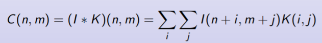

# Convolutional Neural Networks

**Definition**: CNNs are Neural Networks that compute a convolution instead of a matrix multiplication in at least one of their layers

Typically, the convolution operation is combined with other operations, such as non-linear transformation and pooling

With a convolution, the same weights are used to compute output values in different and small parts of the input

where

* I is the input, K is the feature detector or filter or kernel (the weights) and C is the feature map (the output)

* The sum is defined over all valid values Enrique Romero Convolutional Neu