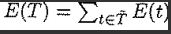

 ## Substractive Clustering

* Consider a colection of *n* data points in M-dimensional space
* Each data point is considered as a candidate for a cluster center.
* The data points are normalized within a hypercube [0, 1]
* A *density measure* at data point *xi* is defined as: 

 
**Note:** ra (radius) positive number defines a neighborhood and || . || denotes the euclidean distance

* Once density measure is calculated at each data point, the one with the highest value is selected as the first cluster center. 

To find the next cluster center , the density measure for each data point is revised subtracting the influence of the first cluster.

   

 
## CART: Classification and Regression Trees (No entra a l'examen)

CART generates a tree partitioning of the input space, which relieves the “curse of dimensionality” problem (num. of rules increasing exponentially with num. of inputs)

**Tree Growing**

* CART grows a decision tree by determining a succession of splits (decision boundaries) that partition the training data into disjoint subsets
*  Starting from the root node (contains all the training data), an exhaustive search is performed to find the split that best reduces an error measure (cost function) 
* The data set is partitioned into two subsets and the same splitting method is applied to both child nodes 
* This recursive procedure terminates either when the error measure associated with a node falls below a certain tolerance level, or when the error 76 reduction does not exceed a certain threshold value

The error measure that quantifies the performance of a node t in separating data into disjoint subsets is usually taken as the square error (or residual) of a local model employed to fit the data set of the node: 

where ***{xi,yi}***  is a data point, ***dt(xi,θ)*** is a local model for node ***t*** (with modifiable parameter θ) and **E(*t*)** is the mean-square error of fitting the local model to the data set in the node.

The strategy for growing a regression tree is to split nodes (or data set) iteratively and thus maximize the decrease in , i.e. the overall error measure (or cost) of the tree. 

**Tree Pruning**

The tree finding the weakest subtree in it, i.e. considering both the training error measure and the number of terminal nodes (measure of tree’s complexity)

(revisar diapo 80)

Therefore, a tree-pruning cycle consists of the following tasks: 

1. Calculate αt for each internal node t in Ti 
2.  Find the minimal αt and choose T - Tt as the next minimizing tree

