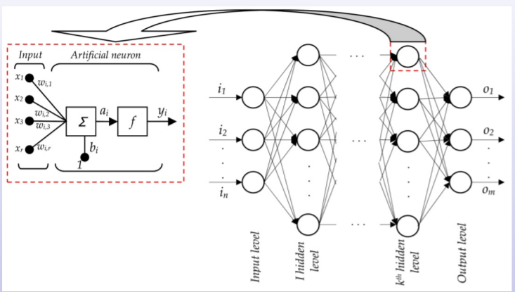
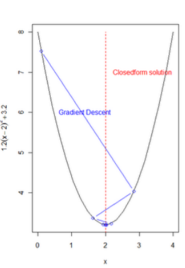

# Neural Networks 

Neural Networks are defined by:

*  A set of interconnected units (neurons) 
* A set of connections (synapses or weights) among the units

**Types**

* Feed-forward Neural Networks
  * Multilayer Perceptrons
  * Radial-basis Function Networks
  * Convolutional Neural Networks

* Recurrent Neural Networks

  * Hopfield Networks
  * Boltzmann 

  

## Feed-forward Neural Networks

There are a neural systems defined by 

* A set of interconnected units (neurons) 
* A set of directed connections among the units without loops

Typically, 

* There are a number of input units, where the process starts 
* Some of the units are output units, with the network results 
* The rest of units are called hidden units 
* Units are usually structured by layers

Aggregation function combines the information received by the unit with the weights. The output is called net-input or pre-activation.

Activation function transforms the output of the aggregation function. The output is called net-output or activation.

**Examples of aggregation functions**

For MLPS and Recurrent Neural Networks.
$$
act_i = \omega_i · act\_to_i = \sum_j \omega_{ij} act_\_to_{ij}
$$
For Radial-basis
$$
act_i = ||\omega_i - act\_to_i||^2 = \sum_j (w_{ij}-act\_to_{i_j})^2
$$
***Note**: In this subject we will focus on MLPs*

**Examples of activation functions**

* Identity function:
  $$
  f(z) = z
  $$

* Logistic function:
  $$
  f(z) = \frac{1}{1+e^{-z}}
  $$
  

* Softmax function:
  $$
  f(z)_c = \frac{e^z_c}{\sum_k e^{z_k}}
  $$
  ... and any more

  The aggregation and the activation function are considered a single function. 

## Linear regression

Given a data set with *N* examples
$$
D = [(x^{(1)}, y^{(1)}), ..., (x^{(N)}, y^{(N)})] 
$$
**Model representation**: Linear
$$
h_\theta(x) = \theta_0 + \theta^\prime · x
$$
where theta is the vector of parameters
$$
\theta = (\theta_1, ... , \theta^\prime·x)
\\\theta_0 \ \text{theta is a bias term, that can be seen as a standard parameter if we add a constant 1 to the input }\\x =(1, x_1, ... x_d)
$$
Y is a scalar and x is a vector

...

### Gradient Descent

It is a first-order iterative optimization algorithm for finding the minimum of a function. It takes steps proportional to the negative gradient of the function (or an approximation) at the current point. It usually obtains a local minimum of the function

...

## General Machine Learning Issues

The Type of Problem is the nature of the problem we are trying to solve: regression, classification, clustering, etc 

* In the example of linear regression, it is regression

The Model Representation is the form of the output function (hypothesis) of the model

* In the example of linear regression, it is a linear function that depends on several parameters

  
  $$
  h_\theta(x) = \theta_0 + \theta^\prime · x
  $$

The Cost Function is the (usually scalar) function to be optimized, which strongly depends on the type of problem (typically based on the empirical risk minimization) and is a function of the data and the parameters

The Optimization Technique is used to optimize the cost function

* In the example of linear regression, it can be done with the normal equations, gradient descent, 