# Convolutional Neural Networks

Machine learning is the study of computer algorithms that allow computer programs to automatically improve through experience.

## What is a Neural Network

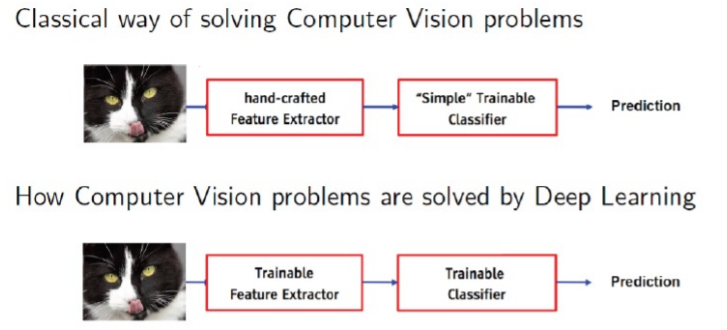

**Learning pipeline**

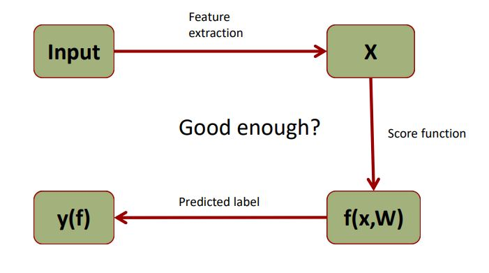

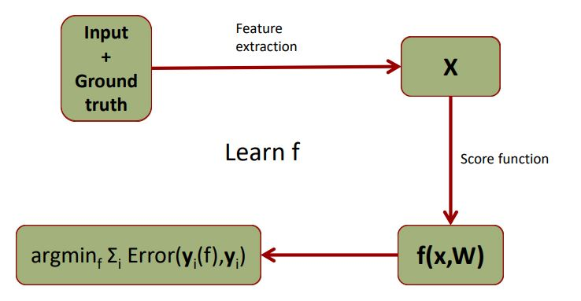

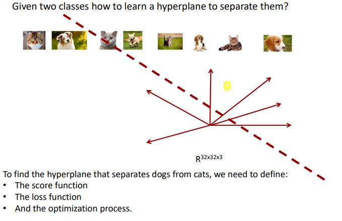

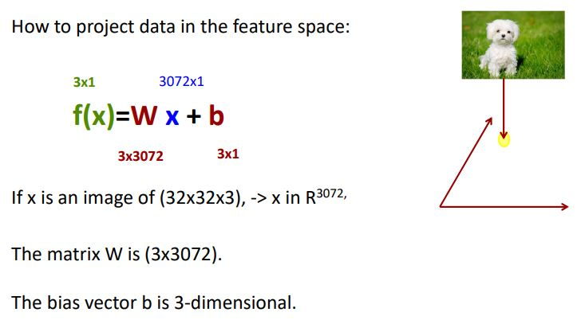

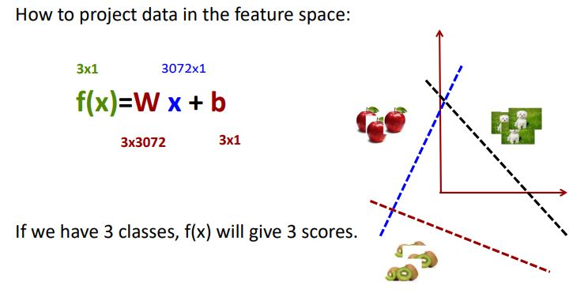

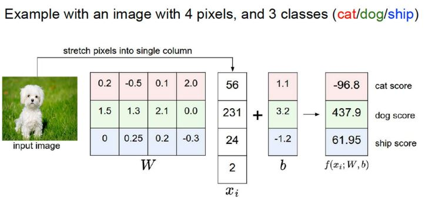

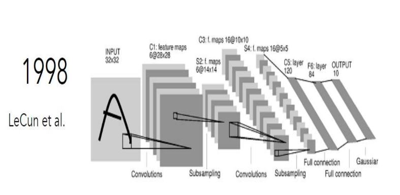

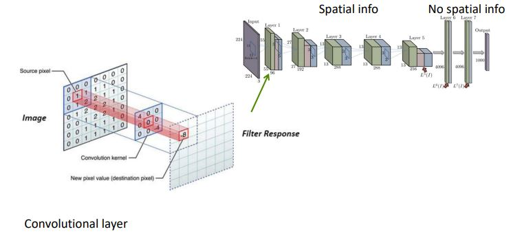

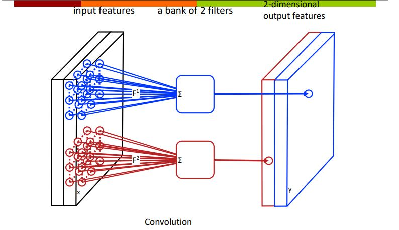

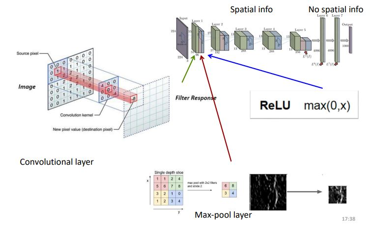

The process of training a CNN consists of training all hyperparameters: convolutional matrices and weights of the fully connected layers.

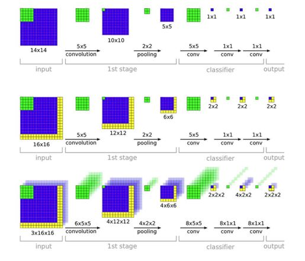

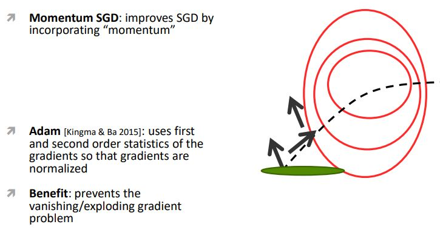

For avoid overfitting in images classification and detection we can make the following:

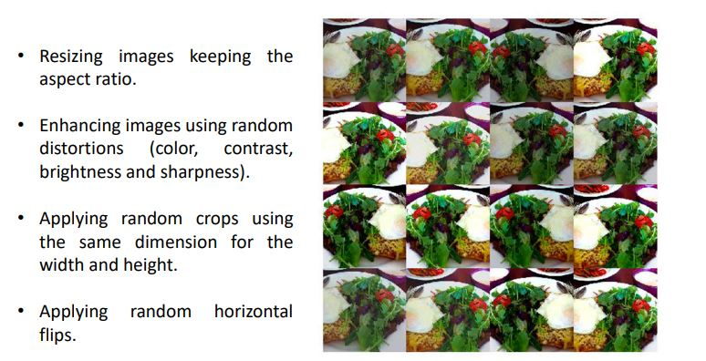

