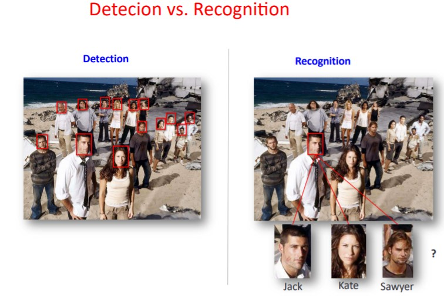
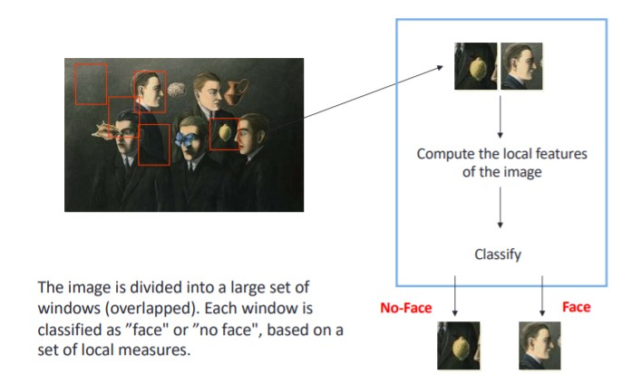
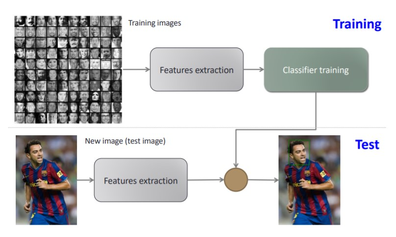
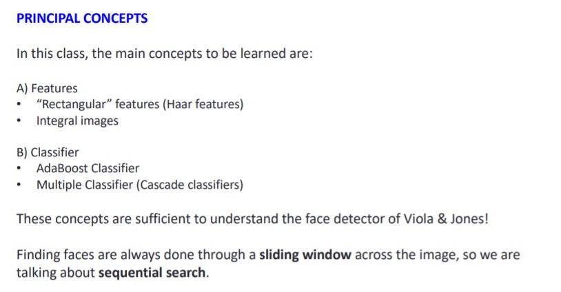
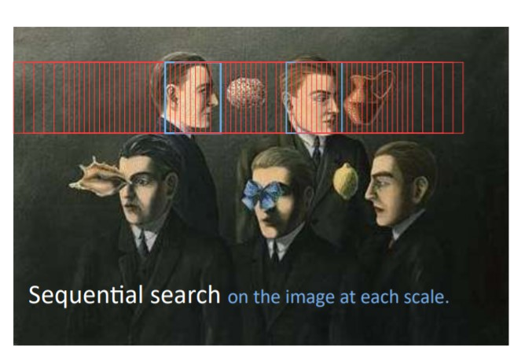

# Face recognition

The problem in object detection is identify and locate human faces in an image regardless of their position, scale, in plane rotation, orientation, pose and illumination.

Recognition of new objects within a class:

* We can infer the properties
* Restricts the number of models for identifying (indexing)
* Allows the use of specific information to identify the class (eg neutralizing facial expressions)
* It enables generalization from very partial information

### Supervised classification method

**Classification of image features** 

**Goal**: Define a space of image features allowing to represent objects based on their appearance (or through a set of local features) in the image.

**Principal aspects**

* Adequate representation: reduce the size of the data so that the invariance is kept and the other dimensions are removed.
* Training, from a set of objects examples with their descriptors.
* Detection or recognition of new object instance by using its descriptor and the learned model.

## Face detection

### Viola & Jones

**Goals**

* Accurate detection of faces

* Fast algorithm

* Real-time detection

  

Is formulated as a standard supervised classification problem. 

The major steps are:

* Extraction of image features.

* Training a decision rule, called classifier. 

* Test for new images using the trained classifier. 

  

