# Face recognition

The problem in object detection is identify and locate human faces in an image regardless of their position, scale, in plane rotation, orientation, pose and illumination.

Recognition of new objects within a class:

* We can infer the properties
* Restricts the number of models for identifying (indexing)
* Allows the use of specific information to identify the class (eg neutralizing facial expressions)
* It enables generalization from very partial information

### Supervised classification method

**Classification of image features** 

**Goal**: Define a space of image features allowing to represent objects based on their appearance (or through a set of local features) in the image.

**Principal aspects**

* Adequate representation: reduce the size of the data so that the invariance is kept and the other dimensions are removed.
* Training, from a set of objects examples with their descriptors.
* Detection or recognition of new object instance by using its descriptor and the learned model.

## Face detection

### Viola & Jones

**Goals**

* Accurate detection of faces

* Fast algorithm

* Real-time detection

  

Is formulated as a standard supervised classification problem. 

The major steps are:

* Extraction of image features.

* Training a decision rule, called classifier. 

* Test for new images using the trained classifier. 

  

Haar features Considering an image, we consider a square window in a given position: this window apply the Haar-type features. Repeat for each posible position.

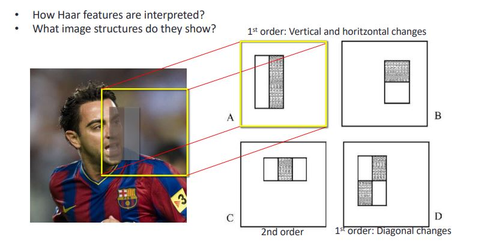

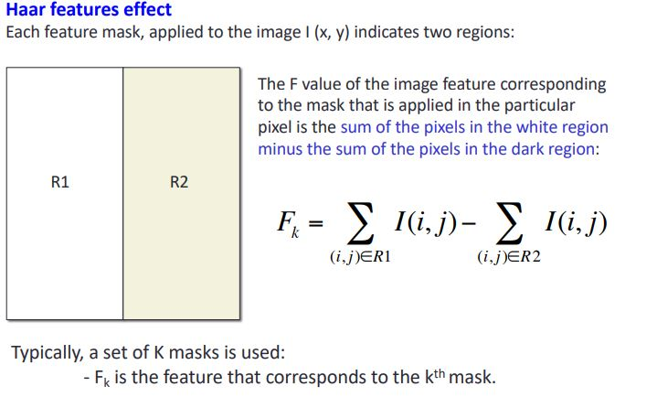

We can define a different mask with different sizes , position etc... . 

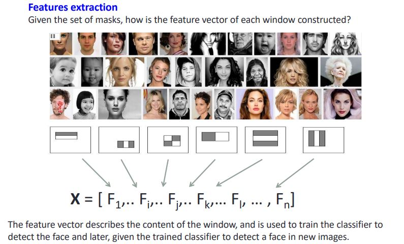

## Integral Images

**Definition:** The integral image S is constructed as follows: the value at position (x, y) is the sum of all pixels in the image I above and left of point (x, y):

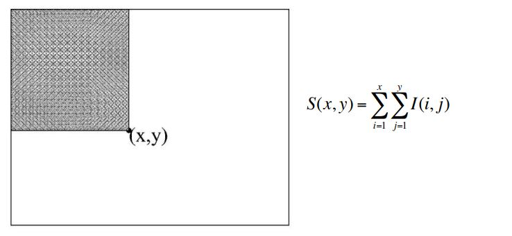

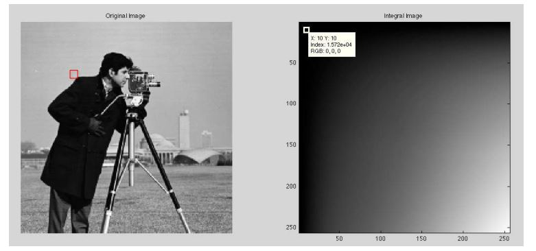

**Why are we interested in the integral images?** The Haar features are based on sums and subtractions of image rectangles.

The computation of the features through integral images, is reduced to computating a set of 3 sums and subtractions on the integral image points

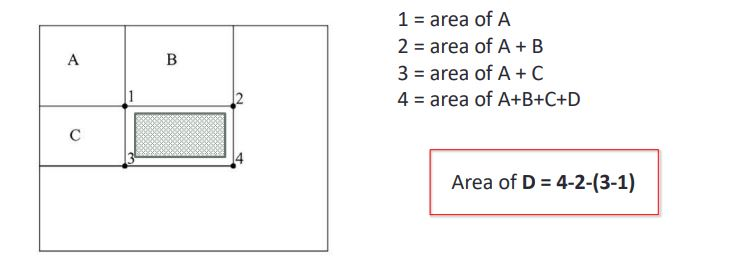

Convolution with a mask is substituted by a subtraction of pixels of the integral image.

**FEATURES FOR FACE DETECTION:** 

Computing values of the I and II order Haar features at different scale and at different points of the image of the face => thousands of features.

## AdaBoost

Viola & Jones uses AdaBoost classifier to detect faces.

AdaBoost: Adaptive Boosting Introduced by Freund & Schapire in 1999

It is a classification algorithm that joins several weak classifiers (weak) to form a single strong classifier (strong) . BOOSTING

The weak classifiers are defined at each iteration, and each is devoted to examples that are misclassified in the previous classifier: ADAPTIVE

***Note**: Check example of AdaBoost on L5 Slide 37*

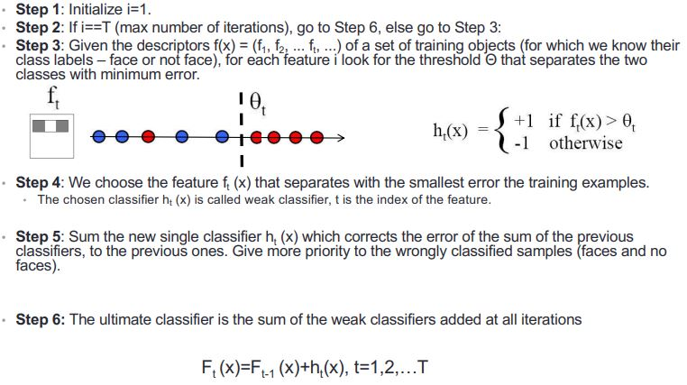

Even if the filters are fast to compute, each new image has a lots of possible windows to search

## Cascade of classifiers

The main objective is to obtain an algorithm:

* Fast and Reliable.

The idea of Viola & Jones is that each itera`on of the cascade can accept a False Posi`ve, but no False Negave, that is not to be missed any face.

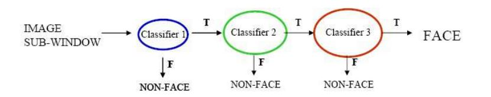

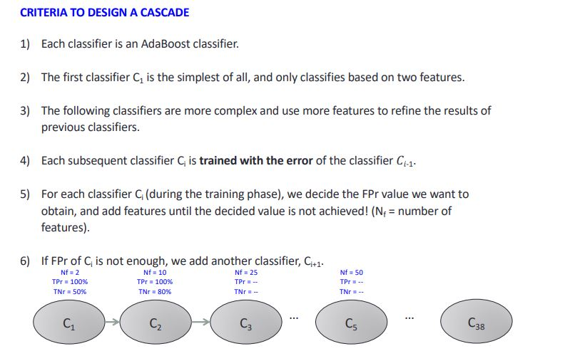

Each classifier in the cascade reduces the number of false nega`ves, keeping the number of successes (TP)

### Other tasks

* Profile detection
* Facial Feature Localization
* Male vs. female

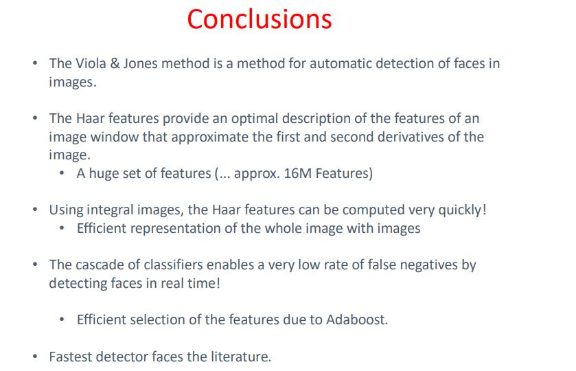

## Eigenfaces

Representation of faces as points in high dimension space

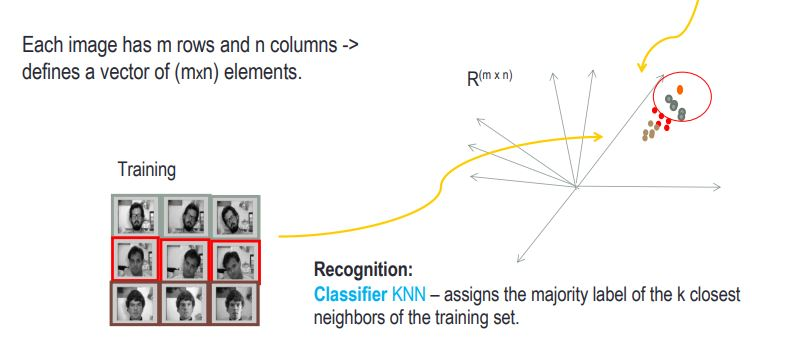

Using knn algorithm. First apply a dimensionality reduction of the original data and retaining only de information necessary to classify and recognize.

For reduce space we need to apply PCA.

**Remember** that PCA reduce the dimensions of data and accelerates the execution time of the algorithms. 

### PCA

According to the PCA, if we compute:

* the eigenvectors (e1, e2, ...) of the covariance matrix define the axis of maximum variance, and the eigenvalues give a measure of the variance of the data.

The eigenvectors of the covariance matrix are called eigenfaces.

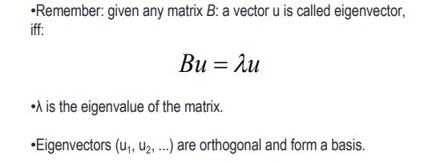

The eigenvalues λ (eigenvalues) measure the variance of the data in the direction of the eigenvector. 

The larger the λi , there is more variance in the data vector in the direction of the eigenvector u

We only are interested in the first k eigenvectors of the largest eigenvalues (k = 1,2, ... M-1)

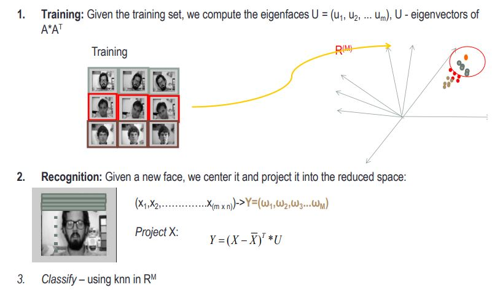

### Eigenface trick

**Objective**: To find the eigenvectors and eigenvalues of AAT

Trick: Multiplying both sides with A: •A(AT AV)=A (ΛV) => AAT (AV)= Λ (AV) => AAT U= ΛU where U=AV

**Algorithm of eigenfaces**

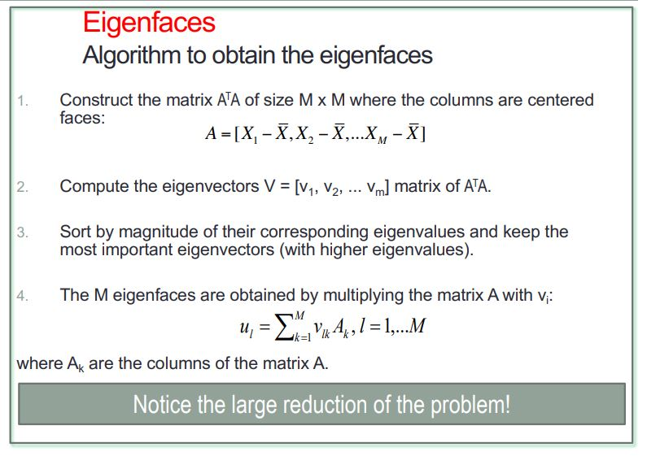

**Interpretation**: Since eigenfaces are forming a base, we can express a face as a linear combination of eigenfaces.

Global appearance method: not robust to misalignment.

The space defined by the eigenfaces can be viewed as a subspace of the space of images.

We can always calculate the distance between any image and the face subspace.

And use it as a criterion for deciding whether an image is a face or not.

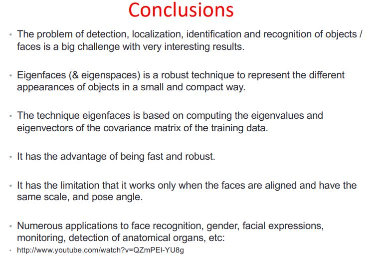