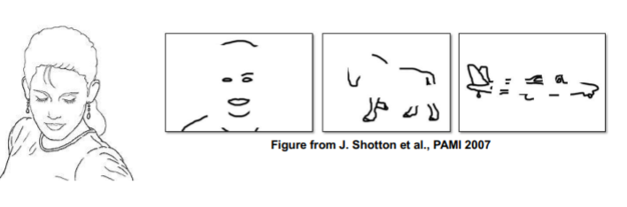
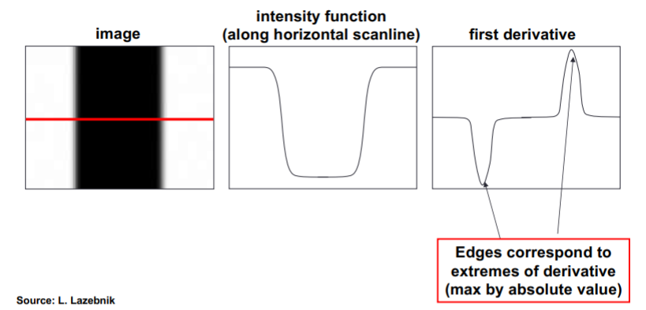
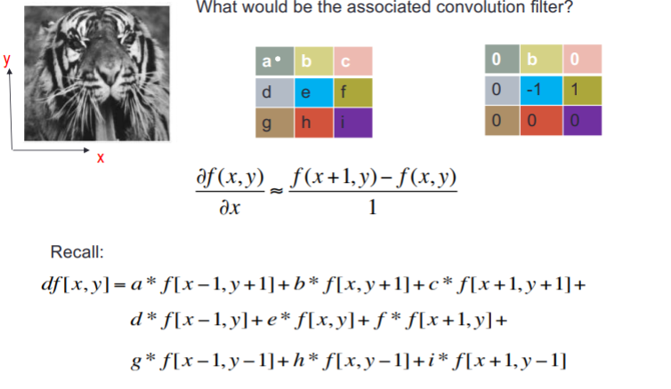
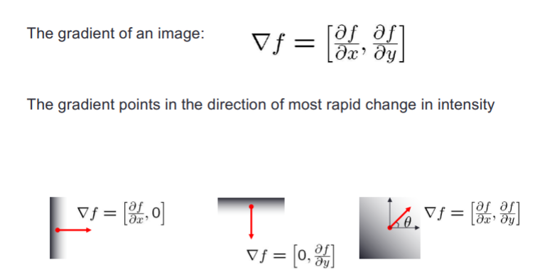
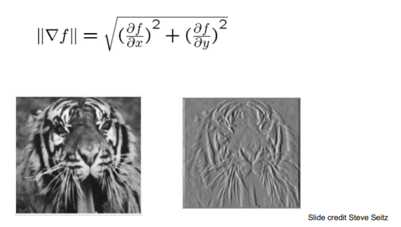
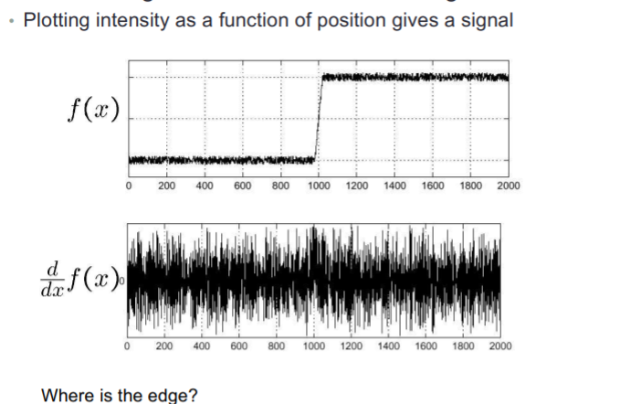

# COMPUTATIONAL VISION: EDGES

## Edge detection

**Goal**: map image from 2d array of pixels to a set of curves or line segments or contours.

We can detect edge when we have a change of intensity. 

## Derivatives and edges

An edge is a place of rapid change in the image intensity function.

We need to use a partial derivatives.

...

## Image gradient

The edge strength is given by the gradient magnitude

...

## Effects of noise

