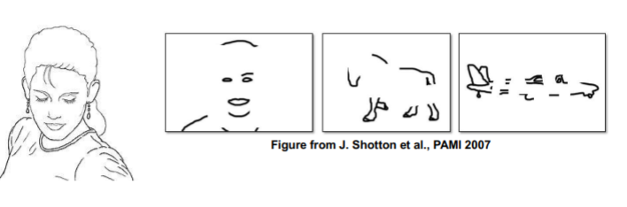
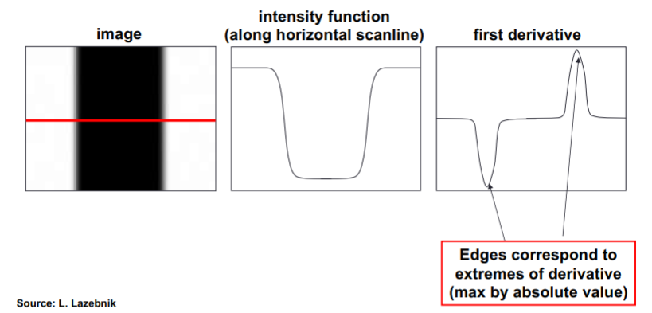
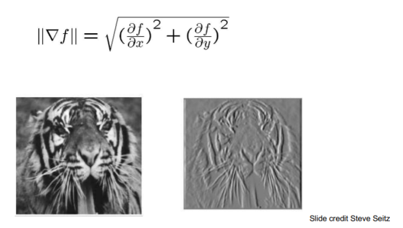
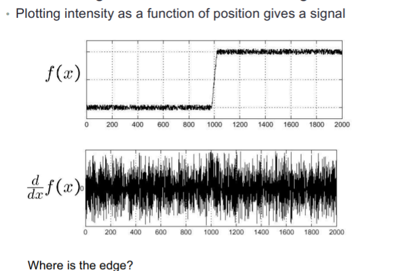

# COMPUTATIONAL VISION: EDGES

## Edge detection

**Goal**: map image from 2d array of pixels to a set of curves or line segments or contours.

We can detect edge when we have a change of intensity. 

## Derivatives and edges

An edge is a place of rapid change in the image intensity function.

If image is a discrete matrix we can approximate it using finite differences. 

We need to use a partial derivatives.

When we have noise we can get the average of the three derivatives in order to be less sensitive to noise

Filters:

The difference is that Sobel use non-uniform weights so gives more importance to the closest neighbors.

## Image gradient

The edge strength is given by the gradient magnitude

Second derivatives: Given an edge, the first derivative has an extreme, and the second one has a zerocrossing in the edge and extremes before and after the edge.

**Discrete operators: Laplacian Mask**

## Mask properties Quiz

Test on smoothing

* Values should be _ _ _ _ _ _ _ 
* Sum to _ _ _ _ _ _  &rarr; constant regions same as input.
* Amount of smoothing _ _ _ _ _ _ _ _ _ to mask size.
* Remove “_ _ _ _ _  -frequency” components; “_ _ _ _ _ -pass” filter.

Test on derivatives

* _ signs used to get high response in regions of high contrast.

* Sum to _ &rarr; no response in constant regions.
* _  value at points of high contrast.

## Effects of noise

**Solution**: Smoot first

### 2D edge detection filters

Parameter σ i is the scale / witth of the gaussian kernel and controls the amount of smoothing. 

Larger values: high scale edges detected.

Smaller values: more features detected.

## Canny edge detector

Filter image with derivative of Gaussian.

Find magnitude and orientation of gradient.

Define two thresholds (hysteresis): low and high. Use the high threshold to start edge curves and the low threshold to continue them. 

### Non-maximum suppression

Check if pixel is local maximum along gradient direction, select single max across width of the edge. 

### Hysteresis thresholding

Use a high threshold to start edge curves, and a low threshold to continue them.

**Example**

### Limitations of canny edge detector

Only focuses on local changes and it has no semantic understanding. 

## Hybrid Images

Low frequencies &rarr; pixel values that are changing slowly over space.

High frequency &rarr; pixel values that are rapidly changing in space. 

## Summary

Filters allow local image neighborhood to influence our description and features.

* Smoothing to reduce noise
* Derivatives to locate contrast, high image gradient

Different edge detectors:

* Sobel & Prewitt – fast but sensitive to noise
* Convolution with the Gradient of a Gaussian
  * Less fast but more robust
  * Using different sigma allows to smooth more or less
  * Zero-crossing with a Laplacian – assures closed contours.
* Canny edge detector – state of the art edge detector
  * Assures continuous and thin contours due to the hysteresis and the thinning steps but needs parameters.
  * Edges used to contain good contours but also many other pixels with high intensity change.
