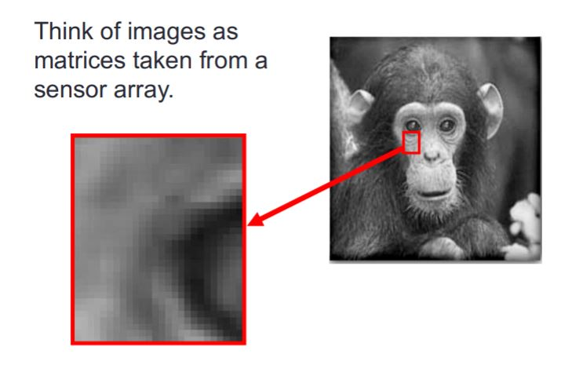
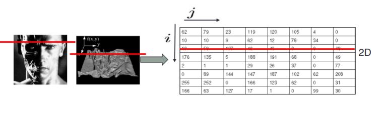
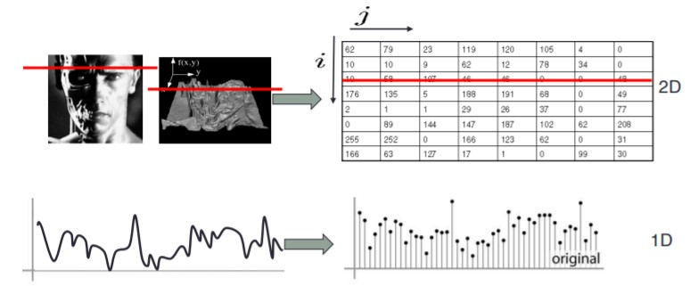
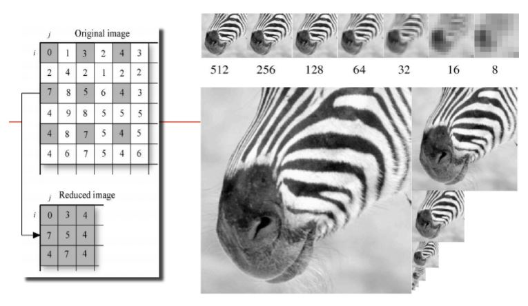
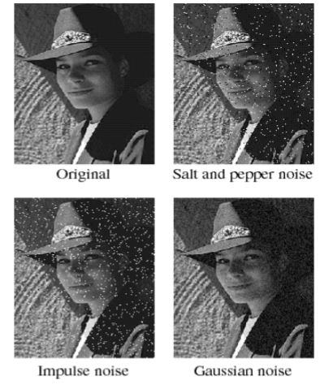
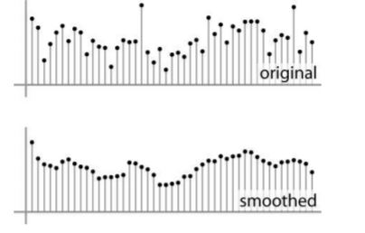
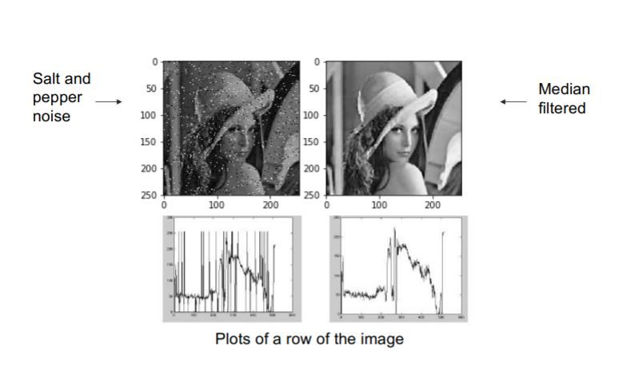
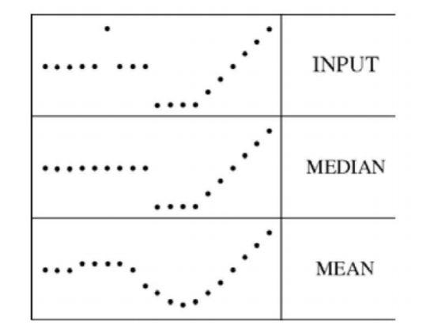
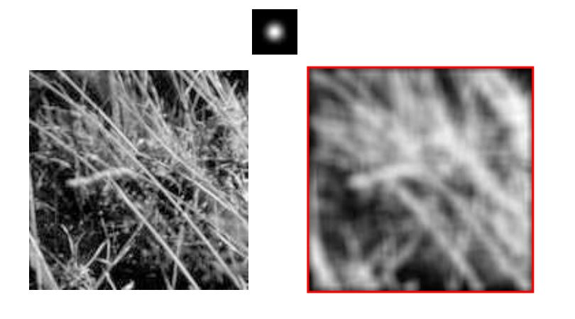
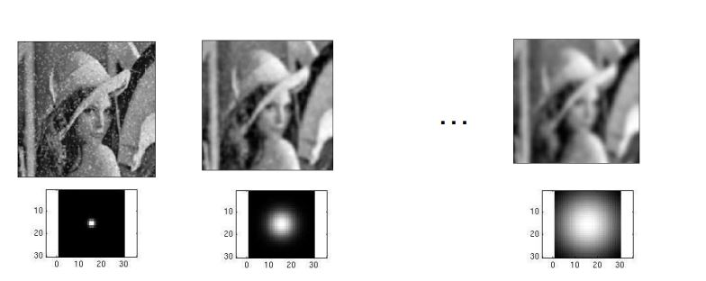

# Computational vision : Linear Filters

### Digital Images

Try to think of images as a matrices taken from a sensor array

* Sample the 2D space on a regular grid

* Quantize each sample (round to nearest integer)

  

Image is represented as a matrix of integer values

## How do we obtain color images?

Light is an energy source that carries coded information about the world which can be read from a distance through the images.

A human eye will respond to wavelengths from about 380 to 750 nm.

In order to get a full colour image, most sensors use filtering to look at the light in its three primary colours (Red, Green, Blue). Once the camera records all three colours, it combines them to create the full spectrum.

## Images in Skimage

Image can be Grey-value (1 channel) or color images (3 channels)

## Spatial resolution

* **Sensor resolution**: size of real world scene element that images to a single pixel
* **Image resolution**: number of pixels

## Image Magnification

## Image reduction

## Photometric resolution

Histogram of an image represents the frequencies of the image grey levels.

The number of different grey levels (different pixel values in each color channel) determines the photometric resolution of the image. 

## Histogram manipulation for contrast enhancement

To increase the contrast we need to apply the following:

**Example**

## How to process by a lineal filter

### Image Filtering

**Linear Filtering**: Compute a function of the local neighborhood at each pixel in the image.

* Function specified by a filter or mask saying how to combine values from neighbors.

Uses of filtering:

* Soft blur, smoothing
* Extract information
* Detect patterns

### Common types of noise

* Salt and pepper noise: random occurrences of black and white pixels.
* Impulse noise: random occurrences of white pixels
* Gaussian noise: variations in intensity drawn from a Gaussian normal distribution
* 

### Reducing Noise

The motivation is that even multiple images of the same static scene will not be identical. 

* Firs attempt at a solution:
  * Replace each pixel with an average of all the values in its neighborhood
  * Assumptions:
    * Expect pixels to be like their neighbors
    * Expect noise processes to be independent from pixel to pixel

For each pixel i, multiply its neighborhood by a mask:

### Weighted Moving Average

### Moving Average in 2D

### 

### Convolutional filtering

Say the averaging windows size is (2k + 1) x (2k +1):

And for Non-uniform weights

### Properties of convolution

* Shift invariant:

  * Operator behaves the same everywhere, i.e. the value of the output depends on the pattern in the image neighborhood, not the position of the neighborhood.

* Superposition:
  $$
  h * (f1 + f2) = (h * f1) + (h * f2)
  $$
  
* 

## Mean and median filters

Median filter is edge preserving

## Linear filters with Gaussians

2D Gaussian function
$$
h(u,v) = \frac{1}{2\pi\sigma^2}e^{-\frac{u^2 + v^2}{\sigma^2}}
$$

Gaussian function has infinite support, but discrete filters use finite kernels

• Variance of Gaussian: determines extent of smoothing

Smoothing filters remove "high-frequency" components; "los-pass" filter.

