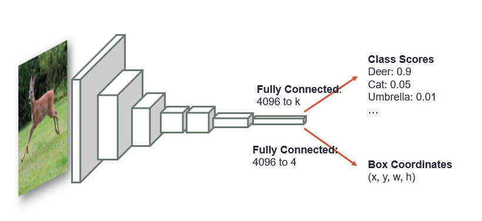
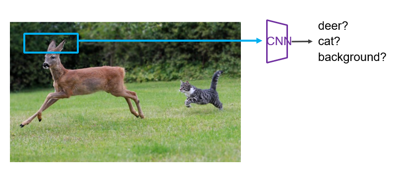
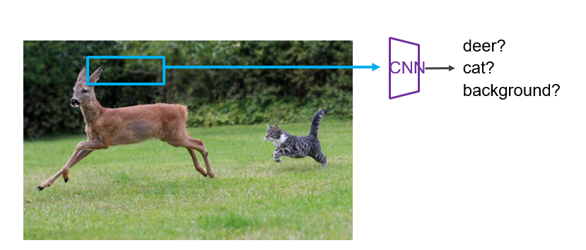
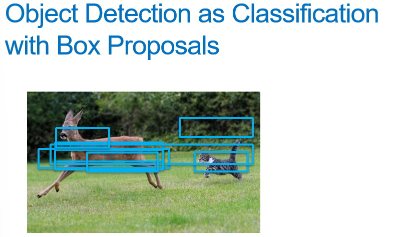
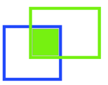
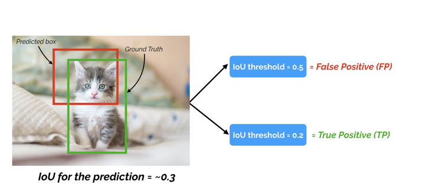
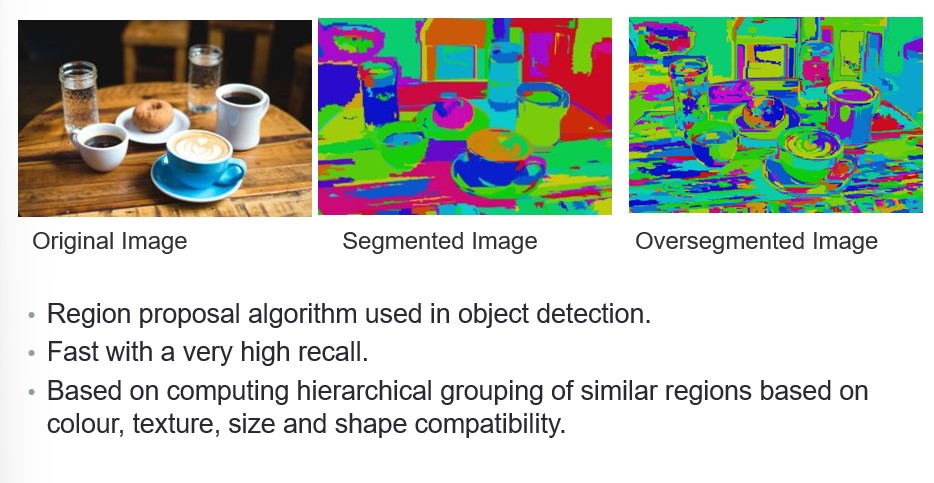
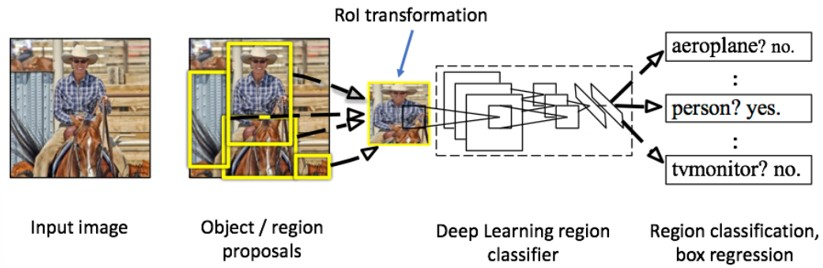

# Object Detection

## Object detection as Classification with Sliding window

## Object detection as Classification with Box Proposals

## Mean Average Precision

Considering the Intersection of Union (IoU)

mAP metrics calculates the average precision (AP) for each class individually across all of the IoU thresholds.

Then the metric averages the mAP for all classes to arrive at the final estimate. 

## Selective Search for Object Recognition

Selective Search algorithm takes these oversegments as initial input and performs.

1. Add all bounding boxes corresponding to segmented parts to the list of regional proposals
2. Group adjacent segments based on similarity
3. Go to step 1

At each iteration, larger segments are formed and added to the list of region proposals in a bottom-up approach

## R-CNN

R-CNN combines region proposals with CNNs

1. Applying high-capacity convolutional neural networks (CNNs) to bottom-up region proposals in order to localize and segment objects
2. When labelled training data is scarce, supervised pre-training for an auxiliary task, followed by domain-specific fine-tuning, yields a significant performance boost. 

### R-CNN

Stages... To do

### Problems with R-CNN

* Takes a huge amount of time to train.
* It cannot be implemented real tame. Can takes around 47 seconds for each test image.
* Selective search algorithm is a fixed algorithm. So no learning is happening at that stage.