# OBJECT RECOGNITION BY BAG-OF-WORDS

## Texture recognition

Texture is characterized by the repetition of basic elements or textons.

For stochastic textures, it is the identity of the textons. 

## Bag of features: outline

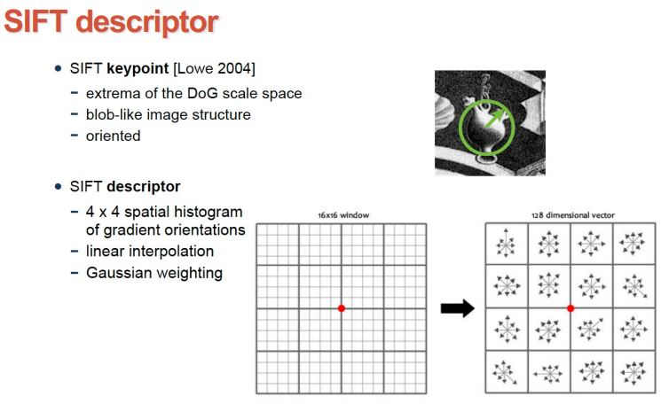

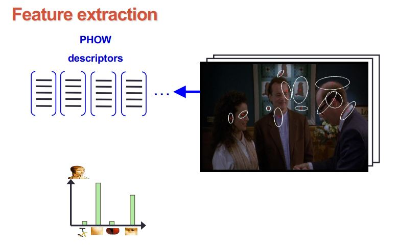

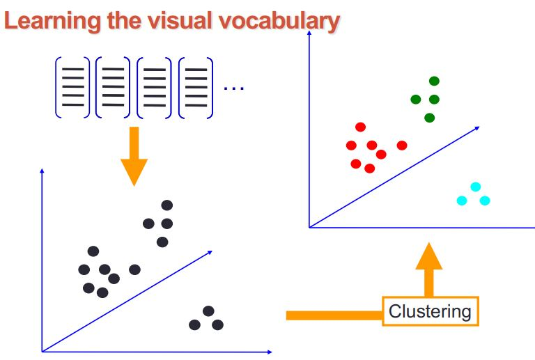

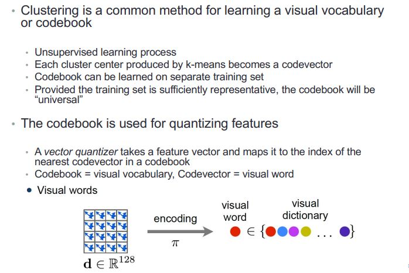

**Issues in visual vocabulary**

How to choose vocabulary size?

* Too small: visual words not representative of all patches
* Too large: quantization artifacts, overfitting

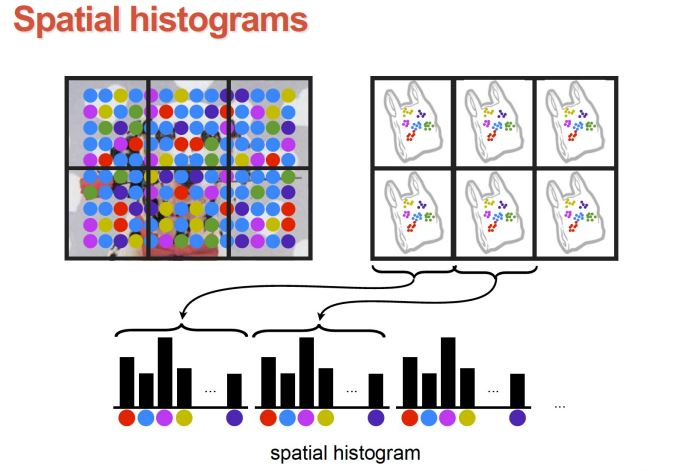

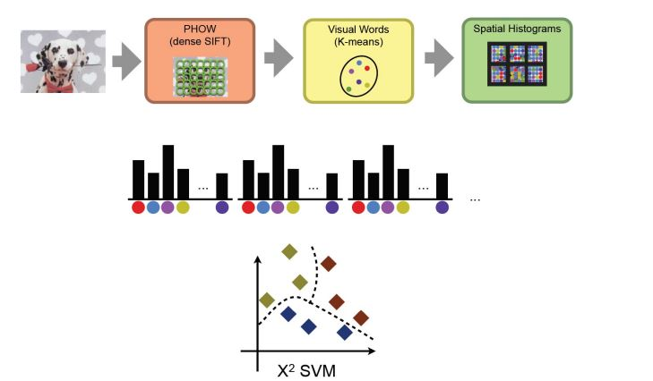

For classification use a SVM that Finds hyperplane that maximizes the margin between the positive and negative examples

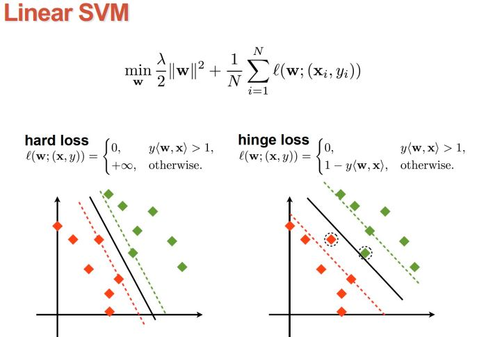

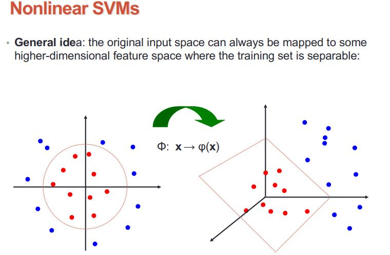

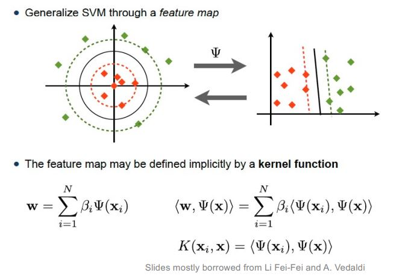

***Note**: El simbol raro vol dir kernel map*

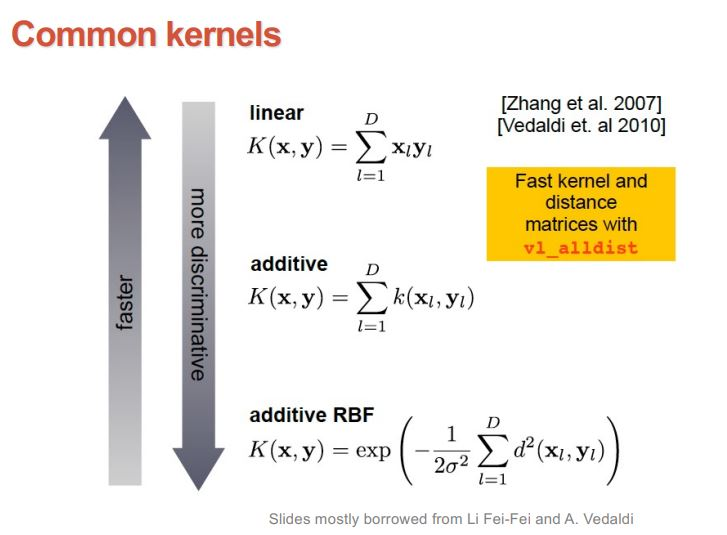

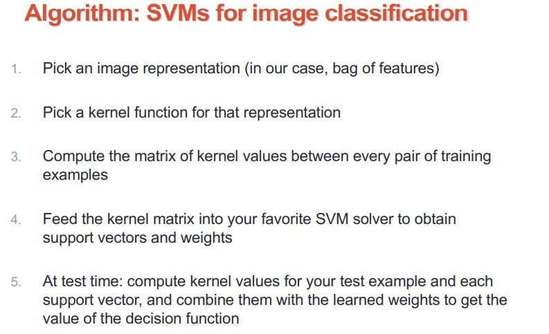

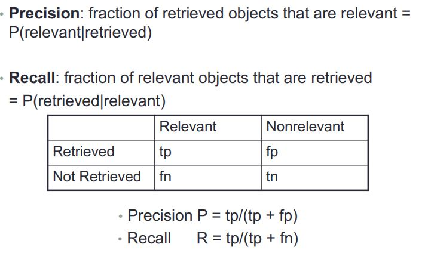

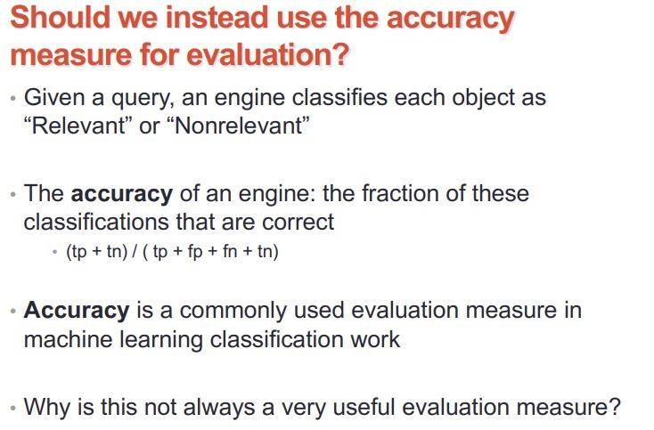

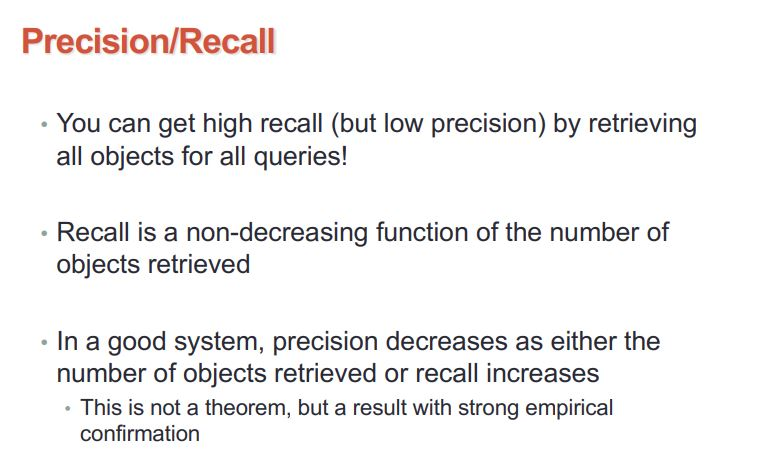

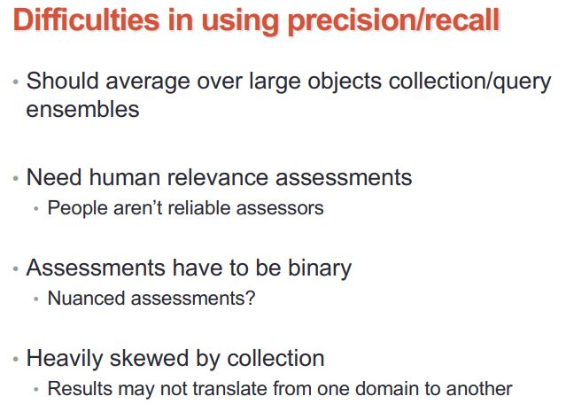

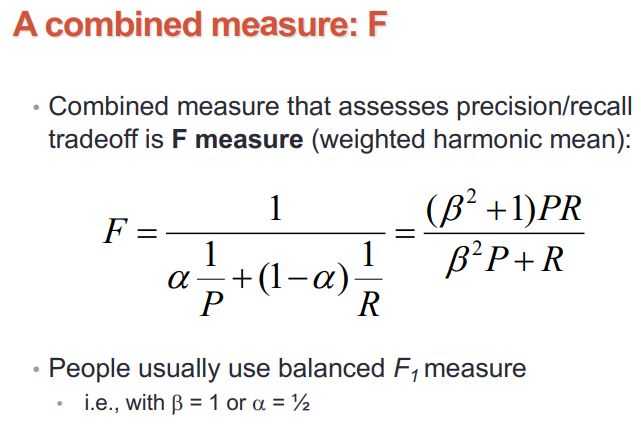

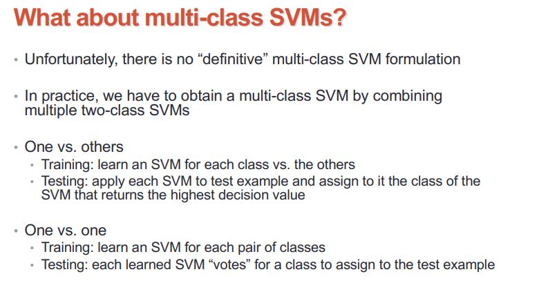

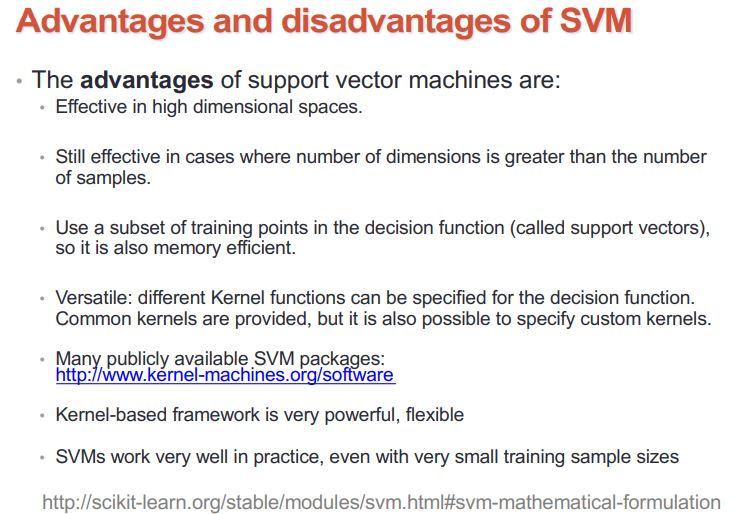

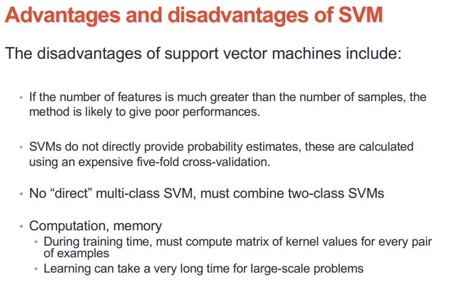

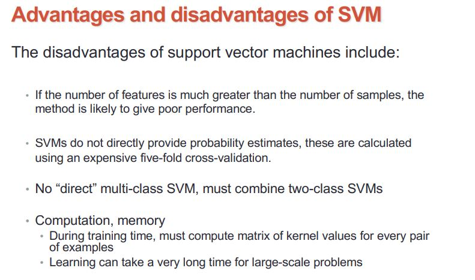

