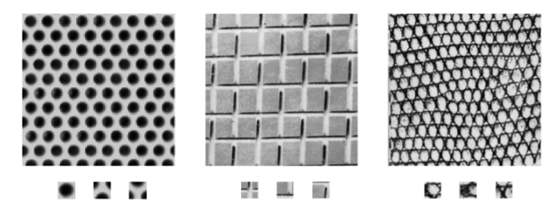
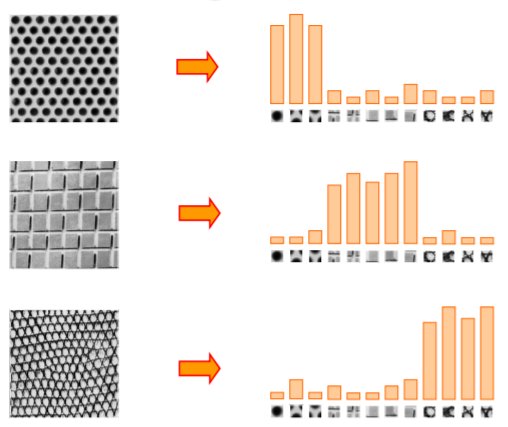
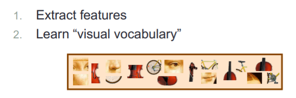
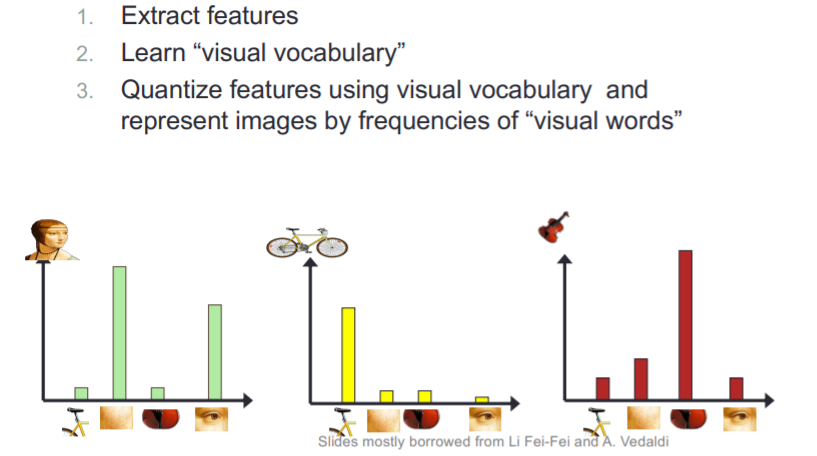
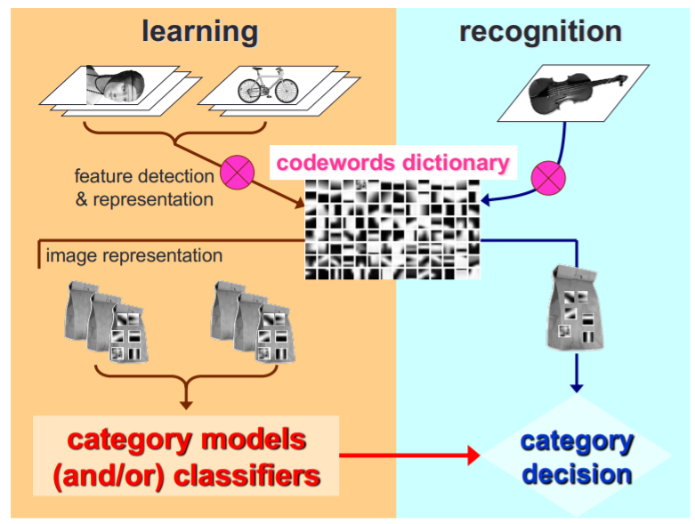
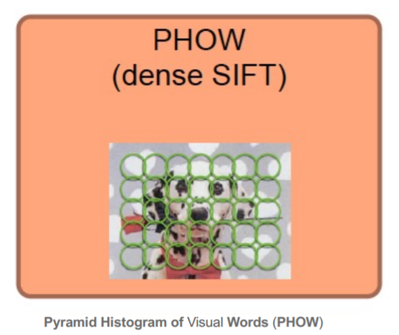

# OBJECT RECOGNITION BY BAG-OF-WORDS

## Texture recognition

Texture is characterized by the repetition of basic elements or textons.

For stochastic textures, it is the identity of the textons. 

## Bag of features: outline

## PHOW

## Feature description