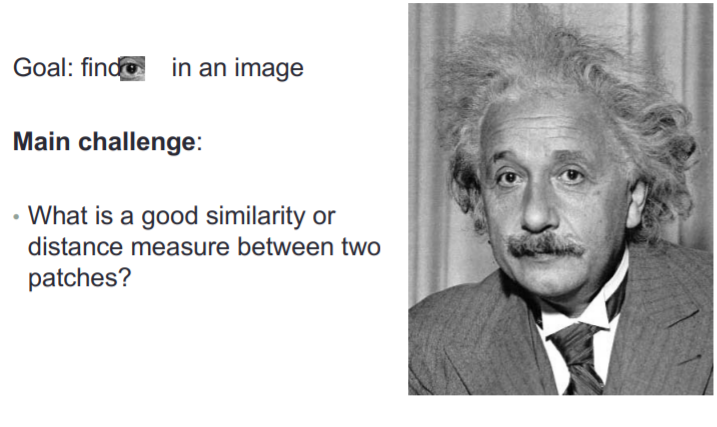
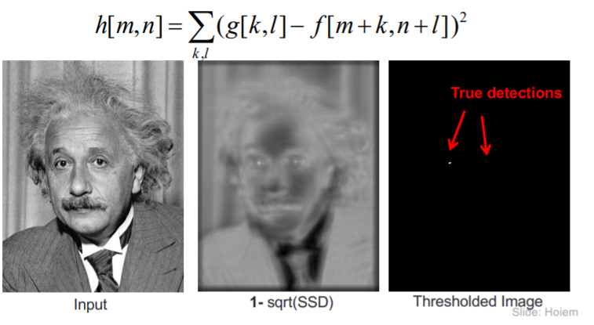
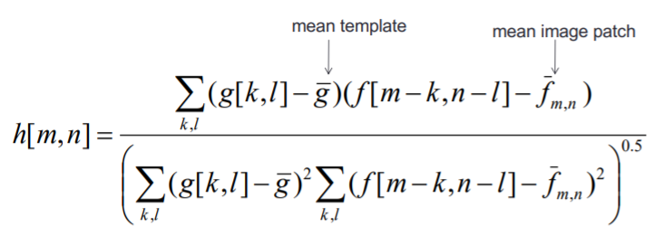
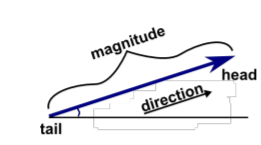
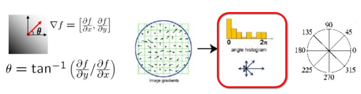
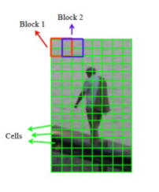
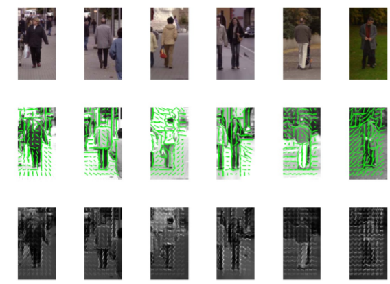

# TEMPLATES HOG

Eye-trackers applications

* Market research
* Usability research
* Packaging research

## Template matching

First Method : SSD

Second method: Normalized cross-correlation

## Image descriptors

To solve real world problems (image retrieval, image classification, etc.), we need to find a connection between:

* a matrix of pixels (raw representation),
* what humans see in an image (face, smile, emoticon).

Image descriptors allow to describe and represent the image/object by quantities (colour, shape, regions, textures and motion) closer to the visual characteristics perceived by humans.

### Histogram of gradient (HOG)

• The image gradient at each pixel is a vector. 

• As a vector, it has a magnitude and a direction. 

* Te gradient orientation is an angle
* Count occurences of gradient orientation in a patch
* Quantize to 8 bins, each bins cover 45 degrees
* Visual representation of the histogram

We will divide the image in to a small connected regions called cells.

Compute local histogram for each cell

Simply concatenate the histogram of the cells.

For compute gradient in practice we convolve the image with discrete derivative mask:

Dx=[-1, 0, 1], Dy=[1, 0, -1] T

## Pedestrian detection

Transform the detection problem into a binary (yes/not) classification problem.

Compute HOG descriptor for all training samples

Descriptor extraction: 

(a) Get the average gradient image over query and test examples, 

(b) Extract HOGs for the query image,

(c) Extract HOGs for the dataset of images.

HOG-based Retrieval: 

(d) For each dataset image, extract the region bottom left and compare to the query HOG. 

(e) Apply the sliding window technique all over the image and compute the HOGs correlation 

(f) Apply the maximum over the correlation resulting image. 

(g) Decide if the correlation is high enough -> Pedestrian vs. No-pedestrian

## Image Retrieval

Definition: Given an image (query image), the image retrieval consists of sorting the rest of images according to the similarity to the query image.