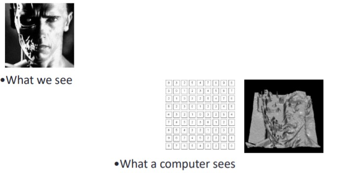
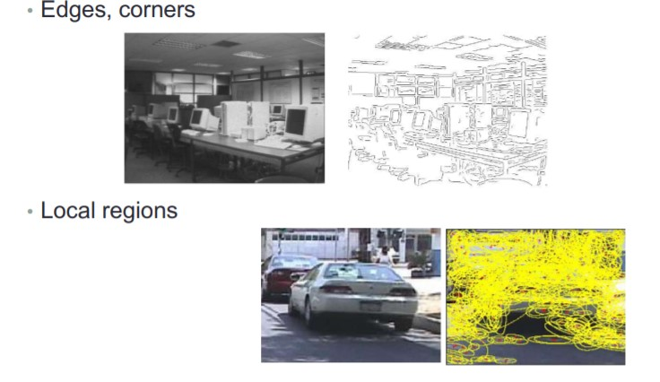
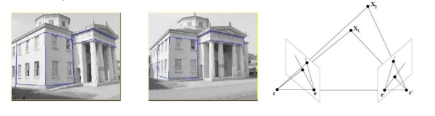
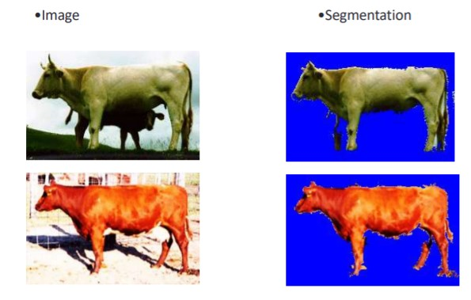
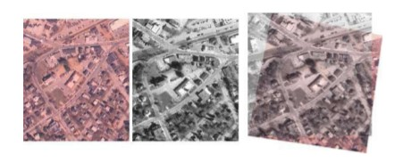
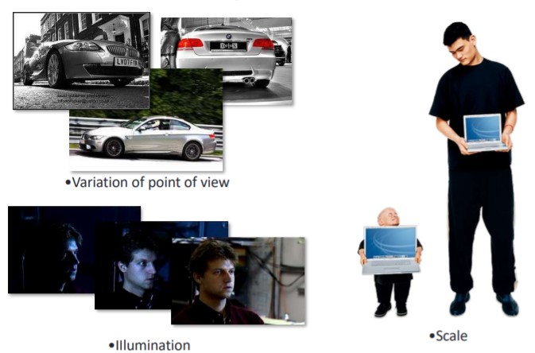
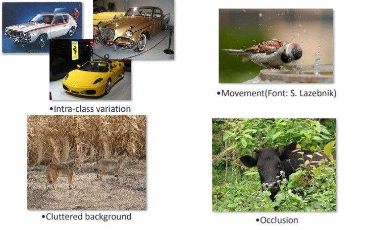

# Computer Vision Introduction

**Definition**: Vision is about discovering from images what is present in the scene and where it is. The computer interprets images of a real scene to: perceive the story behind the image and obtain information useful for tasks such as navigation, manipulation and recognition.

### Main Problems

**Computer Vision bridges the gap between pixels and “meaning”**

**CV problems: Low-Level Feature extraction**

**Stereo vision**

For solve this need to have two cameras that could triangulate the features in the left and right images to obtain depth.

**Shape from shading**

Recover scene structure from shading in the image.

**Segmentation**

### Image Registration

It is the process of transforming different sets of images into one coordinate system.

### Motion detection

Process of determining motion vectors that describe the transformation from one image to another from adjacent frames in a video sequence.

## Why CV its hard?

