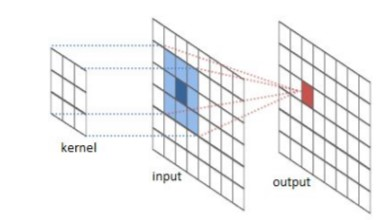
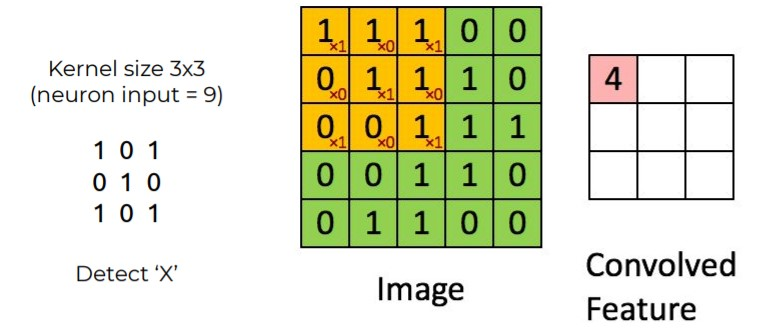

# Deep Learning Convolutional neural networks

Some data has spatial correlations that can be exploited 1D, 2D, 3D...

### Convolution in action

### Convolution Details

* **Kernel Size**: Size of the receptive field of convolutional neurons
* **Stride**: Steps size of convolution
* **Padding**: What to do when filters arrive to border. Most common is put zeros. 

$ OutputSize = \frac{InputSize-KernelSize + 2*Padding}{Stride}+1$

### Dilated/Atrous Convolutions

* Increases perceptive field without added complexity
* Loses details, gains context.
* Used for: Down/Upsampling (segmentation) and High resolution inputs. 

Typically , conv filters are full depth (**N** *  **N** * **input_depth**)

### Depth-wise Separable Convolutions

Decreasing the complexity and cost of convolution

1. Depth-wise convolutions
   * Filters: **N * N * 1 **
2. Point-wise convolution
   * Filters: **1 * 1 * input_depth

​	Params: **N * N + N**

### Polling

* Operation: **Max** or Avg

* Dimensionality reduction

* Not applied in full depth

* Robust to invariance

  

### Spatial Pyramid Pooling (SPP)

Often used between conv and fc. 

Multi-scale Pool (by powers of 2)

### Tips 1

**In convolution**

* Small/big filters (3x3, 5x5, 7x7)
  * Cheap/Expensive
  * Local/General
  * Bigger/Smaller outputs (Stride)
* Kernel size = inputsize: fc
* Kernel size = 1x1: Alfter depth

**Pooling**

* 2x2, stride 1 is the least invasive

**Hyperparameters list**

* Kernel size ( con & pool)
* Stride (con & pool)
* Padding ( con & pool)
* Num filters
* Dilatation rate

### Data Augmentation for CNNs

Apply what is safe for each case

* Horizontal / vertical flips
* Random Crops
* Color Jitter
* Rotation

* MixUp (merge two samples)
* CutOut (remove a patch)
* CutMix (merge samples w/patch)

***Note**: More data is always better than more augmentation*

### CNNs Big Bang

**AlexNet**

5 convs + pools, ReLU, 2 dense, and dropout. 62M parameters. 

### The skipped Connection

### Inverted Residuals

### EfficientNet

Find a balance between them. 

* Width (neurons per layer)
* Depth (layers)
* Resolution (input)

### Noisy Student

A semi-supervised training paradigm

1. Train model A (teacher) with the labeled data.
2. Use A to generate pseudo-labels for an unlabeled data set.
3. Train model B (student) with both labeled and pseudo-labeled data

* Iterate , re-labeling the unlabeled data each time.
* Highly regularized (noise), student to guarantee improvement. 
* Each student has more capacity than the previous.

### Spatial Dropout

*Not in the actual slides that can be found in the webpage of subject*

## Visualizing CNNs

### Ways of Looking at CNNs

* Attribution: where is the network looking?
  * Grounded. Instance based.
  * Explainability in practice.
* Feature Visualization: What is the network seeing?
  * Uncontextualized. Maximization based.
  * Diagnosys & Insight
* Exemplification: Which images cause a maximum activation.
  * Samples from a distribution.

## Playing with CNNs

### Encoder - Decoder CNNs

### Transposed Convolution

* Reverse effect of regular convolution (upsample)

* Learn interpolation

* Applications

  * Segmentation
  * GANs
  * Super Resolution
  * Conv. Autoencoders

  
