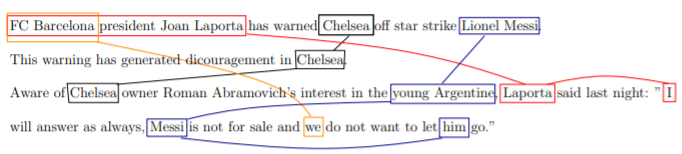
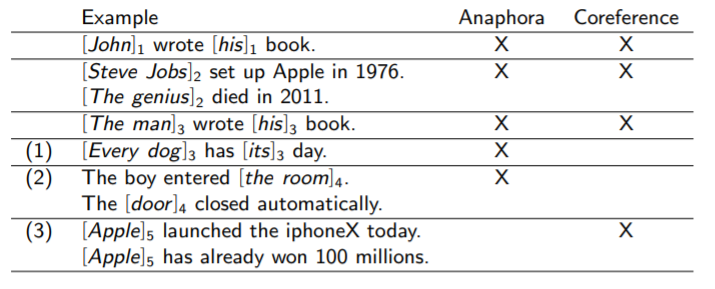
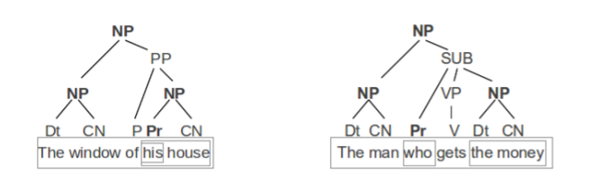
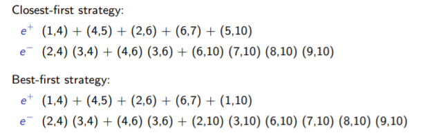
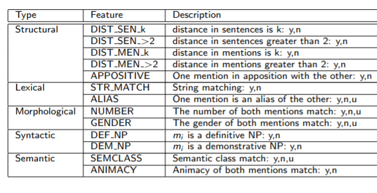
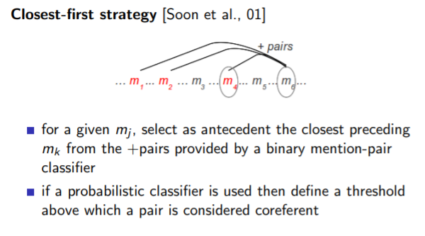
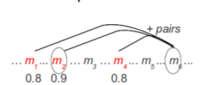
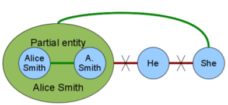
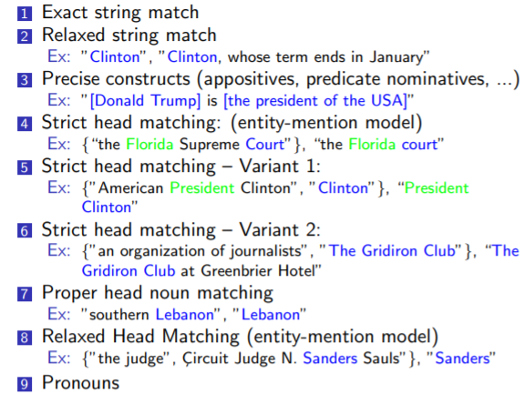

# Coreference resolution

**Goal**: Determining which mentions in a discourse refer to the same real world entity, property or situation.

## Motivation

* Reading machine: required to full understanding text
* Information extraction 
  * Ex: Extract organizations in which a person has worked. 
* Automatic summarization 
  * Ex: Find relevant sentences related to a particular person. 
* Question Answering: 
  * Ex: Answer factual questions such as Where has Mary Doe been working?

## Types of referent

* Referring expressions: world knowledge can be necessary for the resolution.

* Pronouns: linguistic information can be useful for the resolution (number, genre grammatical, constraints)

  

## Coreferent, Anaphor, Cataphor

Orthogonal concepts

* **Coreferent**: two mentions refer to the same world entity

* **Anapahora**: a mention (anaphor) refers to a preceding mention (antecedent) and the interpretation of the anaphor depends on the antecedent

  * Example : John Smith (***antecedent***) has been writting for months. He (***anaphor***) ended up sleeping on the bed

* **Cataphora**: the antecedent occurs after the anaphor (cataphor)

  * He (***cataphor***) had been writting for months. Jonh Smith ended up sleeping on the bed.

  

## Mention detection

* Preprocess: POS-tagging, NERC and parsing
* Recursiverly visiting the parse tree, accept the following as mention
  * Pronouns
  * Proper names
  * Maximal noun-phrase projections
  * Coordinated noun phrases

## Mention-Pair odel

Steps:

* Learn a classifier of mention pairs.
* Generate chains

### Exercise

**Identify all the mentions for identity noun-phrase coreference resolution in the following text:**

Mr. Smith was traveling when Lara came back home. He had never been far from his wife. Mrs. Smith closed the door and went to bed thinking of John.

**Extract all positive and negative examples of coreferent mention pairs for closest-first and for best-first strategies**

1) Learn a mention-pair classifier

2) Generate chains

   1) Closest-first strategy

   

   2.  Best-first strategy

## Mention-ranking models

Mention-pair models take profit of independent mention pair decisions between mj and each possible antecedent

Mention-ranking models take profit of decisions between mj and all its possible antecedents. The mention-pair classifier is replaced by a ranker. 

For a given mj , provide a ranking of the set of possible antecedents

**Pros**: take profit of decisions involving all the candidate antecedents. 

**Cons**: always pick an antecedent from the candidates, although the mention in course is not anaphoric.

## Entity-Mention model

The classifier classifies a partial entity and a mention.

Entities characterization:

* Partial entity: a set of mentions considered coreferent during the resolution

* Each partial entity is represented as the set of features of its mentions.

* Each partial entity has its representative mention

  

## Hand crafted Rules

