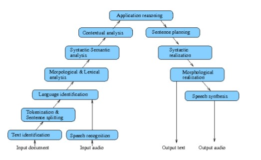
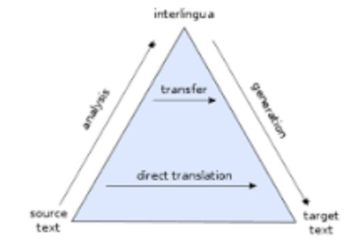

# Introduction to Human Language Technologies

**Definition**: HLT is the technology focused on the study of human language from a computational point of view.

Corpus is a collection of documents in electronic format. 

**Morphology**: structural formation of words

**Syntax**: : structural relations between words in sentences. E.g., a determiner is followed by a common noun

**Semantics**: meenings of words and their composition via syntax.

E.g., the president of USA is Donald Trump → president(USA, Donald Trump)

**Pragmatics**: meaning in the context. E.g., He is very well known in his country [sarcasm]

## Problems

**Multilinguality** 

* Different languages require different models and resources.
* Use of words from other languages:  Estoy a full! (non-standard Spanish text)

**Evaluation**

*  Correctness/suitability of a translation/summary

**Variability** 

* Different sentences refer to one meaning

  Where can I get a map? I need a map

**Ambiguity**

* One sentence refers to different meanings

## Applications

* Text correction
* Plagiarism detection
* Question answering...

## Information Extraction

Extract the relevant information contained in the text

Main subtasks:

* Name entity recognition and classification (NERC)
* Event Extraction
* Relationship Extraction

Depending on the specific task, more in-depth NLP is required. 

## Automatic Summarization

Given a document or a corpus, generate an extract or an abstract consisting of the most relevant content.

Abstractive methods: Generate new text from the conceptual representation of the important information contained in the input text. Require language understanding and generation.

Extractive methods: Select the most important sentences in the input text and produce a summary. The set of sentences should maximize overall importance and coherency and minimize the redundancy.

## Machine Translation (MT)

Translation of written documents, help in human-human communication.

Different MT models differ from the level of NLP they use.

## Dialog Systems

Help users to achieve specific goals by means of natural language interaction.

Main subtasks:

* Interpreting user intervention
* Determining the next system's action considering the user intention
* Generating system's intervention. 