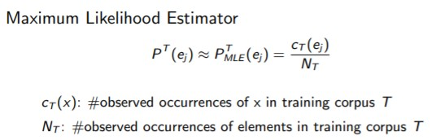
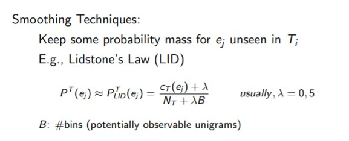

# Document Structure

## Document Types

* Structured documents (web pages)
* Semi-structured documents (web pages containing pieces of plain text)
* Documents with plain text only

## Tokenization

**Goal**: split plain text into basic units

**Use**: IR tasks, text categorization, sentence splitting, language identification, text normalization . . .

Different basic units depending on the task,

* Naïve tokenizations: split by blanks and punctuation marks occurring after alphanum-string.
* Complex tokenizations: names, clitics, abbreviations, collocations. . .

**Word N-gram**: sequence of words occurring in a text.

**Collocation**: sequence of words that frequently occur together. 

## Sentence splitting

**Goal**: Recognition of sentence boundaries in plain text

Language-dependent task. 

### Problems of sentence splitting

Main problems: 

* Abbreviations and acronyms

* Ellipsis
  * (A,B, ...)  but...
* Internal quotation
  * " 'Stop! ' he shouted"

* Ordinal numbers (German)

### Hand-crafted rules for sentence splitting

Specific hand-crafted rules for specific cases

* Abbreviation classes (list of abbreviations)
  * TITLE = ('Mr', 'Mrs', 'Dr')
* Regular expressions for general cases.

The problem is that is high expensive adapt to new languages. 

### Supervised ML 

Most used : ME, SVM, CRF

Require annotated corpora

But the problem in this cases is that requires a very large set of examples. 

### Unsupervised ML

Based on corpus statistics. Easily adaptable to new languages. 

Mainly focus on abbreviations and ellipsis. 

Heuristics and statistics calculated from the training corpus to decide which tokens are abbreviations and when is a sentence boundary. 

## Language identification

Can be seen as a particular classification problem.

Model *M* can be learned from training corpus. 

* Supervised Machine Learning methods

* Statistical Language models.

  

Most model used are unigram language models.

## Unigram Language models

But this model have a problems.  So we need to smoth 

