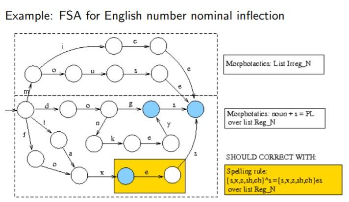

# Morphology

**Definition**: Study of the structure of words as a combination of morphemes

**Types**

* Stems: (e.g., ’work’, ’of’,’mak’[e])
* Affixes
  * Prefixes: in + frequent
  * Suffixes: work + s
  * Infixes: [Arabic] ktb + CuCuC → kutub (books)
  * Circumfixes: en+light+en

The resulting words can be classified into categories known as a Part of Speech (POS): Noun, verb, adjective...

## Types of morphology

### Inflectional morphology

Inflectional morphemes provide morphological information depending on the POS and language of the input word.

**Nouns (N)**

* Genre: niñ-o (M), niñ-a (F) 
* Number : italian-o (SG) , italian-i (PL)
* Case 

**Verbs (V)**

* Tens: want-ed (PAST)
* Mode : Imperative or indicative...
*  Aspect
* Voice

**Adjectives (A)** 

* Genre: (M) or (F) blanco, blanca

* Number: blanco, blancos

* Comparision: cheap-er 

  

### Derivational Morphology

Derivational morphemes can change the POS and the meaning of the word.

## Morphological Analysis

**Goal**: Morphological recognition and parsing.

**Resources needed**: 

* List of regular stems
* List of irregular stems
* List of suffixes and prefixes
* Morphotactics: general rules for combining morphomes.
* Spelling rules: orthographic rules for combining letters.

### Types of morphological processors

Based on dictionaris: list of words forms. 

Based on finite state automata (FSAs)

- languages with complex morphology

Based on finite state tranducers (FSTs)

## Finite State Automata (FSA)

Defines a function over words *w* of a regular language *L*

An FSA can be the union of different FSAs

* Generated from morphological rules
* Generated from spelling rules
* Generated from derivational rules
* Generated from compositional rules

FSAs can be useful for recognising words but are not able to output a word analysis.

## Finite State transducers (FSTs)

Defines a relation between regular languages *L1* and *L2*

### Analysis

1. A FST that computes morphotactics

   

   

2. FSTs each computing a spelling rule

   

​		

​	**Examples**: 

* Consonant doubling: two-syllable word stressed in the last one with ending CVC pattern double last consonant before -ing/-ed EX: control → controlling

* E-insertion: -e added after ending -s,-z,-x,-ch,-sh, before -s EX: flash → flashes

## Spell checkers

**Goal**: Given a piece of text recognise the word forms that do not belong to the text language *L*

**Possible approach**: FSAL OR FSTL S = Tokenizer(text) (sequence of forms) for each x ∈ S if FSAL(x) then print(”x”) else print(”****x****”)

## Spell correctors

**Goal**: Given a word form, provide a list of possible correct forms. 

* Edit distance: minimum number of insertions, deletions, swaps to achieve y from x
* Weighted edit distance: minimum cost of insertions, deletions, swaps to achieve y from x
  * Cost of insertion/deletion = 1
  * Cost of swap = s(a, b): (typo - Manhattan distance in a keyboard)
  * Total cost = d(x, y):
    * Compute cost matrix E, with dimension mXn (lengths of x and y) using dynamic programming
    * d(x, y) = E(m, n)

