# Introduction to Human Language Technologies POS tagging

## Goal and Motivation

* Morphological analysis provides lexical information related to forms (POS, nums, gen, tense,...) so the **goal** for a POS this disambiguate POS of part of speech.

**Examples of applications of POS tagging**

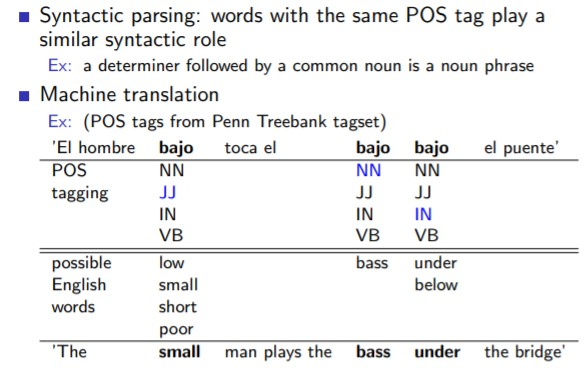

## Open class vs. Closed class

**General classes**:

* Closed class: never invent new closed items ( functional words). Usual subclasses for indo-european languages:
  * prepositions, conjunctions, etc...
* Open class: new open items can be invented. Usual for subclasses for indo-european languages:
  * nouns, non-auxiliary verbs

Each language defines its particular set of subclasses.

Subclasses can be represented with a particular granularity.

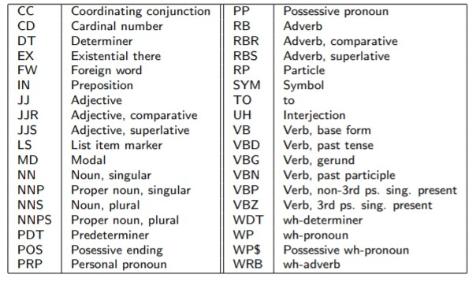

## Stochastic methods

### Stochastic taggers

**Goal** 

Assign the most likely POS-tag sequence to a word sequence.
$$
W = w_1...w_n (a \ word \ sequence) \\
T = t_1...t_n (a \ POS-tag \ sequence) \\
$$
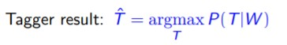

*P(T|W)* is computed applying a Hidden Markov Model

And T is finded applying a Viterbi algorithm. 

**Markov model**

*X = (X1, ... ,XT)* sequence of random variables taking values in observed states *S = {s1, ... sn}

Sequence probabilty P(X)?

**Markov Properties**

* Limited Horizon

  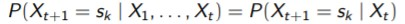

  Time invariant (Stationary):

  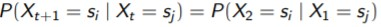

**Transition matrix**:

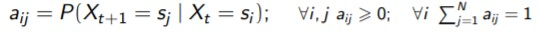

**Initial probabilities**

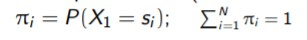

**Example of Markov Model**

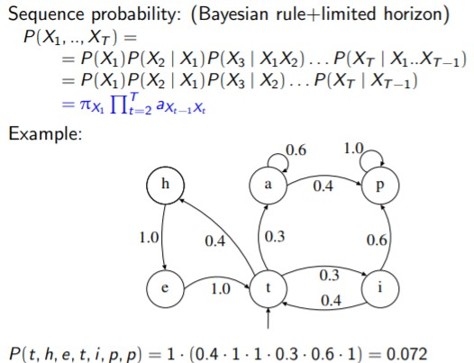

**Hidden Markov Model**

X = (X1, . . . , XT ) sequence of random variables taking values in unobserved [hidden] states S = {s1, . . . ,sN} given a sequence of observations O = (O1, . . . , OT )

**Example Hidden Markov Model**

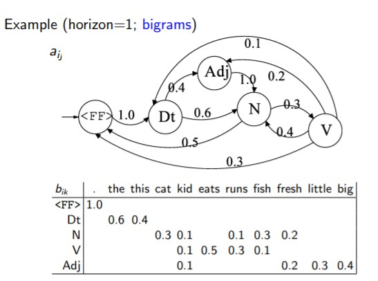

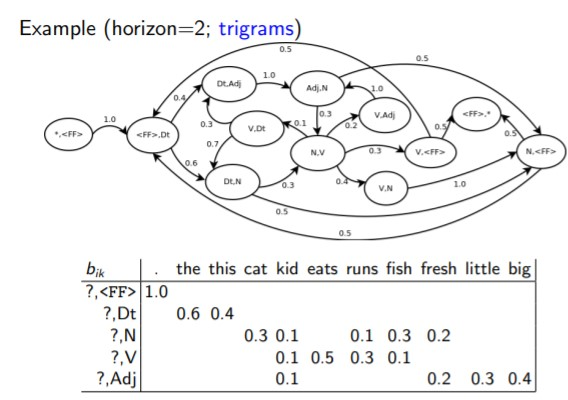

**Learning of Parameters**

* Parameters aij , bik and πi can be estimated over a training corpus C
* Use smoothing techniques
* Use Baum-Welch algorithm

*Note : Ex L4 Slide 21*

The prob of a POS-tag sequence is computed by:

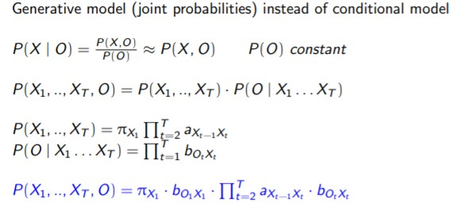

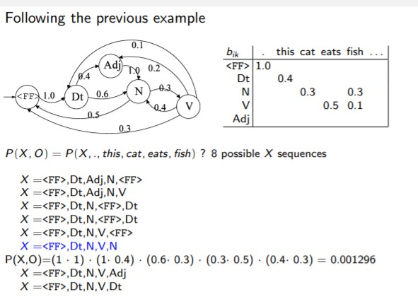

## Viterbi algorithm

**Need Auxiliar Structure**

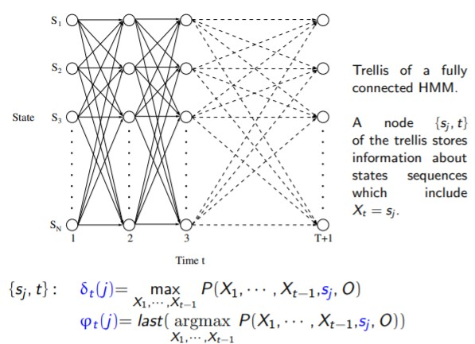

**Algorithm**

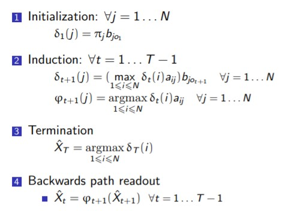

***Note**: Make Ex L4 Slide 30*
