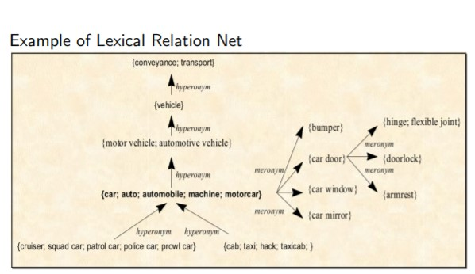
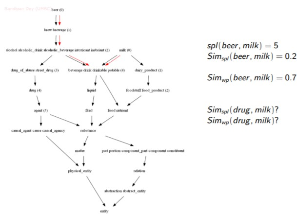
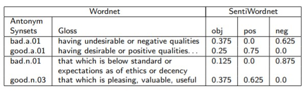
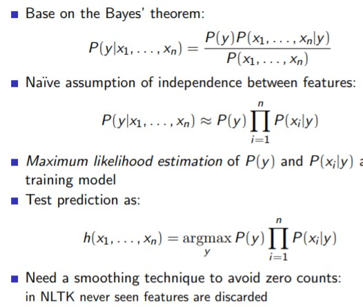

# Semantics

Semantics deals with the meaning:

* Lexical semantics: deals with the meaning of individual words
* Compositional semantics

The motivation of lexical semantics is discover pattern, relations etc...

Knowledge-based resources: represented as graphs. For example **WordNet**

Corpus-based resources: contextual usage of words.

## WordNet

* Free large lexical database of English

  Contains only nouns, verbs, adjectives and adverbs

* Words are grouped into synonyms sets (synsets)

* each synset has an associated gloss and some examples

* synsets are interlinked by means of lexical relations

**Example of lexical relation net**

Ones of the most important lexical relations are:

* Synonym
* Hypernym
* Hyponym

### Similarities in WordNet

* Shortest Path Length: 
  $$
  Sim(s_1, s_2) = \frac{1}{1+SPL(s_1, s2_2)}
  $$

* Leacock & Chodorow:
  $$
  Sim(s_1, s2_) = -log · \frac{1+SPL(s_1,s_2)}{2·MaxDepth}
  $$
  
* Wu & Palmer:

$$
Sim(s_1, s_2) = \frac{2·depth(LCS(s_1,s_2))} {depth_{LCS(s_1,s_2)}(s_1) + depth_{LCS(s_1,s_2)}(s_2)}
$$

where *LCS(s1, s2)* = Lowest Common Subsumer of s1 and s2 depths'(s) = SPL(TopSynset, s)

* Lin

$$
Sim(s_1,s_2) = \frac{2·IC(LCS(s_1, S_2))}{IC(s_1) + IC(s_2)}
$$

Where IC(s) = -log2P(s) = information content of s (from frequencies in a corpus)

---

## SentiWordNet

Extension of wordnet that adds for each synset 3 measures:

* positive score
* negative score
* objective score = 1 - positive_score - negative_score

## Sentiment analysis

Different subtasks:

* **Opinion detection**: given a piece of text (document etc..), is it an objective text or subjective one?
* **Polarity classification**: given a subjective piece of text, is it a positive opinion or negative one?
* **Opinion extraction**: given a subjective piece of text recognize the focuses of the opinion

Unsupervised sentiment analysis

* Possible solution:
  $$
  h(D) = \sum_{s\in D} score(s)
  $$
  

  D is usually the set of synsets related to adjectives, or to nouns and adjectives, or to nouns, verbs, adjectives and adverbs.

* Opinion detection:
  $$
  score(s) = 1 - obj_s \ \ or \ \ score(s) =obj_s
  $$

* Polarity classification:
  $$
  score(s) = pos_s - neg_s
  $$

Pros:

* no need for training corpora

Cons: 

* Low results
* need for POS and WSD taggers

Supervised sentiment analysis

* Possible solution:

  Bag of words with Naïve Bayes
  $$
  h(D) = h(w_1,...,w_n) = argmaxP(y)\prod_{i=1}^n P(w_i|y)
  $$
  where *y* is the category(positive/negative, subjective/objective), and w1,...,wn is the bag of words related to *D*

  * Given a training corupus *C={di}* partitioned into subsets Y1 and Y2

    * $$
      P(y)\sim Y_iP_C{MLE}(y) = \frac{Y_i}{C}
      $$

    * $$
      P(w_i|y)\sim P_{MLE}(w_i|Y_j) = \frac{c(w_i,Y_j)}{\sum_{w_i \in Y_j} c(w_i, Y_j)}
      $$
    
      

* Pros:
  * Higher results
  * no need for POS and WSD taggers
  
* Cons
  * need for training corpora

### Hybrid approach for sentiment analysis

* Combine two supervised methods with SentiWordnet method
* I.e., consensuate the output of the three methods, using voting, for instance:
  * if at least 2 of the methods answer y then output y else output the answer of the method with better accuracy in the training corpus.

The combination improves the results of the isolated methods.

