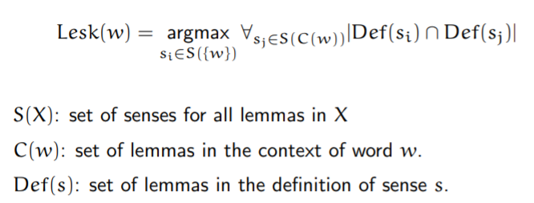
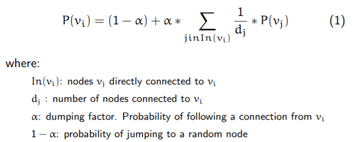

# Word Sense Disambiguation

## Usefulness of  WSD

WSD is a potential intermediate task for many other NPL tasks.

WSD capabilities are involded in many applications:

* Machine Translation
* Information Retrieval
* Speech Synthesis and Recognition
* Natural Language Understanding

## Resources

**Sense Definitions**

* Machine Readable Dictionaries
* Bilingual Machine Readable Dictionaries
* WordNets (large lexical databases)

**Corpora**

* Samples with only word labeled for each sample.

* Samples with all words labeled

**Evaluation exercisis** 

* SensEval
* SemEval

## Types of WSD Algorithms

### Classification according to the information source

* Knowledge-based. 
  * From a external knowledge source
* Supervised corpus-based
  * Examples with its correct sense
* Semisupervised corpus-based
  * Most of examples with no sense information
  * 

## Lesk Algorithm

Disambiguates just one word within a context

**Example**

Input: ”pine cone” 

PINE 

1. kinds of evergreen tree with needle-shaped leaves 
2.  waste away through sorrow or illness 

CONE 

1. solid body which narrows to a point 
2. something of this shape whether solid or hollow
3. fruit of certain evergreen trees 

Solution The best intersection is Pine#1 ∩ Cone#3 = 2. 

* sense for ”pine”: Pine#1 

* sense for ”cone”: Cone#3

## Lesk Algorithm simplification

## UKB Algorithm

Disambiguates all words within a context at once

WordNet is seen as an undirect concept graph

Steps:

1. Create the disambiguation subgraph from the content words in the input text
2. Apply PageRank algorithm
3. Provide the output: best ranked synset for each content word in the input text

**How to create the disambiguation subgraph**

1. Take the content words in the input text which have synsets and select their synsets
2. Compute the shortest paths in the WordNet between each selected synset for a word and the synsets associated to the rest of words.

**Apply PageRank algorithm**

* Initially  P(vi) = 1/N where N is the number of nodes in the subgraph
* Iterate the computation of P(vi) until convergence or k iterations

