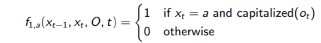
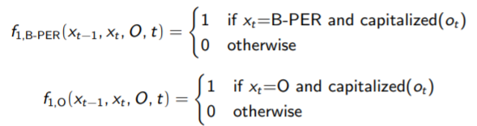
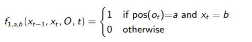
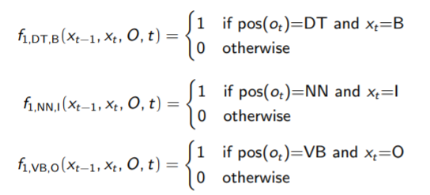

# Word Sequences

## Goal

* Recognize and classify word sequences of these types
  * Named entities (NEs): person, location, organization etc...
  * Noun phrases (NPs)

## Motivation

* **Anonymization**: hide personal information occurring in personal text. (i.e.) Names of person, addresses...

* Information Extraction: (i.e.) Extract employees of companies, their positions...
* Question answering: find the focus of some question types or indexing document
  * Ex: Who was [Albert Einsten] ?
* Machine Translation

## Methods

Based on hand-crafted rules

* Used for simple cases (i.e. basic NPs or simple NEs such as telephones, e-mails...)
* Pattern matching is commonly used (Regular Expressions for example)

Based on discriminative models:

* Learn automatically from training corpus.
* Conditional Random Fields (**CRFs**) are the most used ones.

## Hand-crafted rules for simple cases of NERC

Patterns match words and/or POS-tags

List of keywords and contextual words can be useful for some NE types

* Ex: Names of months, week days...

Patterns use syntatic information

### Hand-crafted rules for basic-NP chunking

***Note**: NP means noun phrase* 

Input: 

* ”The:DT cat:NN eats:VBZ in:IN the:DT dark:JJ room:NN ”

Output:

* ”[NP The:DT cat:NN] eats:VBZ in:IN [NP the:DT dark:JJ room:NN] ”

1. ... (\w+:DT \w+:NN) ... → ... [NP match] ...
2. ... (\w+:DT (\w+:JJ)+ \w+:NN) ... → ... [NP match] ...

or 

3. ...(\w+:DT (\w+:JJ)* \w+:NN) ... → ... [NP match] ...

## Exercise 

1. **Provide NERC patterns for expressions similar to the following ones:**
   1. ”during:IN the:DT next:JJ morning::NN”, ¨ın:IN the:DT evening:NN””after:IN this:DT Sunday:NN”
   2. ”5:CD e:NN”, ”one:CD million:CD dollars:NNS”
   3. "ana.sanchez@gmail.com”, ”ana.sanchez at gmail dot com”
2. **Provide patterns to recognize the basic NP-chunks of the following POS-tagged sentences:** 
   1. ”We:PRP ’re:VB going:VBG to:TO the:DT best:JJ cinema:NN with:IN Gina:NNP ’s:RP father:NN and:CC 24:CD friends:NNS”
   2. ”Workers:NNS of:IN car:NN parks:NNS hate:VB working:VBG after:IN 7:00:Z pm:NN ”

**Solution 1.1**

Define first:

* Moment = '{morning | afternoon | evening}'
* Day = '{ Monday | ...}'

Now we can define the pattern:

... \w+: IN  \w+:DT (\w+ : JJ) * $Moment →  [NP match]

other possible pattern:

... ( \w+: IN (\w+:DT) {0,1} (w+: JJ) * $DAY) → [NP match]

**Solution 1.2**

Define first:

* cur = '{$ | ...}'

Now we can define the pattern

((\w+ : CD) + $cur) 

**Solution 2.1**

... (\w+: PRP) ... → [NP match]

...(\w+: DT (\w: JJ) * \w+: NN)... → [NP match]

... (\w+:: NNP \w+:RP \w+ : NN) ... → [NP match]

... (\w+ CD \w+: NNS) ... → [NP match]

---

## Discriminative Models

Manually labelled sentence in training corpus:
$$
w_1 w_2 w_3 ... [CLASS \ w_i \ w_{i+1}] ... w_n
$$
Is transformed into:
$$
w_1:O \ w_2: O \ ... w_i: B-CLASS
$$
B: beginning; I: inside; O: outside

**Examples:**

NERC

* "The president of [LOC the US] , [PER D. Trump]"
* ”The:O president:O of:O the:B-LOC US:I-LOC ,:O D.:B-PER Trump:I-PER”

Basic-NP chunking

* ”[NP The president] of [NP the US] , [NP D. Trump]”
* ”The:B president:I of:O the:B US:I ,:O D.:B Trump:I”

## Conditional Random Fields

Logistic regressions applied to a sequence

* Based on conditional probability (Discriminative model)

$$
P(X|O) = \frac{1}{Z(O)}· exp(\sum_t \sum_k \lambda_k · f_k(x_{t-1}, x_t O, t)) \\
Z(O) = \sum_x exp(\sum_t \sum_k \lambda_k · f_k(x_{t-1}, x_t, O, t))
$$

*fk* are binary feature functions over states *Xt-1* = s_i and Xt = sj (Markov property) and over observations from O

## Modeling NERC with CRFs

Feature templates can be designed as feature function generalizations

Ex: The current word is capitalized and its tag is a 

Feature functions are automatically generated from feature templates. Some of them will be irrelevant (λi = 0

Ex: Two feature function generated from f1,a

## Modeling NP-chunking with CRFs

States si are tags B, I, O as there is only one class (NP)

**Features templates**

Ex: The POS of the current word is a and the current tag is b

**Feature functions.**

Ex: Three feature functions automatically generated from f1,a,b:

### Exercise

**Write the feature templates for the following descriptions. Provide examples of feature functions generated from them.**

1. NERC
   1. The previous tag is a, the current tag is b and the current word is capitalized
   2. The current tag is a and the next word is w
   3. A person name can be preceded by a title (mr., dr., ...) 

