# Syntatic parsing: grammars

## Goal and motivation

* Syntax studies the combination of words in a sentence.
* Syntactic parsing provides information of the combination of words in a sentence.

So the goal is find the syntactic structure associated to a sentence.

## Types of syntactic structures

### Constituent tree

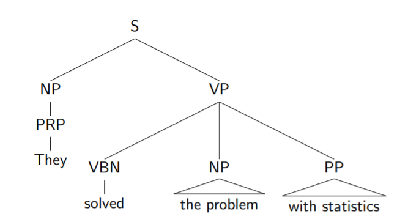

Phrase chunking may be seen as the flattening of this structure.

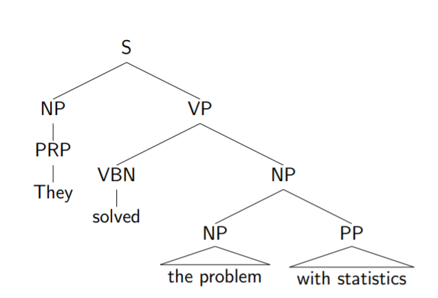

*Other constituent Tree*

### Dependency tree

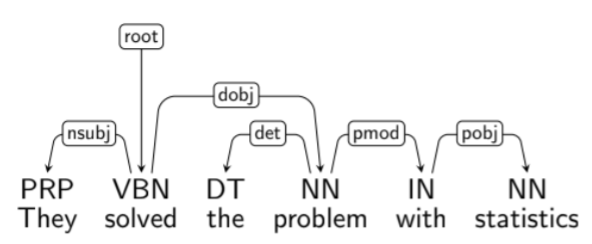

### Theories of Syntactic Structure

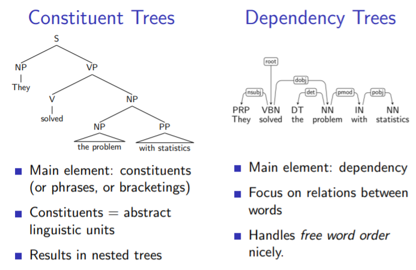

## Context Free Grammars (CFGs)

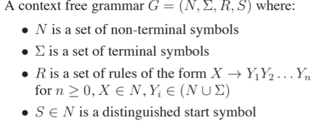

**Example**:

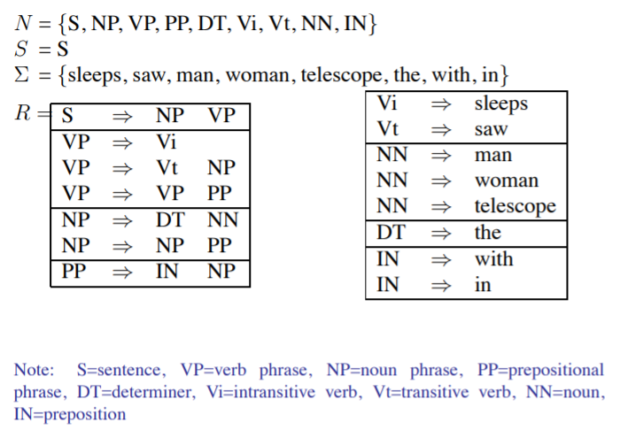

### Left-most Derivations in CFGs

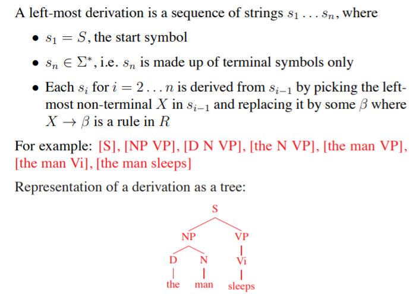

A CFGs:

* Defines a set of possible derivations
* A string s in "sumatori " is in the language defined by the CFG if there is at least one derivation which yields s.
* Each string in the language generated by the CFG may have more than one derivation ("ambiguity")

###   Exercise:

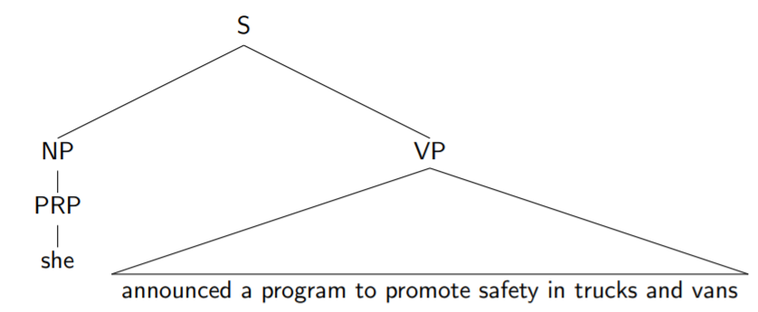

* Give 3 possible interpretations in the form of parse trees
* Provide a CFG to get at least one of the interpretations

**Note**: Solution can find in **8-syntactic-grammars-exercises.pdf**

## Probabilistic Context Free Grammars (PCFGs)

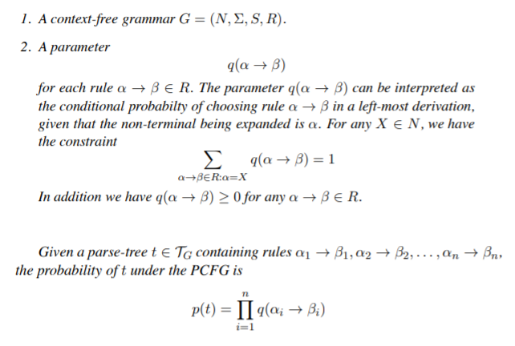

**Example**:

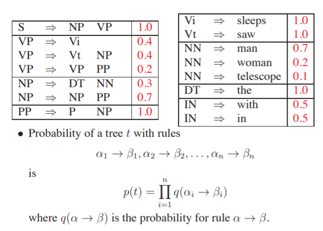

### Properties

* Assigns a probability to each left-most derivation, or parsetree, allowed by the underlying CFG

* Say we have a sentence s,setofderivations forthatsentenceis T (s). Then a PCFG assigns a probability p(t) to each member of T (s).i.e., we now have a ranking in order of probability.

* The most likely parse tree for a sentence s is
  $$
  arg \ max \ p(t) \ \\ t\in \Tau(s)
  $$

**Example**:

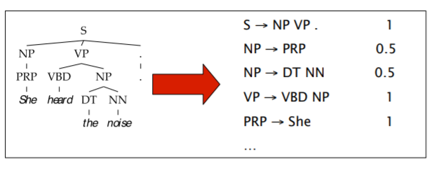

