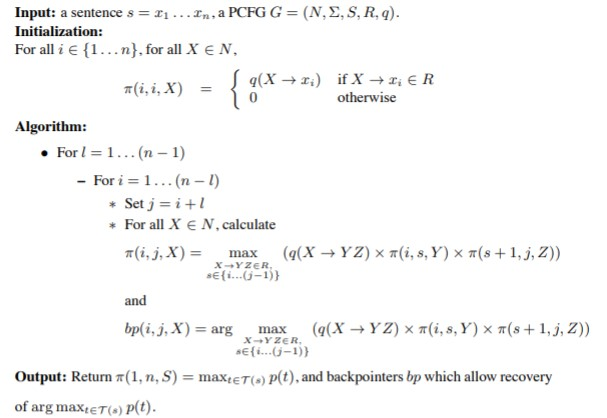

# Syntatic parsing: parsers

## Factors in parsing

Parsing performance depends on many aspects:

* Grammar expressivity (combination of symbols)
* Coverage (words)
* Parsing strategy (bottom-up, top-down)
* Rule Application order
* Ambiguity management

Top-down and bottom-up strategies both lead to repeated derivations when using backtraking. 

## Chart-based Methods

Represent derivations as a directed graph named **chart**

### Chart

* Nodes: positions between words of the input sentence

* Edges: dotted rules subsuming a sequence of words of the input sentence

* Dotted rules represent rules states:

  * Passive rules: A &rarr; B1... Bk
  * Active rules: A &rarr; B1... Bi , Bi+1 ... Bk

  

### Popular char-based algorithms

* CKY algorithm

  * Introduced dynamic programming
  * Limited to CFGs
  * Passive bottom-up chart parser (only passive rules)

* Earley algorithm

  * Any CFG
  * Active top-down parser (Active/passive rules)

* Generalized chart parsing

  

## Chomsky Normal Form (CNF)

### CNF conversion

1. Convert Hybrid rules: replaces terminals with a new non-terminals

   

2. Convert unit productions: A &rarr; *B and B &rarr; *&alpha;*  => A &rarr; &alpha;

   

3. Conver non-binary rules:

   

**Exercise**

Convert the following CFG to CNF

* Conver hybrid rules
  * 6 is a hybrid rule.  PP &rarr; A NP ; A &rarr; with

* Convert unit productions
  - 8 and 10 are unit productions. 
  - NP &rarr; cat | fish | knife
  - VP &rarr; eats
* Convert non-binary rules
  * 4 are a non-binary rule
  * VP &rarr; vtB
  * B &rarr; NP PP

**Solution**

***Note**: Solution is incomplete. Need to add a new rule. on the solution. 11 n &rarr; cat | fish | knife*

## CKY algorithm

* A CFG in CNF is required

* The dynamic programming table can be defined as:

  

* Useful to:
  * determine whether a sentence is generated by the grammar or not
  * Can be extended to find all posible parse trees for the input sentence.

**Exercise**

**Solution**

## Probabilistic CKY

