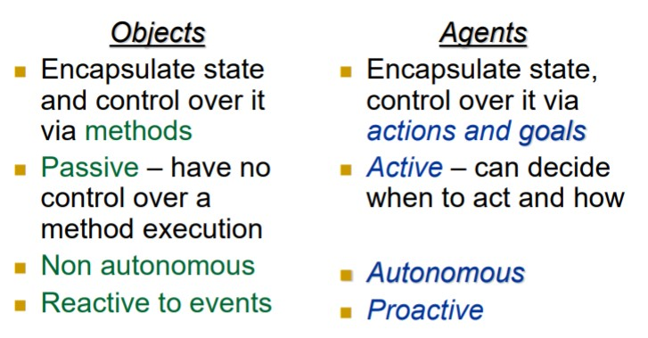

# Introduction to Agents and MAS

Delegation and Intelligence imply the need to build computer systems and can act effectively on our behalf.

This implies:

* The hability of computer systems to act independently.
* The ability of computer systems to act in a way that represents our best interests while interacting with other humans or systems

Agent Definition

An agent is a computer system that is located in a dynamic environment and is capable of independent action on behalf of its user or owner (figuring out what needs to be done to satisfy design objectives, rather than constantly being told)

A multiagent system is one that consists of a number of agents, which interact with one another.

In the most general case, agents will be acting on behalf of users with different goals and motivations.

To successfully interact, they will require the ability to cooperate, coordinate, and negotiate with each other, much as people do.

## Agent Technologies Categories

* Agent-level 
  * Technologies and techniques concerned only with individual agents
* Interaction-level
  * Technologies and techniques concern the communication between agents
  * Communication languages, interaction protocols.
* Organization-level
  * Related to agent societies

---

## Objections to MAS

Agents are assumed to be autonomous, capable of making independent decision so they need mechanisms to synchronize and coordinate their activities at run time

We don’t need to solve all the problems of Artificial Intelligence (i.e., all the components of intelligence) in order to build really useful agents

## Agents vs Objects

Agents are autonomous. They decide for themselves whether or not to perform an action on request from another agent. When a method is invoked on an object, it is always executed.

A multi-agent system is inherently multithreaded, in that each agent is assumed to have at least one thread of active control

