# LECTURE 10: Cooperation in MAS (V): implicit methods

**Hierarchy**

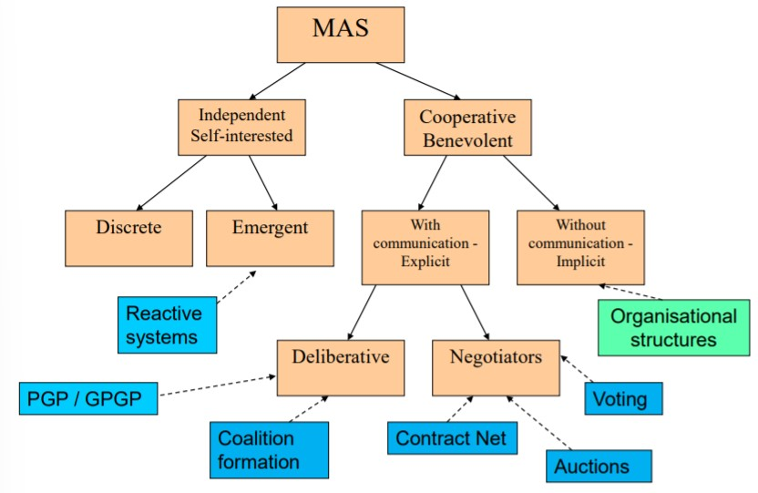

## Implicit cooperation

A group of distributed cooperative agents behaves in a socially coordinated way in the resolution of a global problem without an explicit exchange of communication messages

In many cases the environment acts as the (indirect) interaction mechanism

### Motivation

* Speed: takes to long to communicate with others
* Security: not wanting others to know what your plans are
* Complexity: some agents may be too simple to deal with the task of generating and understanding long plans

### Options:

* Indirect cooperation through the effects on the environment of the actions of each agent.
* Reasoning mechanisms

## Indirect cooperation

* Coordination in cases where:

  * There is no communication between agents
  * There is no mechanism for enforcing a-priori social rules

  

**Example**

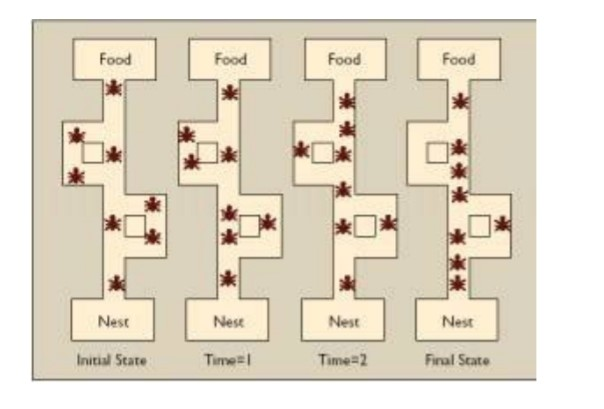

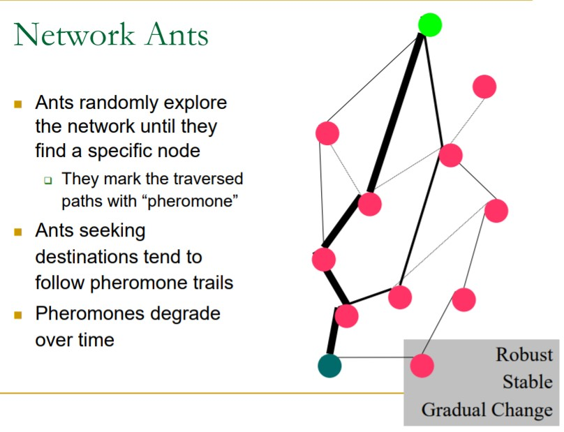

### Pheromone tables

* Each node contains a table of probabilities (pheromone table) for each possible destination in the network
  * In a 30-nodes network, each node keeps 29 tables

* The entries on the tables are the probabilities which influence the ants’ selection of the next node on the way to their destination node
* Pheromone laying = updating probabilities

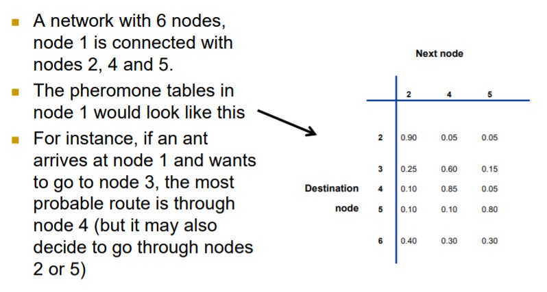

* Pheromone tables are initialized with random values.
* At each step, ants can be launched from any node in the network, with a random destination node.
* Ants move from node to node, selecting the next node to move to according to the probabilities in the pheromone tables for their destination node.
* When ants arrive at a node, they update the probabilities of that node’s pheromone table entries corresponding to their source node

### Basic ideas of implicit cooperation

* Agents do not talk to each other directly
* Agents can modify the environment, and these modifications influence the behaviour of the other agents in the system
* All the agents contribute towards a useful global behaviour of the community

## Agent modelling

* Recursive modelling method
  * Try to deduce their beliefs/desires/intentions from their actions on the environment
* Plan recognition
  * Analyse the sequences of activities of other agents and try to discover their plans.
* Game Playing / Game Tree Search:
  * Modelling opponents (e.g. minimax search)

## Institutions

Are a kind of social structure where a corpora of constraints shape the behaviour of the members of a group

The definition includes:

* Norms about the interactions
* Procedures and protocols to be followed
* Conventions: acceptable (and unacceptable) actions within the institution

An e-Institution is the computational model of an institution through

In the context of MAS, e-institutions:

* reduce uncertainty about other agents’ behaviour
* allow agents to foresee the outcome of an interaction
* simplify the decision making process 

## AMELI

Is an institution middleware that is based in a formal electronic institution specification tool.

Two hypotheses:

* All agent actions are messages, observable by the e-institution.
* An agent should never break the norms.

### Objective

* Mediate and facilitate agent communication within conversations (scenes).
* Guarantee the correct evolution of each conversation.
* To guarantee that agents’ movements between scenes comply with the specification

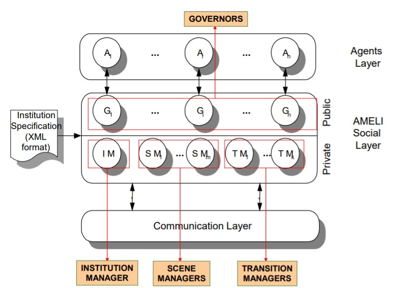

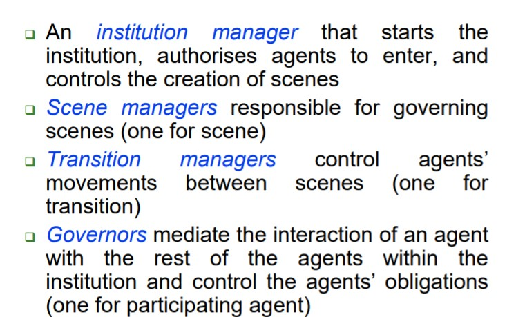

## Organisational Structures

Define a pattern of information and control relationships between individuals, which shapes the types of interactions among them.

Aids coordination by specifying which actions an agent will undertake.

Social structure-based methods impose restrictions or norms on the behaviour of agents in a certain environment.

* avoid many potential conflicts, or ease their resolution

## Sociology and Societies

The aim of any society is to allow its members to coexist in a shared environment and pursue their respective goals in co-operation with others.

Sociology is a discipline that results from an evolution of Philosophy in order to describe the interactions that arise among the members of a group, and the social structures that are established

## Organisation studies

Organisation theory is a descriptive discipline, mainly focusing on explaining and understanding how organizations work.

Organisation design is a normative, design-oriented discipline that aims to produce the frameworks and tools required to create effective organisation.

* involves the creation of roles, communication processes and formal reporting relationships in an organization.
* Two phases:
  * Strategic grouping, which establishes the overall structure of the organization.
  * Operational design, which defines the more detailed roles and processes

Three main kinds of organizations:

* Markets
* Networks
* Hierarchies

### Market Structures

There are agents that provide services, agents that require services (and pay for them), and intermediate agents.

All these self-interested agents are involved in negotiations

### Network structures

They are well-suited for environments where (dynamic) collaboration among parties is needed 

There are contracts established in a dynamic way between the agents of the system

Coordination is achieved by mutual interest

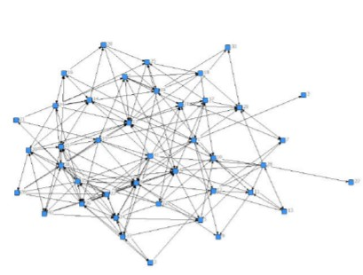

### Hierarchies

Agents are specialized in concrete tasks and fully collaborative.

Coordination is achieved through command and control lines in a closed society.

## Social abstractions

Roles identify activities and services necessary to achieve social objectives and enable to abstract from the specific individuals that will eventually perform them.

* From the society design perspective, roles provide the building blocks for the agent systems that can perform the role .
* From the agent design perspective, roles specify the expectations of the society with respect to the agent’s activity in the society.

Role dependency between two roles means that one role is dependent on another role for the realization of its objectives.

## Agent Societies - Models

Formal role models reflect social competence of agents (rights and obligations) and allow to ensure a global behaviour of the system while also preserving individual flexibility.

Interaction models reflect workflows and business processes.

**Example Product hierarchy**

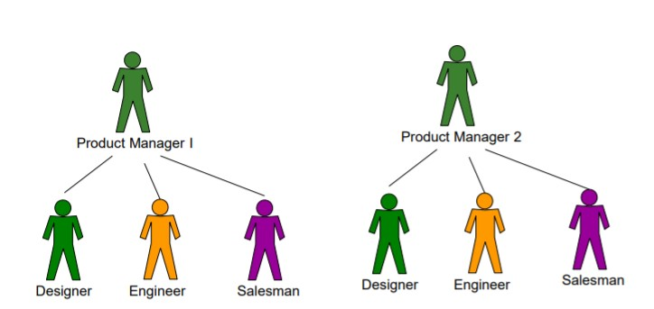

There is a dedicated team for each product (type of car) to be produced.

Easy coordination within each product team.

It might be a good option if products are quite different from each other.

**Example 2 Functional Hierarchy**

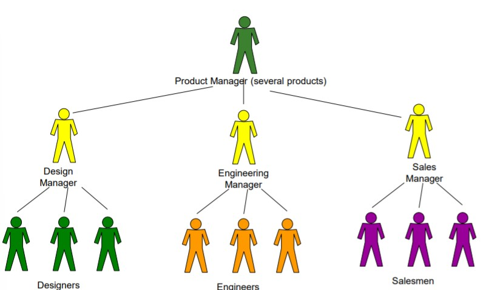

Actors with the same role work together under the supervision of a manager.

A general product manager coordinates all the activities of all the departments.

The specialised actors can work in tasks reusable in different products (e.g. designing and engineering the air-conditioning system).

The resources in each department can be easily shared by its members.

**Example 3 Product + Functional Hierarchy**

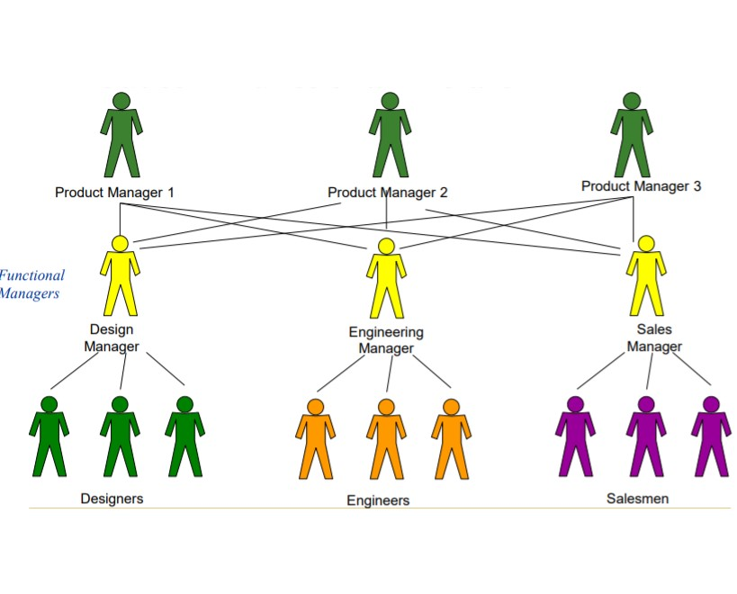

There are specialised departments, with a manager for each of them (department head, or functional manager).

There is a product manager for each product, who talks to the functional managers.

Functional managers act like brokers

Brokers are in contact with possible ”workers” and will choose the best for each task.

Few connections and communication messages are required.

A lot of work for functional managers.

* Receive requests from several product managers.
* Coordinate the work of a team of agents.
* Identify common subtasks, manage shared resources

The failure of one product manager does not affect the others.

**Example Flat Structure**

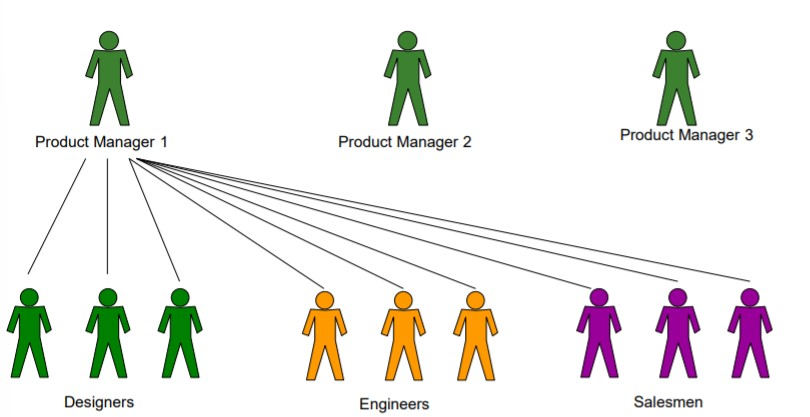

There is a product manager for each product, who talks directly to the low-level workers.

A product manager may have to communicate with many different agents, and these agents have different abilities/expertise/vocabulary.

Furthermore, there may be inefficiencies in the global behaviour:

* A designer could have work in 2 products, while another designer does not have any work.
* Two engineers could be working in similar problems in two different product.
* Difficult to solve even with a high-level global coordinator.

