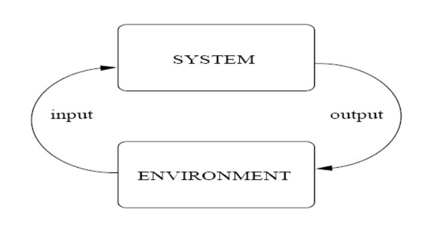
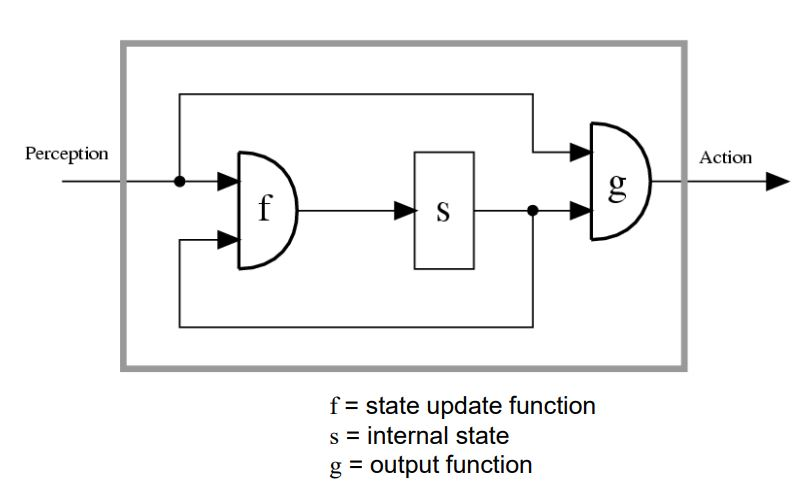
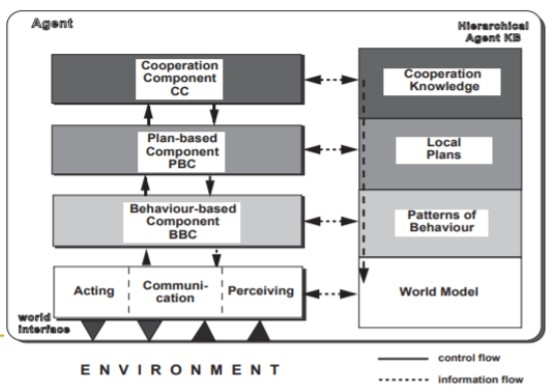

# LECTURE 2: AGENT ARCHITECTURES

## Definitions of agent

1. An agent is anything that can be viewed as perceiving its environment through sensors and acting upon that environment through effectors.

2. Autonomous agents are computational systems that inhabit some complex dynamic environment, sense and act autonomously in this environment, and by doing so realize a set of goals or tasks for which they are designed

2. An autonomous agent is a system situated within and part of an environment that senses that environment and acts on it, over time, in pursuit of its own agenda and so as to affect what it senses in the future

   

An agent has to be able to react in an appropiate way to the dynamic changes in its "environment"

## Kinds of environments

* **Accessible**: agent can obtain complete, accurate, up-to-date information about the environment state.
* **Deterministic environment** : any action has a single guaranteed effect. The physical world can to all intents purposes be regarded as a non-deterministic. **Non-deterministic** environments present greater problems for the agent designer. 
* **Episodic**: The performance of an agent is dependent on a number of discrete, independent episodes, with no link between the performance of an agent in different scenarios. 
* **Static environment** : Static environment is one that can be assumed to remain unchanged except by the performance of actions by the agent
* **Dynamic environment**: A dynamic environment is one that has other processes operating on it, and which hence changes in ways beyond the agent’s control. The physical world and the Web are highly dynamic environments. It is hard to design and implement agents in dynamic environments
* **Discrete environment** Is discrete if there is a fixed, finite number of actions and percepts in it. Real world is a continuous environment.  Discrete environments are much simple than continuous ones. 

## Agent architectures

Two aspects define how the sensor data and the current internal state of the agent determine the actions (effector outputs) and the future internal state of the agent

### Types of agent architectures

1. **Reactive:** Focused on fast reactions/responses to changes detected in the environment.
2. **Deliberative (symbolic)**:  Focused on a long-term planning of actions, centered on a set of basic goals.
3. **Hybrid:** Combining a reactive side and a deliberative side.

## Reactive agents 

Intelligence is a product of the interaction between an agent and its environment.

Behaviour-based paradigm.

**Example**:

* A single ant has very little intelligence, computing power or reasoning abilities.
* The union of a set of ants and the interaction between them allows the formation of a highly complex, structured and efficient system.

### Main characteristics

* Simple agents
* Simple interaction
* Complex behaviour patterns appear as a result of the dynamic interactions
* The global behaviour of the system is not specified a prior
* Agents composed of autonomous modules
* Each module manages a given task
  * Sensor, control, computations
* Basic data from sensors

### Basic schema of reactive architecture

Reactive behaviour: action rules: **S** &#8594; **A ** where S denotes the states of the environment, and A the primitive actions the agent is capable of performing

**Example**:
$$
action(s) = \begin{cases}
Heater \ off, \text{if teperature is OK in state s}
\\
Heter \ on, \ \text{otherwhise}
\end{cases}
$$

### Brooks refutal of symbolic AI

* Intelligent behaviour can be generated withou explicit representations.
* Intelligent behaviour can be generated without explicit abstract reasoning.
* Intelligence is an emergent property of certain complex systems.

* Situatedness: ‘Real’ intelligence is situated in the world
  * The world is its best model
  * The world is always up-to-date
  * A model is an abstraction
* Embodiment: 'Real' intelligence requires a physical body. 

### Subsumption hierarchy

* A subsumption architecture is a hierarchy of task-accomplishing behaviours.

* Each behaviour is a rather simple rule-like structure

* Each behaviour ‘competes’ with others to exercise control over the agent, as different behaviours may be applicable at the same time

#### Behaviour layers

* Lower layers represent primitive kinds of behaviour (such as avoiding obstacles) 
* Higher layers represent more complex behaviours (e.g. identifying an object) 
* Lower layers have precedence over layers further up the hierarchy 
* The resulting systems are, in terms of the amount of computation they do, extremely simple

**Exemple** 

### Advantages of Reactive Agents

* Simplicity of individual agents 
* Flexibility, adaptability 
* Ideal in very dynamic and unpredictable environments
* Low computational cost 
* Robustness against failure
* Elegance

### Limitations of Reactive Agents

* Difficult to make reactive agents that learn dynamic evolution of rules.
* Agents without environment models must have sufficient information available from local environment
* No long-term planning capabilities
* Limited applicability

## Deliberative architecture 

* Explicit symbolic model of the world

* Decisions are made via logical reasoning, based on patter matching and symbolic manipulation

  

### Belief - Desire - Intention (BDI) model

### Human practical reasoning

Two activies:

* **Deliberation**: deciding which state of affairs we want to achieve. The outputs are intentions
* **Means-ends reasoning**: deciding how to achieve these states of affairs. The outputs are plans. 

### BDI plans

Usually have:

* name , goal, 
* pre-condition list. List of facts which must be true for plan to be executed.
* delete list. List of facts that are no longer true after plan is performed 
* add list. List of facts made true by executing the actions of the plan
* body that is a list of actions. 

Intentions (&plans) enable the agent to be goal-driven rather than event-driven

By committing to intentions the agent can pursue longterm goals

### Problems in the deliberative approach

* Dynamic world
  * World changes while planning is being done
* Representation language
  * Expressive enough to be useful in any domain
* Classical planning 
  * High computational cost

## Hybrid Architectures

### Layering techniques

1. Horizontal layering

   * *m* psibble actions suggested by each layer, *n* layers

   

2. Vertical layering

   * *m* possible actions suggested by each layer, *n* layers

   

## Touring machines architecture

Consists of perception and action subsystems, which interface directly with the agent’s environment, and three control layers, embedded in a control framework, which mediates between the layers.

* **Reactive layer** :  implemented as a set of situation-action rules (subsumption architecture)

* **Planning layer** : constructs plans and selects actions to execute in order to achieve the agent’s goals
* **Modeling layer** : contains symbolic representations of the ‘cognitive state’ of other entities in the agent’s environment

## InterRRaP .

Integration of Reactive Behaviour and Rational Planning

Vertically layered

**Behaviour layer**

* Reactive part of the architecture
* Works with the world model
* Only one level interacts with the real world
* Has a set of "situation &rarr; action" rules

**Planning layer (PBC)**

* Works with the mental model
* Standard deliberative level
* Implements local behaviour

**Cooperative planning layer**

* Works with the social model
* Allows planning and cooperation with other agents

## Critiques to hybrid architectures

* Very specific, application dependent
* Unsupported by formal theories