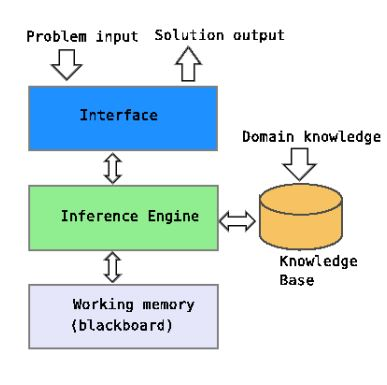
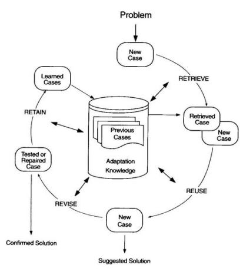

# LECTURE 3: AGENT PROPERTIES

## Flexibility

Computer system capable of flexible action in some dynamic complex environment.

* Adaptative
* proactive
* social

## Reactivity

System that responds to changes that occur in environment. If a program's environment is guaranteed to be fixed, the program can just execute blindly.

### Ways to achieve reactivity

* Reactive architectures
* Deliberative architectures
* Hybrid architectures

## Aspects of proactiveness

* Generating and attempting to achieve goals.
* Behavior not driven solely by event
* Taking the initiative when appropriate
* Executing actions/giving advice/making recommendations/making suggestions
* Recognizing opportunities on the fly

**Example**

Detects the movement of the person around the house and the actions he/she performs

## Social Ability

The real world is a multi agent environment. Some goals can only be achieved with the cooperation of others.

Social ability in agents is the ability to interact with other agents visa some kind of agent-communication language.

## High-level activities

### Coordination

* How to divide a task between a group of agents
* Distributed planning

### Cooperation

* Share intermediate results
* Share resources

### Negotiation (e-commerce)

* Agree conditions in an economic transaction
* Find the agent that can provide a service with the best conditions

## Rationality

* An agent will act in order to achieve its goal.

* It will not act in such a way as to prevent its goals from being achieved

* For instance, it will not apply deductive procedures without purpose

## Reasoning capabilities

* Knowledge base with beliefs on the world

* Capacity to make plans

This is the characteristic that distinguishes an intelligent agent from a more "robotic" reactive-lie agent

## Kinds of reasoning in AI

### Knowledge-based systems / expert system

* Reasoning techniques specialized in the system's domain

### Rule-based systems

* Knowledge is represented as a set of rules

### Case-based reasoning

Using similarity to solved problems

### Approximate reasoning

Fuzzy logic, Bayesian networks, probabilities...

## Learning for improving

* Make less mistakes 
* Do not repeat computations performed in the past 
* Find solutions more quickly 
* Find better solutions 
* Solve a wider range of problems 
* Learn user preferences and adapt the behavior accordingly

## Advantages of learning systems

* Can adapt better to a dynamic environment, or to unknown situations
* Can leverage previous positive/negative experiences to act more intelligently in the future

## Autonomy

Ability to pursue goals in an autonomous way, without direct continuous interaction/commands from the user.

Given a vague/imprecise goal, the agent mus determine the best way to attain it. 

### Autonomy requirements

To have autonomy, it is necessary for and agent to have a control on its own actions (an agent cannot be obliged to do anything). Have a control on its internal state (agent state cannot be externally modified by another agent) and have the appropiate access to the resources and capabilities needed to perform its tasks.

### Autonomy limitations
Sometimes the user may restrict the autonomy of the agent. For instance, the agent could have autonomy to search in Internet for the best place to buy a given book  but the agent could not have the autonomy to actually buy the book, using the credit card details of the user

## Issues

* **Legal issues**: Who is the responsible of the agent's actions
* **Ethical issues**: What extent should decisions be delegated to computational agents

## Temporal continuity

Agents are continuously running processes. Running active in the foreground or sleeping/passive in the background until certain message arrives

## Mobility

Agent can move physically through a network to another computer and continue their execution there.

In most applications the idea is to go somewhere to perform a given task and then come back to initial host with the obtained results. 

***Note**: See example in Lecture 3 Slide 28*

## Problems of mobile agents

* **Security** : How can I accept mobile agents in my computer?
* **Privacy** : Is it secure to send an agent with the details of my credit card or with my personal preferences?
* **Technical management** : Each computer has to be able to "pack" and agent, send it and receive agents form other machines. 

## Conclusions

It is almost impossible for an agent to have all those properties.

 Most basic properties:

* Autonomy 
* Reactiveness 
* Reasoning and learning
* Communication

