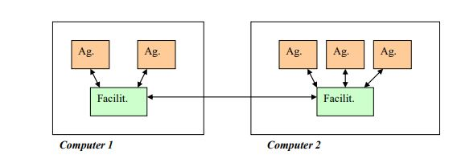

# LECTURE 4:  AGENT  TYPES

## How to classify Agents

An initial classification was made based on the properties that are emphasized in a particular agent , reasoning, mobility etc... or by purpose

## Classifying agents by purpose

### Collaborative Agents

* Emphasize communication and cooperation with other agents
* Typically operate in open multi-agent environments (MAS)
* Negotiate with to reach mutually acceptable agreements during cooperative problem solving
* Collaborative agents are usually deliberative agents (BDI model), with some reasoning capabilities

**Applications**

* Provide solutions to physically distributed problems (air-traffic control etc...).
* Provide solutions to problems with distributed data sources. (different offices of a multi-national business)
* Provide solutions that need distributed expertise
  * health care provision (HeCaSe)

---

### Interface Agents (or User Agents)

* Emphasize autonomy and learning in order to perform tasks for their owners 
* Support and provide proactive assistance to a human that is using a particular application or solving a certain problem 
  * Anticipate user needs 
  * Make suggestions 
  * Provide advice

Interface Agents have a limited cooperation with other agents, reasoning and planing capabilities. 

Interface Agents need to learn about user. At the beginning of the service it could not be very helpful but with the experience it will improve.

**Applications**

* Mail management
* Scheduling meetings
* Internet browsing
* News filtering agent

**Problems of interface agents**

*  Slow learning curve (require many examples)

* Learning from scratch

---

### Information Agents

* Software agents that manage the access to multiple, heterogeneous and geographically distributed information sources. 
* Information agents = Internet agents 
* Main task: proactive acquisition, mediation and maintenance of relevant information for a user/other agents

**Applications**

* Information acquisition and management

  * Provide transparent access to different information sources
  * Monitor information sources
  * Update relevant information on behalf of the user

  * Personalized presentation of information
    * Learn automatically user preferences
    * Adapt dynamically to changes in user preferences

Information agents must help in the task of information retrieval

---

### Facilitator agents

* Flat system

  * Each agent can talk directly to any other agent

* Federated system

  * There are special agents that manage the connection of the system with the users and the communication between the agents

  

Agents do not communicate directly, but through facilitators and can help agents to find other agents in the system that provide some services

**RETSINA agents**

* Interface agents: input/output, learn from user actions

* Task agents: encapsulate task-especific knowledge, used to perform/request services to/from other agents/humans *
  * They can coordinate their activites 
* Middle agents: infrastructure service (e.g. they know the services provided by other agents) 
* Information agents: monitor and access one or more information sources

Broker agents: in addition to facilitate the connection with users or providers, they can: 

* Store data about the resources available (cache)
* Select which agents should be contacted
* Collect, merge and filter answers
* Coordinate with other brokers

---

### Translators and Wrappers

**1.Translators**

Agentification is the ways to transform a standard application into an “agent” that can be integrated and participate in a multi-agent system of collaborative agents to help to solve complex distributed tasks

* “Bridge” between the application and the other agents 
* Takes the messages of other agents, and translates them to the program communication protocol (and the other way round)

**Advantages of translators**

* The code of the application does not have to be modified
* We only need to know the inputs/outputs of the application 
* The same translator can be used to agentify different applications/resources

**2.Wrapper**

**Positive aspects** 

* More computationally efficient than translators 

**Negative aspects** 

* We need access to the application source code
* It may not be easy to understand/modify the code of a complex application
* A wrapper is not reusable as a translator
  * One wrapper for each program to be agentified

**Note**: Check L4 35 . Rewrite code