# Agent Communication

Remember that Multi-agent Systems are a collection of deliberative, autonomous, collaborative agents, that may communicate and cooperate with each other to solve complex distributed problems.

Each agent is specialised in the solution of a particular kind of problems

The process of solving a complex problem is reduced to solving easier subproblems

### Efficiency

Different agents are working at the same time in different parts of a problem.

### Reliability

Avoid single point of failure in centralised systems. We can have redundancy. If an individual agent fails, the other agents can take its work and re-distribute it dynamically

## Task descomposition

* Divide a complex problem into a set of tasks

* Decompose a large tasks into a subtasks that can be tackled by different agents

* Tasks can be totally independent or can have some relationships

  

## Task allocation

Assign the subproblems to different agents

Easy case: there is only one agent capable of solving each subproblem

Interesting case: the same subproblem can be solved by different kinds of agents

## Task accomplishment

Each agent solves its assigned subproblems.

This phase can be done without communication if the problems are independent

In some cases,there may be dependencies between subproblems

## Conflict management

**Example**

* Two sub-solutions are incompatible
* Conflicts in the use of shared resources

Agents have to communicate with each other to solve these situations

## Agent support in task execution

### Task sharing

An agent can request the help of other agents to solve a particular task

### Result sharing

Use intermediate results obtained by other agents.

Agents can provide intermediate subsolutions to help other agents in their work

## Result Synthesis

Put together the results of all agents to find the complete solution

## Summary Questions about the desing of a collaborative MAS

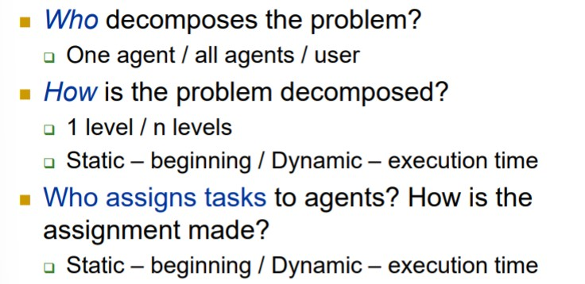

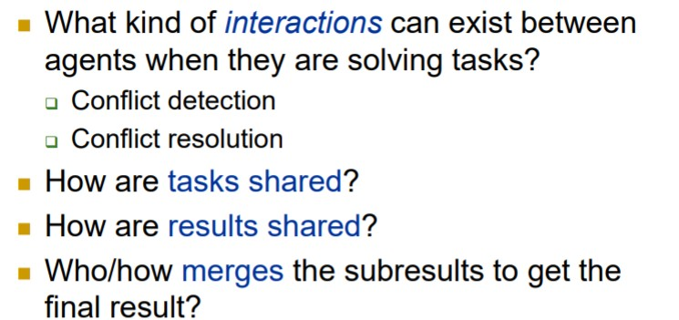

## Communication 

### Categories

* Mechanistic manner
  * via the type of sendee-addressee link
  * via the nature of the medium
* meaning-based manner
  * via the type of intention

### Addressee Link

* Point to point
  * Agent talks directly to another agent
* Broadcast
  * Agent sends some information to a group of agents
* Mediated
  * The communication between two agents is mediated by a third party

### Communication via facilitator

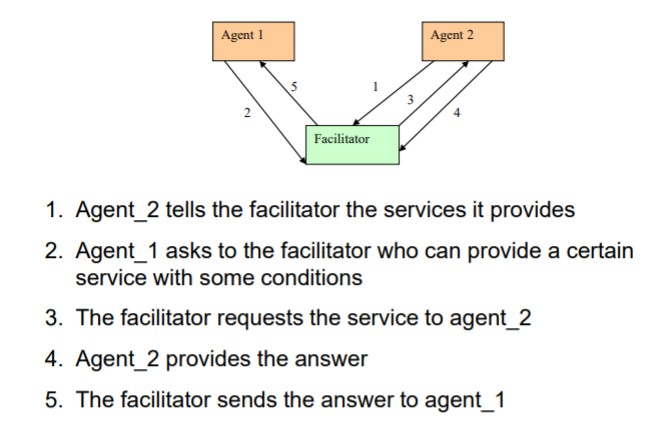

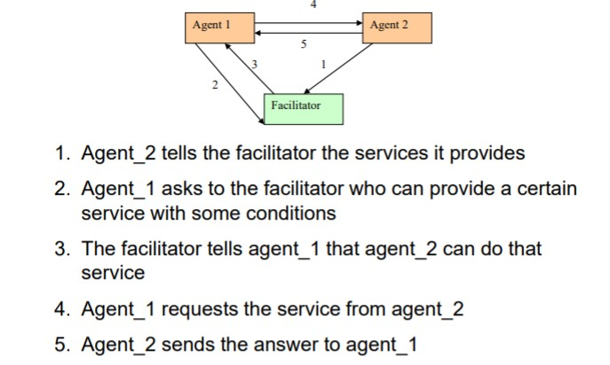

### Nature of the medium

* Direct routing
  * Message sent directly to other agent(s) with no interception
* Signal propagation routing
  * Agent sends signal whose intensity decreases according to distance

* Public notice routing
  * Blackboard systems

### Blackboard systems

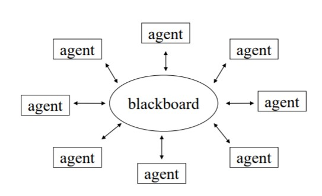

Information in blackboard

* Data of the common problem
* Current state of the solution
* Next subproblems to be solved
* Requests of help
* Present task of each agent
* Intermediate results

Uses of blackboard

* Detect conflicts

* Notice incompatible solutions

* Share results

* Share tasks

  

**Positive aspects**

* Flexible mechanism for communication/cooperation
* Independent of cooperation strategy

**Negative aspects**

* Centralised structure
* Single point of failure
* Everyone has to read/write info from the blackboard

### Message passing

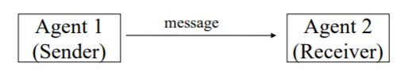

**Types of speech act**

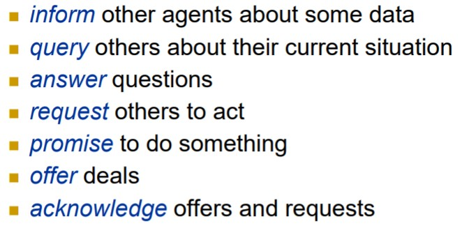

**Examples**

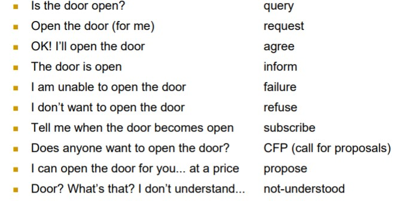

Speech act have two components, a performative verb ( request, inform etc...) and a propositional content ("the door is open")

Standards in commnication allow different groups to write cooperating agents. 

### FIPA (Foundation for Intelligent Physical Agents)

**Contents**

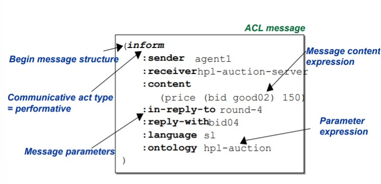

**Parameters**

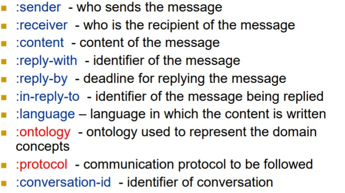

**1.INFORM**

* Content: Statement
* The sender informs the receiver that a given proposition is true

**2.Query-if**

* Content: proposition
* The sender asks the receiver if a given proposition is true

**3.Query-ref**

* Content: descriptor
* The sender asks the receiver for the object referred by the descriptor

**4.Request**

* Content: Action
* The sender requests the receiver to perform some action

**FIPA-Query protocol**

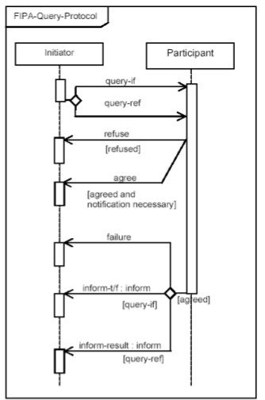

**FIPA-Request protocol**

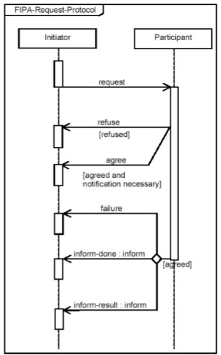

**The Contract Net protocol**

An agent asks for other agents to solve a task that it cannot do.

It is a task-sharing protocol consisting in:

1. Recognition

   * In this stage, an agent recognize that have a problem and need help

2. Announcement

   * Sends out an announcement which includes a specification of the task to be achieved
   * This must encode the description of the task, any constraints ( deadlines, quality etc...)
   * Is in broadcast

3. Bidding

   * Agents that receive the announcement decide for themselves wheter they wish to bid for the task.
   * If an agent chooses to bid, then it submits a tender, detailing the conditions on which it can execute the task

4. Awarding

   * The agent that sent the task announcement must choose between bids and decide who to "award the contract"

5. Expediting

   * The successful contracto then expedites the task

   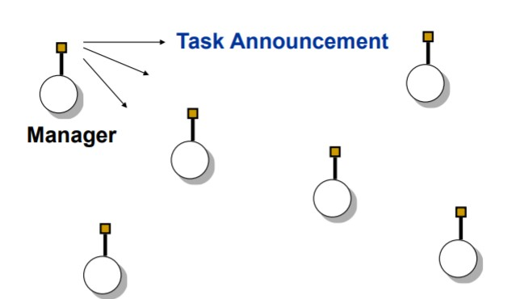

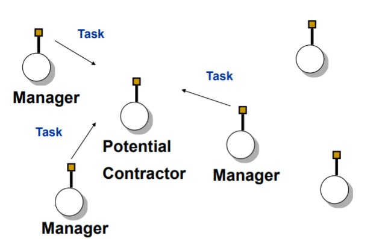

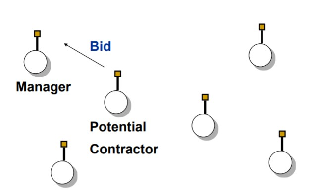

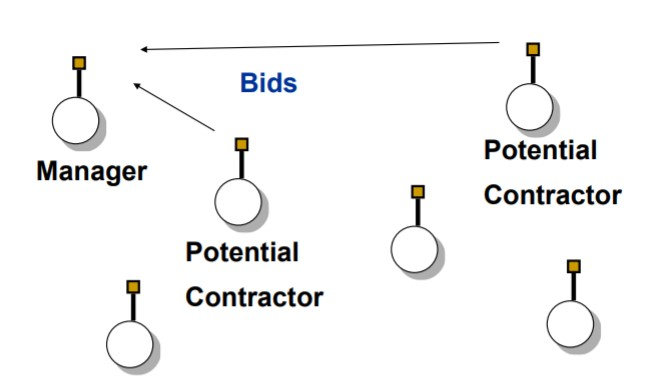

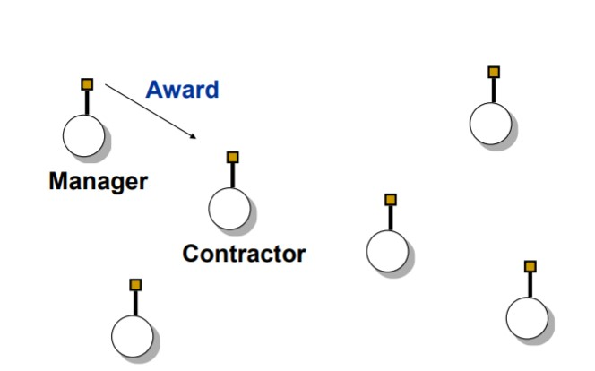

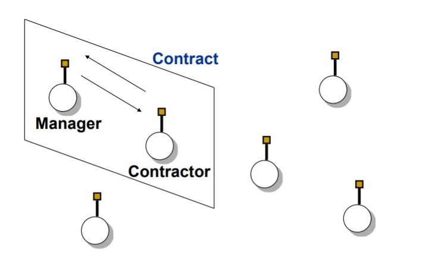

Manager considers the submitted bids using a domain specific bid evaluation procedure

## Ontologies for communication

Ontology defines a common vocabulary and a shared understanding of domain among a set of agents.

### Ontology Web Language (OWL)

**Components**

* RDF Schemas Features
* Equality and Inequality
* Property Characteristics
* Property Restrictions
* Logical Operators

**RDF Schemas Features**

Define the basic ontological components

* Classes
* Subclasses
* Individuals
* Properties
* Subproperties
* Domain
* Range

**Classes**

 Are sets of individuals with common characteristics.A Class should be described such that it is possible for it to contain Individuals.

**Subclasses**

Define class specializations by constraining their coverage. Ex: Breast Cancer is a subclass of Cancer

**Individuals (Instances)**

Specific objects in the domain. Individuals may be (and are likely to be) members of multiple Classes.

**Properties**

Can be used to state relationships between individuals or from individuals to data values

Eg: hasSymptom, isCausedBy, Author

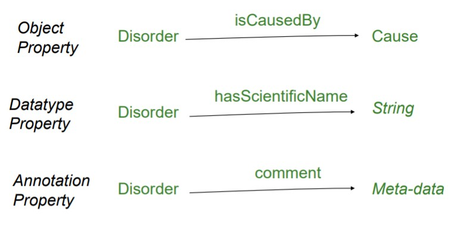

**Sub Properties**

Defines properties specializations by constraining their coverage.

Ex. hasScientificName is a subPropertyOf hasName

**Domain**

It indicates the individuals to which the property is applied.

If a property relates an individual A to another individual B, and the property has a class C as its domain, then the individual A must belong to class C.

Ex. hasSymptom has the domain Disorder

* X hasSymptom Y &rarr; X is a Disorder

**Range**

It indicates the individuals that receive the application of the property

Ex. hasSymptom has a range of Symptom

* X hasSymptom Y &rarr; Y is a Symptom

  

**Equality and Inequality**

OWL terms that allow expressing equalities and inequalities between ontological components

Ex:

* EquivalentClass: two classes are equivalent
* EquivalentProperty: two properties are equivalent

**Property Characteristic**

Define the semantics of properties

* InverseProperty: one property is the inverse of another (hasSymptom,isSymptomOf)
* etc...

**Property Restrictions**

Define constraints on the use of properties

* AllValuesFrom: all the values in the range of a property belong to a given class
* SomeValuesFrom: at least one value in the range of a property belongs to a given class

**Logical Operators**

Define classes out of other classes

Ex: 

* IntersectionOf
  * Tuberculosis_Symptoms = Fever IntersectionOf Coughing_Blood
* UnionOf
  * Flu_Symptoms = Fever UnionOf Vomi

* ComplementOf
  * StandardDisorder = ComplementOf ContagiousDisorder
* OneOf: defines a class by enumerating all the individuals that belong to it
  * Hospitals is OneOf {University-Hospital}, {St_John}, {City-Clinic}

**Conclusions**

OWL is a language for representing ontologies, which extends frame languages

OWL has a rich set of features