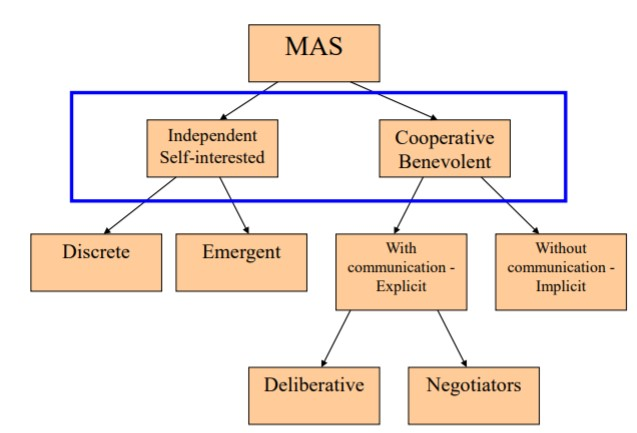
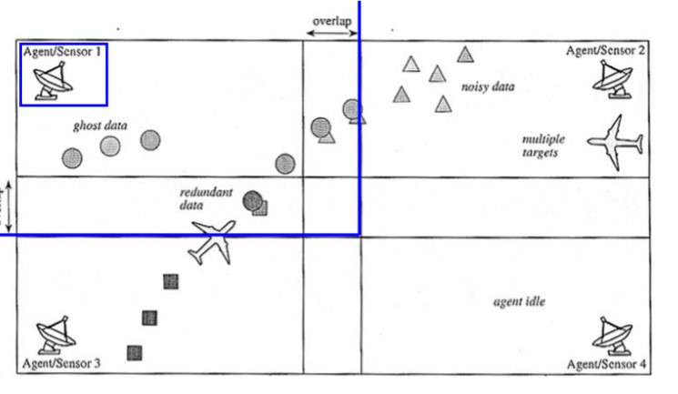
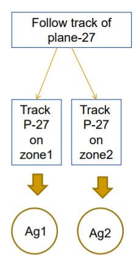
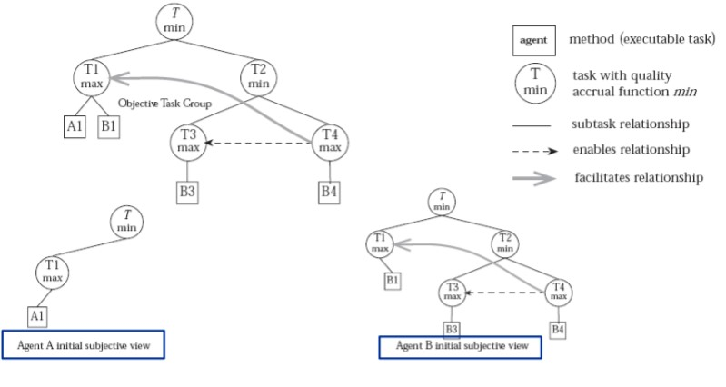
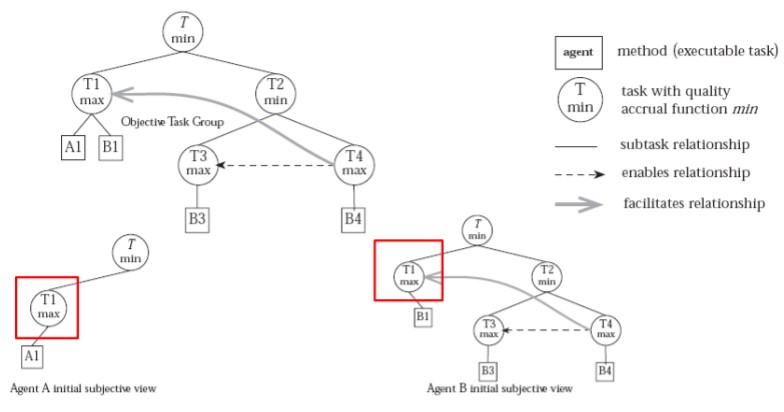
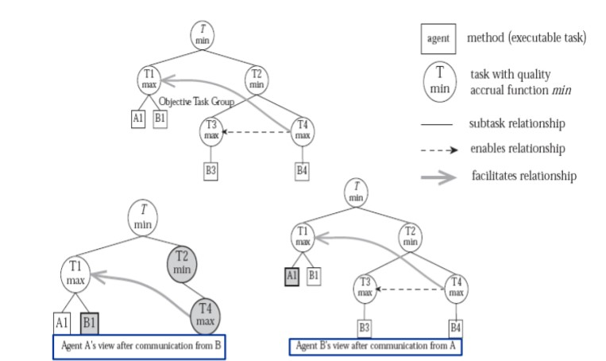

# Lecture 6: Cooperation in MAS

**What is coordination?** Coordination is the process by which an agent reasons about its local actions and the (anticipated) actions of others to try and ensure that the community acts in a coherent manner. 

We neet to use coordination when the order or time in which actions are carried out affects performance and there are subproblem dependencies.

## Components of coordination

Deciding for each agent in the context of a multiagent system

* What activities it should do and when it should do them 
* What it should communicate, when it should communicate and to whom

So Agents need Domain information and Control information.

Coordination depends on ability to cooperate.

---

**Cooperation hierarchy**

## Benevolent Agents

Design agents to help each other whenever asked.

Problem-solving in benevolent systems is cooperative distributed problem solving.

### Cooperative agents

The agendas of the agents include cooperating with other agents in the system in some way.

* Explicitly: intentional sending and receiving of communicative signals (e.g. via a common blackboard or via messages)
* Implicitly: without explicit messages (e.g. observing and reacting to the behaviour of the other agents of the system)

**Deliberative Agents with communication explicitly**

Agents with inference and planning capabilities.

Has a Partial Global Planning (PGP) that is a distrubted planning thechnique. 

The tasks are inherently distributed and each agent performs its own tasks

**Partial Global Planning phases**

1. Create local plans.

   * Each agent has a local plan
   * The plan can store other information like derived objectives.
   * Plan has to be easily modifiable at run time

2. Exchange local plans.

   * The agents exchange information about their local plans with other agents 
   * Each agent must have knowledge about the MAS organisational structure, so that it can decide which information to send to which agents

3. Generate Partial Global Plans.

   * Each agent models the collective activity of the system by combining the received local partial plans into a Partial Global Plan
   * Check dependencies between the received information and its own local plan
   * Identify when the goals of one or more agents can be considered subgoals of a single global goal: partial global goal
   * Identify opportunities to improve coordination

   **Example**

   Partial global goal: final aim of the global plan.

   Plan Activity Map: plan actions to be executed concurrently by itself and the other agents, including costs and expected results of actions.

   

   

4. Optimize Partial Global Plans

   * Each agent has a Planner Module, especialised in analyzing the received information to detect if there are several agents working on the same goal. This information is put in the Plan Activity Map, along with the expected future behaviour and expected results of the other agents.

5. Building the solution

   * From the modified Plan Acitivity Map, each agent builds a Solution construction Graph that includes specifications about a partial results, when to exchange them and who to exchange. 

**Possible optimizations of Local Plan**

* Task reordering
* Task reallocation

The advantages of PGP is that system has a highly dynamic behaviour so all plans can be adapted to dynamic changes in the environment (Flexibility)

**Generalised Partial Global Planning (GPGP)**

Set of modular coordination mechanisms

Each mechanism responds to certain features of the problem tasks, posing scheduling constraints (to the own agent or other agents).

Mostly domain-independent (except initial determination of tasks interrelationships)

**Tasks relationships**

Example: 

* A enables B: A must be executed before B
* A facilitates B: executing A makes it possible to solve task B more quickly and with more quality
* The general task structure is an AND-OR tree

***Note**: Min= AND node , Max = OR node*

Coordination mechanisms (CMs) analyse the task structure and the relationships between tasks to determine scheduling restrictions, and make commitments based on them (a specific task should be finished before a certain deadline with a given quality)

Local scheduler constructs a possible schedule based on the local and non-local commitments.

***Note**: Task T1 may be solved by both agents*

**CM: Management of hard coordination relationships**

* If A enables B, the agent that can make an action to complete A makes a commitment to finish A as early as possible (so that it gives the maximum space for B to be scheduled – by the same agent or other agents)

* If A facilitates B, an agent can make a commitment to finish A as early as possible, if it is possible (so that it gives to B the possibility to be solved faster and with better results)
* If A hinders B, an agent can make a commitment to finish B as early as possible, if it is possible (so that its execution time and solution quality are not disturbed by solving A)

**Redundancy detection**

If two agents commit to actions that solve the same task, they apply a common algorithm to decide who takes the task and who abandons it. 

Options:

* Random choice
* Choose agent that obtains solution faster
* Choose agent that obtains a better solution 
* Choose agent that has less assigned tasks

**Conclusions of GPGP**

* Using the commitments information and the schedules, the agents agree in the distribution of the tasks and the final plan.
* The different coordination mechanisms can be adapted to each problem by using different policies (diff modules).
* Managing dynamic problems can be easy with this method.

## Self-Interested Agents

If agents represent individuals or organizations, then we cannot make the benevolence assumption. Agents will be assumed to act to further their own interests, possibly at the expense of others.

### Discrete

* Independent Agents
* Each agent pursues its own agenda and the agendas of the agents bear no relation to one another. No cooperation

### Emergent

Agents can cooperate with no intention of doing so.

**Important Factors**

Agents don't need to know about each other, don’t communicate with each other. Don't have special roles. The environment is affected by the actions of all individuals.

