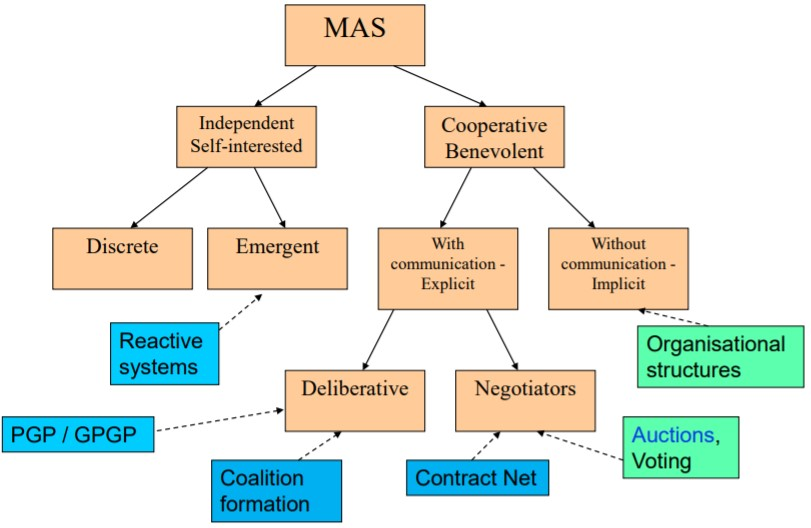
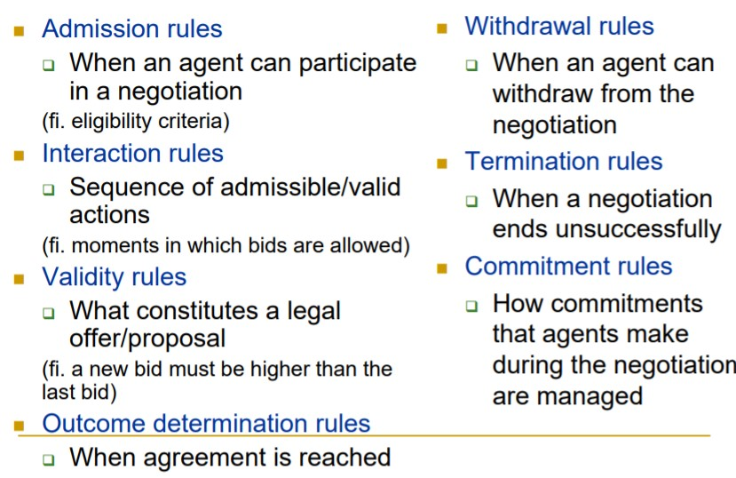
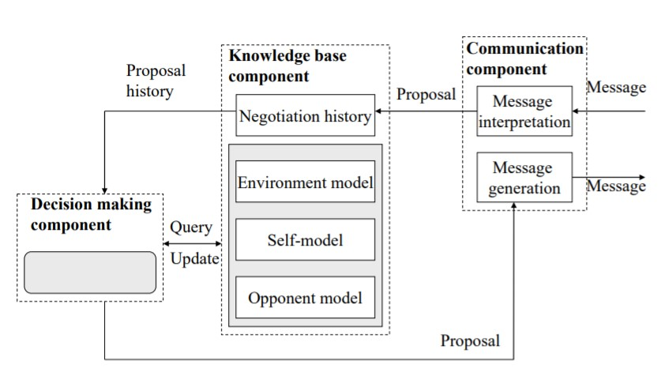
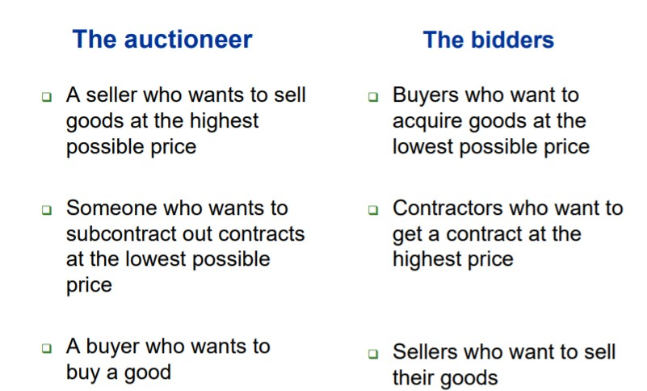
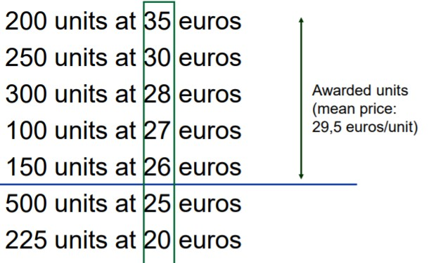
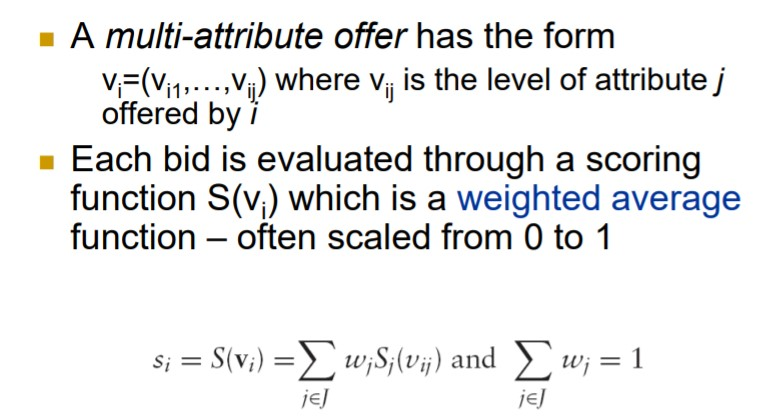
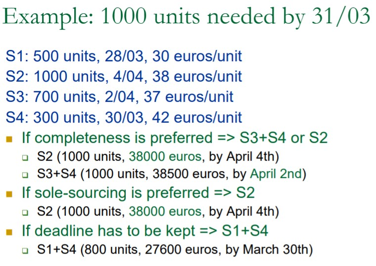
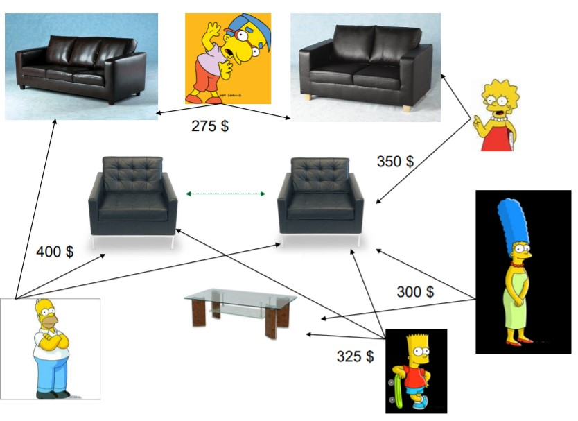
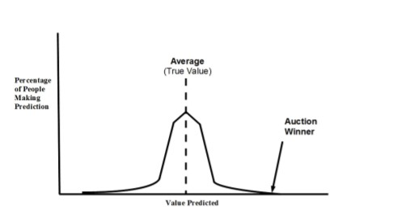

# LECTURE 8: Cooperation in MAS (III): Negotiation via auctions

**Hierarchy**

**Why we need a negotiation?**

* Agents may have incompatible goals, and the resources to achieve these goals may be limited; in such cases competition and conflicts may arise
* Agents must be able to reach compromises, resolve conflicts, allocate goods and resources by way of an agreement

## Negotiation protocol elements

**Private elements**

Set of strategies that the agents can use to participate in the negotiation process

**Public elements**

A negotiation set which represents the space of possible offers/proposals that agents can make.

The protocol rules which govern the agents interactions

### Protocol rules

### Negotiation factors

* Number of attributes: one , many
* Number of agents: one-to-one, one-to-many, many-to-many
* Number of units: one , many
* Interrelated goods.

### Protocol evaluation criteria

* Social welfare – the sum of all agent’s payoffs or utilities in a given solution
* Pareto efficiency – a solution x is Pareto optimal if there’s no other solution x’ such that at least one agent is better off in x’ than in x, and no agent is worst off in x’ than in x.
* Individual rationality – an agent should not lose out by participating in a negotiation.
* Stability – mechanism should be designed to be non-manipulable: motivate each agent to behave in the desired manner
* Computational efficiency – mechanisms should be designed so that when agents use them, as little computation is needed as possible
* Distribution and communication efficiency – distributed protocol vs. minimum communication (time, money,…)

## Auctions

A class of negotiation protocols which provide us with methods for allocating goods/resources based upon competition among self-interested parties

Used:

* Telecommunication and TV licenses, mining rights, airport gates and takeoff/landing slots
* Collectibles (paintings, books, antiques)
* etc...

**Advantages**

* Markets may not exist for what the seller wants to sell.
* The seller does not know how much an item is worth.
* Create competition; enhances the seller’s bargaining power.
* Flexibility

The agents that participate in auctions we suppose to be interested and always prefer a larger payoff than a smaller one.

### Classification of auctions

* By bidding rules (single good or combinatorial , ascending or descending , open or sealed-bid , etc...)

* Information revelation policy

  * When to reveal information
  * What information
    * Bid: the price a seller
    * Ask: the price a buyer would have to offer in order to trade
    * Auction closure: known, unknown...

* Clearing policy

  * When to clear: on each bid, on closure...
  * Who gets what
  * At what price: first, second etc..

  

### English Auction

* Open-outcry and ascending-price auction
* The auctioneer announces an opening price or the reserve price
* Bidders raise their bids and the auction proceeds to successively higher bids
* The winner of the auction is the bidder of the highest bid

The best strategy is to bid a small amount above the previous bid until one reaches its private value and then stop

The bidders gain information by observing the others’ bids

**Disadvantages**

The reserve price may not be met and the item may remain unsold

Phantom bid: The auctioneer calls a bid that no one has made

Bidders can become carried away and overbid

Vulnerable to shills

### Dutch auction

* Open and descending-price auction
* The auctioneer announces a very high opening bid 
* Then the auctioneer keeps lowering the price until a bidder accepts it – the winner pays the price of its bid

Bidders need to decide in advance the maximum amount that they are willing to bid.

No relevant information on the valuation of the other bidders is disclosed during the process of the auction until it is too late.

Used for selling fish etc...

### First-price sealed-bid auction

Each bidder submits its own bid (usually in writing) without knowledge of the bids of others.

Two phases: (i) the bidding phase in which participants submit their bids (ii) the resolution phase in which the bids are opened and the winner is determined.

The highest bidder wins and pays the amount of its bid.

A higher bid raises the probability of winning, but lowers the bidder’s profit if it wins 

### Multi-unit Auctions

In a multi-unit auction sealed bids are sorted from high to low, and the items are awarded at the highest bid price until the supply is exhausted.

### Vickrey auction

A second-price sealed-bid auction, also known as uniform secondprice sealed-bid or the philatelist auction.

Two distinct phases: the bidding phase and the resolution phase.

The highest bid wins but the bidder pays the amount of the secondhighest bid.

Bidders adjust their bids upwards since they are not deterred by fear that they will have to pay too much.

The price that the winning bidder pays depends on the others’ bids alone and not on any action that the bidder undertakes.

The best strategy is for the agent to bid its true valuation.

### Multi-attribute auctions

Multi-attribute or multi-dimensional auctions allow bidders to submit bids on more than one attribute or dimension of a good.

The attributes under negotiation are usually defined in advance and bidders can compete in open-cry or sealed-bid auctions.

**Example**

* Consider a manufacturer which uses raw materials from a number of suppliers to produce finished goods.
* Assume the manufacturer requires 1000 units of A by March 31st.
* The manufacturer sends a Request For Quotes (RFQ) to all potential suppliers of A.

More degrees of freedom for bidders. More efficient information exchange.

### Sequential vs Parallel auctions

Sequential auctions: run individual auctions one after the other.

* Impossible to determine best strategy because game tree is huge

Parallel auctions: run individual auctions in parallel.

* Difficult to keep track of several simultaneous auctions with substitutable and interdependent goods

### Combinatorial auctions

Bids can be submitted on a combinations (bundles) of items

**Advantages of auctions**

* Flexibility, as protocols can be tailormade
* Less time-consuming and expensive than negotiating a price
* Simplicity in determining the market prices

**Disadvantages of auctions**

* Winner’s curse

  * What bidders suffer when they win an auction by overestimating how much something is worth and therefore bidding too much

    

    To avoid:

    * Assume that you have the highest estimate
    * Rational bidding: correct downwards

* Lying auctioneer

  * In the Vickrey auction, the auctioneer may overstate the second-highest bid
    * Solution: use of cryptographic electronic signatures
    * It cannot happen in the other 3 protocols
  * In sealed-bid auctions: Auctioneer may place a bid himself (reservation price)

* Sniping

  *  bidding very late in the auction in the hope that other bidders do not have time to respond and you can snatch a bargain. This is an issue, in particular in online auctions.