# LECTURE 9: Cooperation in MAS (IV): voting protocols

**Hierarchy**

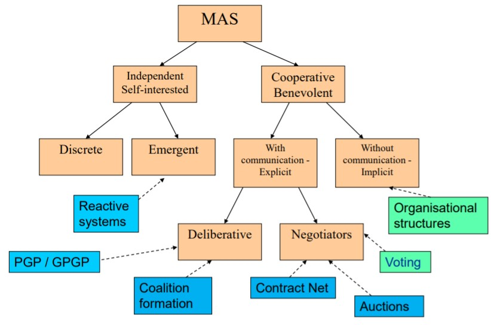

## Basic elements in a voting protocol

Aim of the negotiation: rank a set of alternatives based on the individual ranking of those options by each agent

* A - set of *n* agents

* O - set of *m* alternatives

* Each agent *i* has a preference relation

  <i : O x O

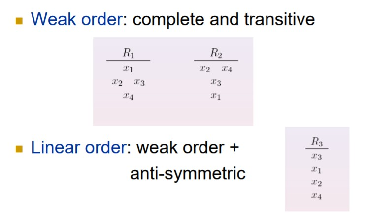

**Social Choice rule**

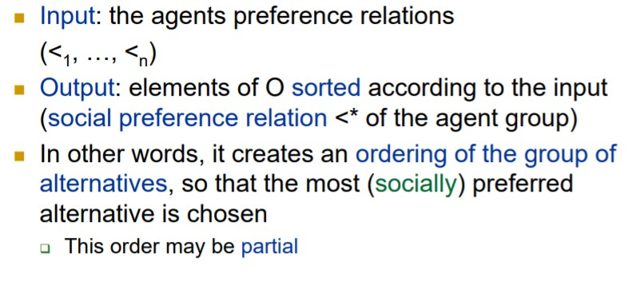

**Desirable properties of the social choice rule**

* Calculability A social preference ordering <* should exist for all possible inputs
* Completeness <* should be defined for every pair of alternatives (o, o')∈O
* Linearity <* should be antisymmetric and transitive over O
* Anonimity / No dictatorship
* Unanimity / Pareto efficiency If ∀i ∈A (o <i o') then (o <* o‘) 
* Neutrality: The outcome of the social choice rule should not depend on how alternatives are named or ordered
* Independence of irrelevant alternatives: Removing / Adding an irrelevant alternative should not affect the winner of the vote

## Plurality protocol

* Each agent can give 1 vote to 1 of the alternatives 
* The alternative with the highest number of votes wins

### Problems

* Each agent can only give 1 vote, even if it considers 2-3-4 “good” alternatives

* Strange effects

  * Example:

    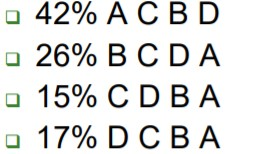

    * A wins with 42% of the votes
    * 58% of the voters preferred other options
    * 58% consider A the worst option
    * 100% consider C the 1st-2nd best option

**Advantages**

* Simple mechanism
* Efficient from computational point of view
* Equality, 1 agent = 1 vote

## Anti-plurality

Each voter gives a negative vote to the alternative he considers the worst. The option with less votes wins. In the previous example, A would have 58 negative votes!

**Example**

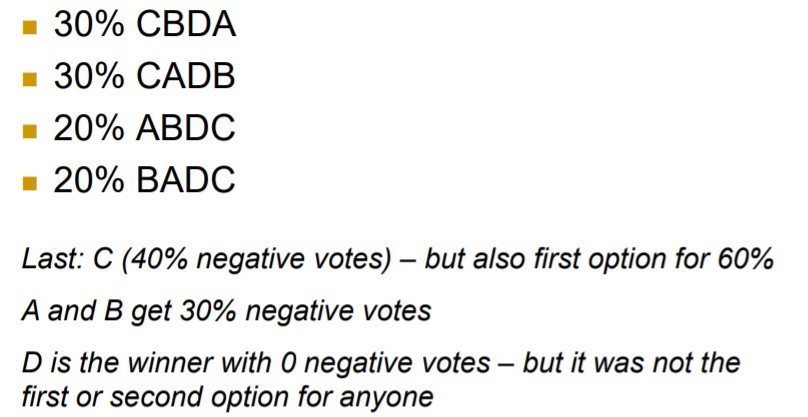

## Best-worst voting system

Each agent gives a positive vote to his best alternative and a negative vote to his worst alternative

Each alternative receives α>0 points for each positive vote and -δ<0 points for each negative vote.

**Example**

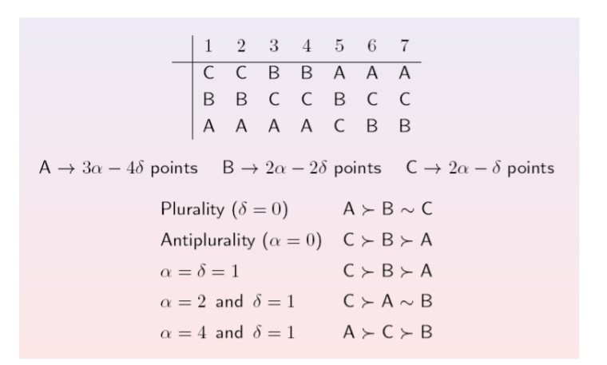

## Protocols based on linear orders

Each voter gives a full list of the options, ordered according to his preferences (from best to worst)

A voter prefers option ***i*** to option ***j*** if option ***i*** appears before option ***j*** in his list

## Binary Protocol

All the options are ordered and then evaluated in pairs (options 1 and 2, the winner with option 3, the winner with option 4, etc.)

Simple majority: option A is better than option B if and only if the number of voters that prefer A to B is greater than the number of voters that prefer B to A

The option that wins the last evaluation is the overall winner

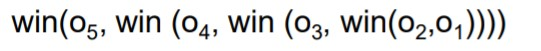

## Borda protocol

For each voter, we assign |O| points to the preferred option, |O|-1 points to the second, and so on

* Example: 4 possibilities, one agent considers the order ABCD A:4 points, B:3 points, C:2 points, D:1 point

### Problems

* Most computationally expensive
* Eliminating (or adding) one irrelevant alternative may totally change the outcome of the protocol
* Total order changes if options are removed one by one

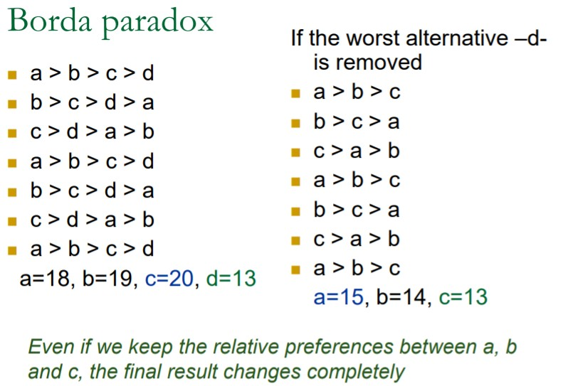

## Condocert protocol

Each voter ranks the candidates in order of preference 

Each candidate is compared to each other 

If a candidate wins all the comparisons, it is the winner of the election

**Example**

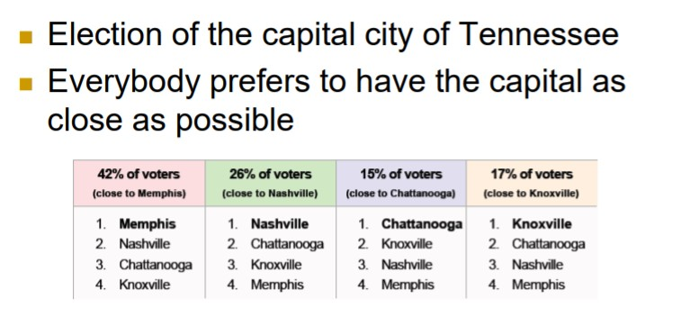

### Problems

* Possibility of circular ambiguities: No alternative wins to all the other alternatives

## More complex voting mechanisms

Use of linguistic information to represent the opinion of each voter with respect to each alternative.

Management of uncertainty in the voter’s opinions.

Each voter can use a linguistic label from a predetermined set to evaluate each alternative 

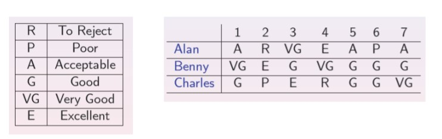

### Distance measure

The distance between two vectors of linguistic labels may be defined as the addition of the distances between the labels in each position

* Distance(Poor, Poor) = 0
* Distance(Poor, Good) = 2
* Distance(Reject, Excellent) = 5

## Uncertain preferences

Each voter represents the opinion on every alternative with an interval defined over an ordered set of linguistic labels

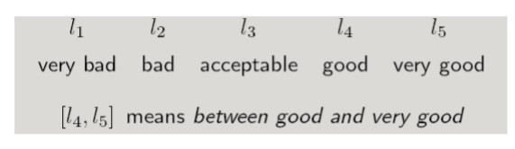

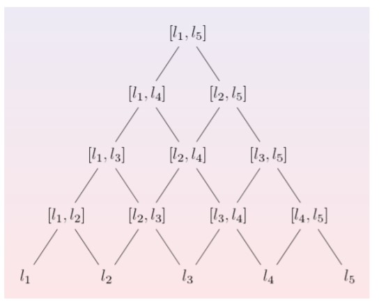

Top is more imprecise than bot.

