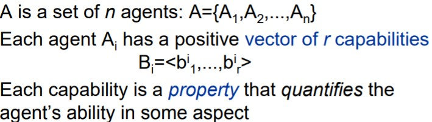

# LECTURE 7: Cooperation in MAS (II): coalition formation

**Cooperation hierarchy**

**Definition**: Coalitions are (temporary) collections of individuals working together for the purpose of achieving a task. So Coalition formation is the process whereby an agent decides to cooperate with other agents, because:

* The task cannot be performed by a single agent
* The task can be performed more efficiently by several agents working together

The reason is that agents usually bring different so they are not clones.

**Issues**

* What mechanism can an agent use for coalition formation?
* Once a coalition has been defined, how should its members distribute the work/payoff?

### External coalition formation

* By imposition: an external agency makes decisions
* Agents advertise skills (capabilities) and prices (cost)
* Requestor defines properties of coalition to the external agency
* An entity external to the MAS computes the optimal coalition

### Internal coalition formation

* By self-organisation: coalitions are established by group interactions
* Multi-lateral negotiation of tasks and outcomes
* Identification of tasks to be solved

### Coalition formation activities

Need to calculation the coalition value (benefit of coalition for each task) and the structure for try to maximize the coalition value. Finally need to decide how distribute the payoff between coalition members.

### Coalition structure generation

### Optimal distribution of task

**Optimality** could be defined in different ways:

* Minimum number of coalitions
* Minimum size of coalitionts
* etc...

### Capabilities in agents

Capabilities may be expendable (e.g. amount of material of a certain type) or non-expendable (e.g. ability to perform an action)

### Capabilities for tasks

### Conditions on coalitions

* A coalition can work on a signle task at a time

* Each agent can only belong to one coalition at time. 

* A coalition C has a vector of capabilities Bc

* A coalition C can perform a task *t* iff
  $$
  \text{for all} \ 1<= i <=r \ \ b^t_i <=b^C_i
  $$
  

### Coalitional cost

For each coalition C and specific task t, it is possible to calculate the coalitional value V, that measures the joint utility that the members of C can reach if they cooperate to satisfy t. This value depends on the capabilities contributed by the team members and the number of coalition members.

## Task allocation process

* Initial state is that we have a n single agents.

* 1 new coalition at each iteration
* When an agent joins a coalition, it quits the coalition formation process

### Algoirithm

* Assign a task to the best coalition
* Coalitional values for each pair <coalition,task> are (re)calculated
* One coalition C is formed
* Agents in coalition C quit the coalition formation process

**Stage 1**: Initial calculations of Agent.

***Note**: Check L7 slide 26*

The distribution may not be homogeneous and not be perfect and requires a exchange of message.

 **Stage 2**: Calculate coalitional values

**Example**

**Forming one coalition**

### Overlapping coalitions

The previous algorithm formed disjoint coalitions because agents left the allocation process once they had been assigned to a coalition.

It could be possible to adapt the same task allocation algorithm to allow overlapping coalitions (an agent could participate in several coalitions, as long as it has enough resources).

For do this only need to change when a coalition is form.

