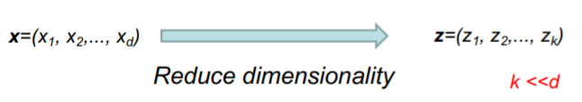
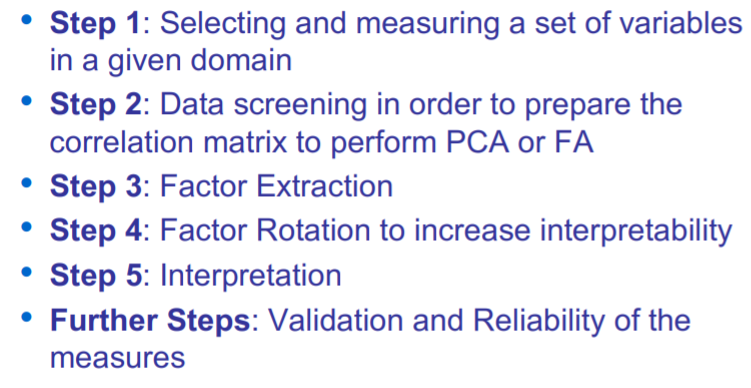
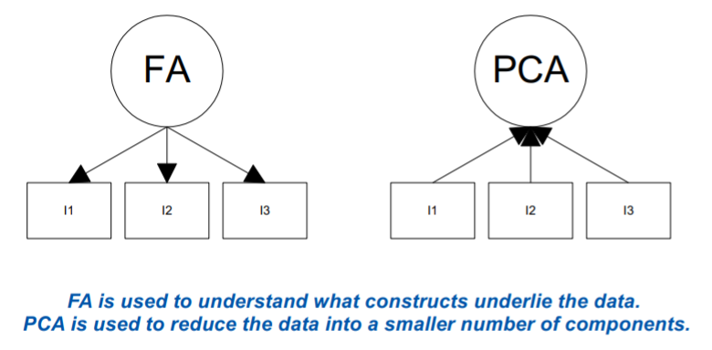
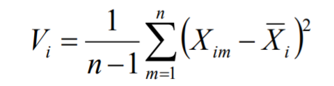
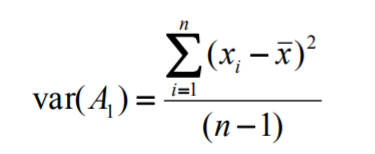
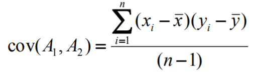
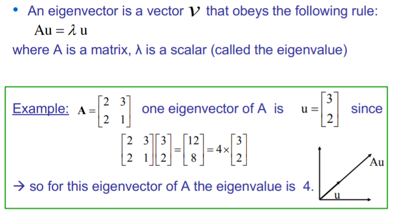

# Factor Analysis

We use factor analysis to explore data for patterns and reduce the number of variables.

Is a statistical method used to describe variability among observed variables, correlated variables in terms of a potentially lover number of unobserved variables called factors.

FA searches for a such joint variations in response to unobserved latent variables. 

**Goal**: Summarize patterns of correlations among observed variables

* Patterns of correlations are identified and either used as descriptive (PCA) or as indicative of underlying theory (FA)
* Latent variables (as opposed to observable variables) are not directly observed but are rather inferred from other variables
  * **Example**: Quality of life is a latent variable

**FA** and **PCA** are statistical methods of data reduction.

- Take many variables and explain them with a few factors or components.
- Correlated variables are grouped together and separated from other variables with low or no correlations.

**FA** is an approach to deal with high dimensional data.

Project high dimensional data onto a lover dimensional sub-space using linear or non-linear transformations.

So with this we can reduce the time complexity => Time of computation, search space => less parameters. May have a better representation. 

**What is a "Good Factor"?**

* Make sense
* Will be easy to interpret
* Simple structure
* Lacks complex loadings

## Problems of FA

* After extraction there is an infinite number of rotations available
* FA is frequently used to "save" poorly conceived research
* There is no statistical criterion to compare the linear combination to
  * (no entenc aquesta diapo)

## Types of Factor Analysis

### Exploratory Factor Analysis

* Used to identify complex interrelationships among items and group items that are part of unified concepts
* Summarizing data by grouping correlated variables.
* Investigating sets of measured variables related to theoretical constructs

***Note:** This is what we study on this course*

### Confirmatory Factor Analysis

* CFA is a more complex approach that test the hypothesis that the items are associated with specific factors.
* When factor structure is known or at least theorized
* Testing generalization of factor structure to new data etc..

## Applications of Factor Analysis

1. Identification of Underlying Factors
   1. Clusters variables into homogeneous sets.
   2. create new variables (i.e. factors)
2. Screening of Variables
   1. Identifies groupings to allow us to select one variable to represent many
   2. Useful in regression
3. Summary
   1. Allows us to describe many variables using a few factors
4. Clustering of objects
   1. Help us to put objects into categories depending on their factors scores

## Principal Components Analysis

In PCA, the components are calculated as linear combinations of the original variables

In FA, the original variables are defined as linear combinations of the factors 

In PCA, the goal is to account for as much of the total variance in the variables as possible

The objective in FA is to explain the covariances or correlations among the variables 

**Goal of PCA**: find new representation (basis) to filter the noise and reveal hidden dynamics

Principal component analysis (PCA) involves a mathematical procedure that transforms a number of (possibly) correlated variables into a (smaller) number of uncorrelated variables called principal components

Usually, PCA is used to discover or reduce the dimensionality of the data set, or to identify new meaningful underlying variables, i.e., patterns in the data.

PCA is "an orthogonal linear transformation" the data to a new coordinate.

* Find new axes
* Decide on wich are significant
* Map data to the new space

### PCA in a nutshell

* Principle
  * Linear projection method to reduce the number of parameters
  * Transfer a set of correlated variables into a new set of uncorrelated variables
  * Map the data into a space of lower dimensionality
  * Form of unsupervised learning

### Geometric Rationale of PCA

Objects are represented as a cloud of n points in a
multidimensional space with an axis for each of the
p variables

Suppose:

* A1 and A2 are atrributes.
* n training examples
* x's denote values of A1 and y's denote values of A2 over the training examples.

Then the variance of an attribute is

Covariance of two attributes

* If is positive then means that both dimensions increase together
* If is negative then means that as one dimension increase, the other decreases.
* If is Zero then means that dimensions are independent of each other.

### Eigenvectors

- Different matrices have different eigenvectors
- Only square matrices have eigenvectors
- Not all square matrices have eigenvectors

