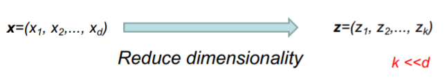
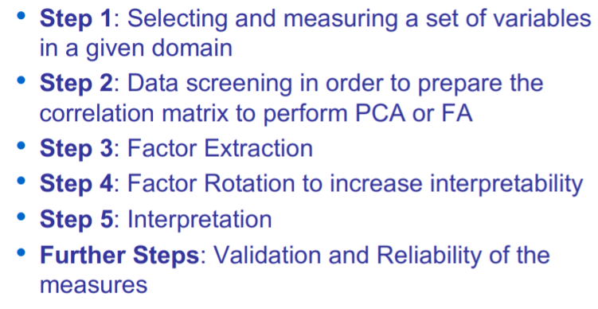
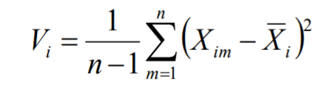
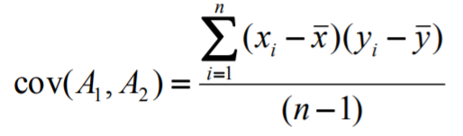

# Factor Analysis

We use factor analysis to explore data for patterns and reduce the number of variables.

Is a statistical method used to describe variability among observed variables, correlated variables in terms of a potentially lover number of unobserved variables called factors.

FA searches for a such joint variations in response to unobserved latent variables. 

**Goal**: Summarize patterns of correlations among observed variables

* Patterns of correlations are identified and either used as descriptive (PCA) or as indicative of underlying theory (FA)
* Latent variables (as opposed to observable variables) are not directly observed but are rather inferred from other variables
  * **Example**: Quality of life is a latent variable

**FA** and **PCA** are statistical methods of data reduction.

- Take many variables and explain them with a few factors or components.
- Correlated variables are grouped together and separated from other variables with low or no correlations.
- Two types of "variables":
  - Latent variables: not directly observed but inferred
  - Observable variables: observed and directly measured

**FA** is an approach to deal with high dimensional data.

Project high dimensional data onto a lover dimensional sub-space using linear or non-linear transformations.

So with this we can reduce the time complexity => Time of computation, search space => less parameters. May have a better representation. 

**What is a "Good Factor"?**

* Make sense
* Will be easy to interpret
* Simple structure
* Lacks complex loadings

## Problems of FA

* After extraction there is an infinite number of rotations available
* FA is frequently used to "save" poorly conceived research (salvar investigacions mal concebudes)
* There is no statistical criterion to compare the linear combination to

## Types of Factor Analysis

### Exploratory Factor Analysis

* Used to identify complex interrelationships among items and group items that are part of unified concepts
* Summarizing data by grouping correlated variables.
* Investigating sets of measured variables related to theoretical constructs

***Note:** This is what we study on this course*

### Confirmatory Factor Analysis

* CFA is a more complex approach that test the hypothesis that the items are associated with specific factors.
* When factor structure is known or at least theorized
* Testing generalization of factor structure to new data etc..

**Summary of FA**

* Enables us to reduce the complexity of data
* Makes it possible to identify the latent variables which exist underneath a set of variables which are actually observed.

## Applications of Factor Analysis

1. Identification of Underlying Factors
   1. Clusters variables into homogeneous sets.
   2. create new variables (i.e. factors)
2. Screening of Variables
   1. Identifies groupings to allow us to select one variable to represent many
   2. Useful in regression
3. Summary
   1. Allows us to describe many variables using a few factors
4. Clustering of objects
   1. Help us to put objects into categories depending on their factors scores

## Principal Components Analysis

In PCA, the components are calculated as linear combinations of the original variables

In FA, the original variables are defined as linear combinations of the factors 

In PCA, the goal is to account for as much of the total variance in the variables as possible

The objective in FA is to explain the covariances or correlations among the variables 

**Goal of PCA**: find new representation (basis) to filter the noise and reveal hidden dynamics

The new variables/dimensions are linear combinations of the original ones. Are uncorrelated with one another and are called principal components.

Principal component analysis (PCA) involves a mathematical procedure that transforms a number of (possibly) correlated variables into a (smaller) number of uncorrelated variables called principal components

Usually, PCA is used to discover or reduce the dimensionality of the data set, or to identify new meaningful underlying variables, i.e., patterns in the data.

PCA is "an orthogonal linear transformation" the data to a new coordinate.

* Find new axes
* Decide on wich are significant
* Map data to the new space

First principal component is the direction of greatest variability (covariance) in the data. 

Second is the next orthogonal (uncorrelated) direction of greatest variability.

* First remove all the variability along the first component, and then find the next direction of greatest variability. 

### PCA in a nutshell

* Principle
  * Linear projection method to reduce the number of parameters
  * Transfer a set of correlated variables into a new set of uncorrelated variables
  * Map the data into a space of lower dimensionality
  * Form of unsupervised learning
* Properties
  * Can be viewed as a rotation of the existing axes to new positions in the space defined by original variables.
  * New axes are orthogonal and represent the directions with maximum variability.

### Geometric Rationale of PCA

Objects are represented as a cloud of ***n*** points in a
multidimensional space with an axis for each of the
p variables

* First, the centroid of the points is defined by the mean of each variable.
* Second, the variance of each variable is the average squared deviation of its ***n*** values around the mean of that variable. 

Suppose:

* A1 and A2 are atrributes.
* n training examples
* x's denote values of A1 and y's denote values of A2 over the training examples.

Then the variance of an attribute is

Covariance of two attributes

* If is positive then means that both dimensions increase together
* If is negative then means that as one dimension increase, the other decreases.
* If is Zero then means that dimensions are independent of each other.

### Eigenvectors

- Different matrices have different eigenvectors
- Only square matrices have eigenvectors
- Not all square matrices have eigenvectors
- An *** n x n*** matrix has at most n distinct eigenvectors.
- All the eigenvectors of a ***n x n*** matrix, with n different eigenvalues, are perpendicular (or orthogonal)

**Example**

Let M be an *n·n* matrix

* v is an eigenvector of M if M &times;  v  =  &lambda; v

* Lamda is called the eigen-value associated with v

* For any eigenvector v of M and scalar a,

  

* Thus you can always choose eigenvectors of length 1:

* If M has any eigenvectors, it has n of them, and they are orthogonal to one another.

* Thus eigenvectors can be used as a new basis for a ndimensional vector space.

**Example of process in L4 Slide 41**

### Steps for PCA

### How many PCs?

* For **n** original dimensions , correlation matrix is **n &times; n**, and has up to **n** eigenvectors. So **n** PCs

If eigenvalues are small we don't lose much information.

## Independent Component Analysis

“Independent component analysis (ICA) is a method for finding underlying factors or components from multivariate (multidimensional) statistical data. What distinguishes ICA from other methods is that it looks for components that are both statistically independent, and nonGaussian

* Finds the directions of maximum independence
* Focus on independent and non-Gaussian components
* Higher-order statistics
* Non-orthogonal transformation

Mean while PCA :

* Fins the direction of maximum variance
* Focus on uncorrelated and Gaussian components
* Second-order statistics
* Orthogonal transformation

### Cocktail Party Problem

ICA Separation Algorithm

* Separation of Speech Signals
* Humans can separate multiple signals with only two ears/sensors
* ICA needs as many ears/sensors as message signals • Here we assume he has four ears!

ICA is a statistical method, the goal of which is to decompose given multivariate data into a linear sum of statistically independent components

### ICA Solution

Find W using the ICA Algorithm. Goal will be to find a matrix W such that the entries of Ŝ = WX are as independent as possible.

### ICA Separation Technique

***Central limit theorem** : if twho random (non-Gaussian) signals are added, the resulting signal will be more Gaussian than the original two random signals*

* Central Limit Theorem (in reverse)
* Maximizing Non-Gaussianity

### What is independent component?

If one variable can not be estimated from other variables.

By Central Limit Theorem, a sum of two independent random variables is more gaussian than original variables è distribution of independent components are nongaussian

Addition of two independent Gaussian random variables is another single Gaussian random variable.

### Measure nongaussianity

ICA maximizes independence between signals.

The mixing matrix and independent components are unknown

The number of separated signals cannot be larger than the number of inputs

* Blind source separation (BSS)
* Image denoising
* Medical signal processing
* fMRI, ECG, EEG
* Clustering

