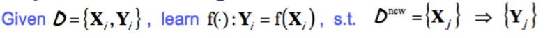
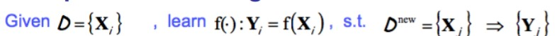

# Introduction to ML

## Definition of “to learn”  

* Learning is any process by which a system improves performance from experience (Herbert Simon) 

## Machine Learning Definition by Tom Mitchell

Study of algorithms that :

* at some task T
* improve their performance P
* based on experience E

So **learning task** can be defined as : < T, P , E > 

**Example**

Suppose your email program watches which emails you do or do not mark as spam, and based on that learns how to better filter spam. What is T, P, E in these sentences?  

[**E**] Watching you label emails as spam or not spam
[**P**] The number (or fraction) of emails correctly classified as
spam/not spam
[**T**] Classifying emails as spam or not spam  

## Designing a Learning System

**Steps**:

* Choose the training experience
* Choose exactly what is to learned (target function)
* Choose how to present the target function
* Choose a learning algorithm to infer the target function from the experience. 

**Task** :

* Classification
* Regression
* Solving problem

**How to evaluate performance**

* Classification accuracy
* Solution correctness
* Solution quality
* Speed of performance

**How to represent experience?**

* Neuron
* Case
* Tree
* etc...

## The machine learning process

1. Data collection and preparation
2. Feature Selection
3. Algorithm choice
4. Parameter and model selection
5. Training
6. Evaluation

## Paradigms of Machine Learning

* Supervised Learning

* Unsupervised learning

