****

# Theory 2. Introduction to unsupervised learning and Cluster Analysis (Part I) 

Differences between Supervised learning and Unsupervised learning

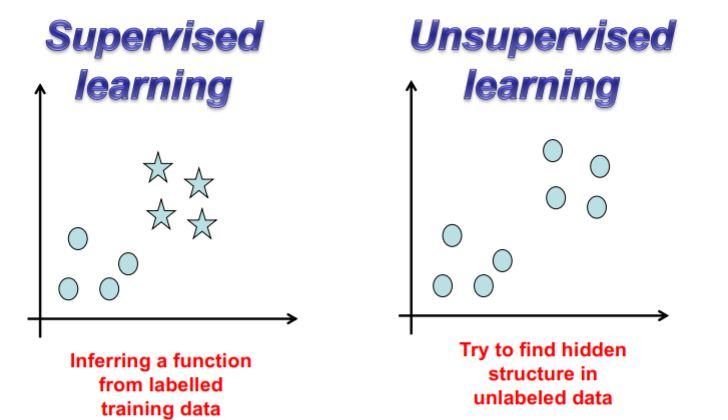

## Goals in unsupervised learning

1. **Summarization**: To obtain representations that describe an unlabeled dataset
2. **Understanding**: To discover the key concepts inside data.

These task are difficult because the discovery process is biased by context.

Clusters can be represented as: 

* Relational (hierarchies)
* Unstructured (partitions)

## Examples of Unsupervised Learning

* **Bioinformatics**: Extract or recognize patterns that share common characteristics.
* **Medicine**: Analyze the different parts of the body.
* **Market research**: Obtain valuable information about customers and potential customers. Data can be used before starting any new business or when expanding an existing one.
* **Social network analysis**: The goal is to improve what social network can offer.

## Approaches

### Clustering

Is the task of grouping a set of objects in such a way that objects in the same group (called a **cluster**) are more similar to each other than to those in other groups (**clusters**).

**Definition**

Method by which large sets of data is grouped into clusters of smaller sets of similar data

* **Based on connectivity**: Hierarchical clustering
* **Based on centroids**: K-means
* **Distribution-based models**: Mixture models, Expectation-Maximization

### Factor Analysis

Statistical methods used to describe variability among observed, correlated variables in terms of a potentially lower number of unobserved variables called factors. 

**Definition**

Blind signal separation using feature extraction techniques for dimensionality reduction.

* Principal component analysis (PCA)
* Independent component analysis (ICA)
* Singular value decomposition (SVD)

### Visualization

Study of visual representations of abstract data to reinforce human cognition.

**Definition**

A set of techniques often used in information visualization for exploring similarities and dissimilarities in data.

* Neural network models :
  * Self-organized maps (**SOM**)
* Multi-dimensional scaling (**MDS**)
  * Classical multidimensional scaling

## Clusters Analysis

Cluster analysis discover new categories in an unsupervised manner.

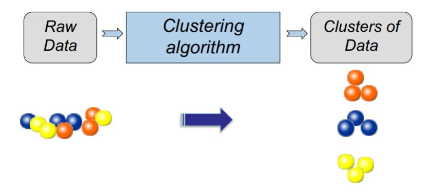

So clustering is the main task of explorative data mining.

Clustering is subjective. See the example below

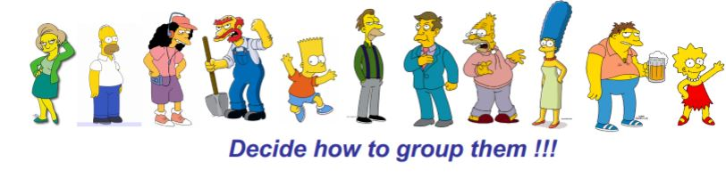

We can group for gender, age or others so it's difficult consider how group them. 

In machine learning we can compute the distance. 

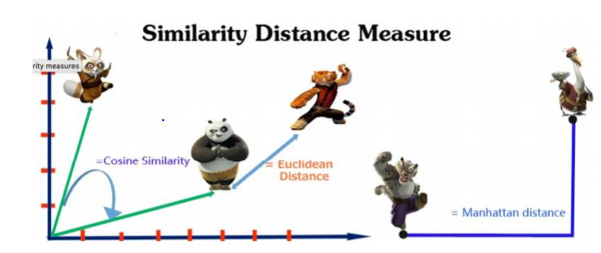

### Minkowski Metric

Assuming that *x* and *y* both have *p* features
$$
x = (x_1, x_2, .., x_p)
$$

$$
y = (y_1, y_2, ..., y_p)
$$

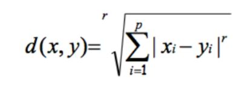

**Common Minkowski Metrics**

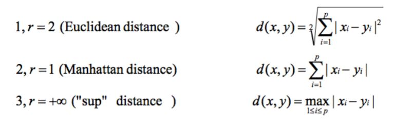

## Taxonomy

### Hierarchical algorithms

* Organized as a binary tree
* No explicit division in groups. 
  * Bottom-up
  * Top-down

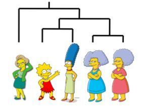

***Note** : Example of bottom-up*

### Partition algorithms

* Start with a random partitioning

* Refine it iteratively using K-means clustering or others

  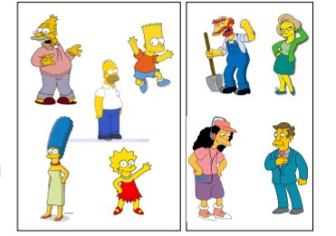

## Hierarchical Clustering algorithms

**Example of dendrogram**

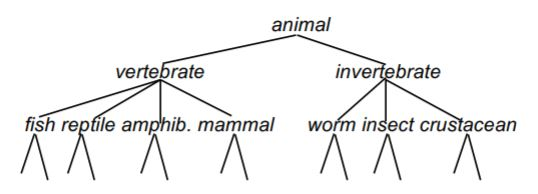

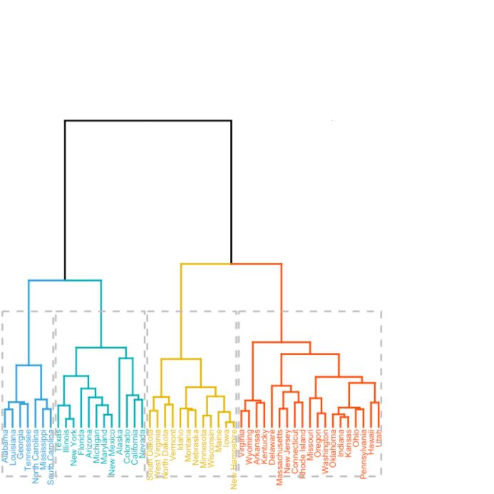

### Basic approaches 

For generating a hierchical clustering we can use this basic approaches

* **Agglomerative** (bottom-up)
  * Methods start witch each example in its own cluster and iteratively combine them to form a larger and larger clusters.
* **Divisive** (partitional, top-down)
  * Methods start with all the examples in a singular cluster. Consider all the possible way to divide the cluster into two and choose the best division. Doing this operation recursively on both sides.

## Cluster Similarity

Using maximum of similarity of pairs
$$
sim(c_i, c_j) = max \ sim(x,y) , x\in c_i, y\in c_j
$$
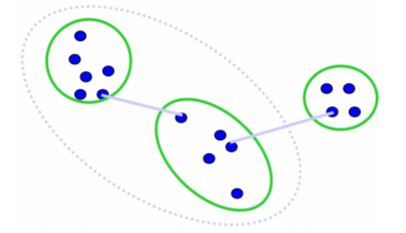

Using minimum similarity of pairs

$$sim(c_i, c_j) = min \ sim(x,y) , x\in c_i, y\in c_j$$
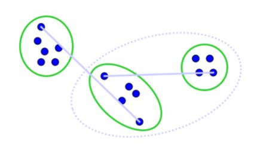
