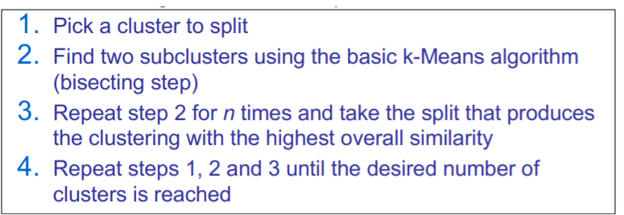

# Introduction to unsupervised learning and Cluster Analysis (Part II)

## Partitional Algorithms

**Method**: construct of ***n*** objects into a set of ***k*** clusters.

**Given**:  a set of objects (training set) and typically must provide the number of desired clusters, ***K***.

**Process**: 

* Randomly choose K instances as seeds, one per cluster 
* Form initial clusters based on these seeds 
* Iterate, repeatedly reallocating instances to different clusters to improve the overall clustering 
* Stop when clustering converges or after a fixed number of iterations

## K-Means basis

* Clusters based on centroids, center of gravity, or mean of points in cluster, ***c***:

### Distance Metrics

* Euclidian distance

  

* Cosine Similarity

  

  

### Algorithm 

**Example** 

### Objective

The objective of k-means is to minimize the total sum of the squared distance of every point to its corresponding cluster centroid.

* Finding the global optimum is NP-hard.
* The k-means algorithm is guaranteed to converge a local optimum

### Comments 

**Strength** 

* Efficient.
* Often terminates at a local optimum.

**Weakness**

* Applicable only when mean is defined. 
* Need to specify **K** , the number of clusters.
* Unable to handle noisy data and outliers
* Not suitable to discover cluster with non-convex shapes.

## Bisecting K-means

A few variants of the k-means which differ in 

* Selection of the initial k means 
* Dissimilarity calculations
* Strategies to calculate cluster means

 Handling categorical data: k-modes (Huang’98)

* Replacing means of clusters with modes
* Using new dissimilarity measures to deal with categorical objects
* Using a frequency-based method to update modes of clusters
* A mixture of categorical and numerical data: k-prototype method

**Algorithm**

## Fuzzy C-Means

### Crisp Clustering

Attempts to cluster data by grouping related attributes in uniquely defined clusters 

* Each data point in the data set is assigned to only one cluster

Clustering is an iterative process of finding better an better clusters centers 

When clusters are well separated, a crisp classification of data points into clusters make sense

### Fuzzy Clustering

According to fuzzy Algebra every element of the universe can belong to any **fuzzy set (FS)** with a **degree of membership** that varies from 0 to 1 taking real values

* “linguistic” terms like “much”, “much more”, “less”, “more or less”, “more than” and others can use in fuzzy clustering
* Data points are given partial degree of membership in multiple nearby clusters
* Central point in the fuzzy clustering is always no unique partitioning of the data in a collection of clusters. In this membership value is assigned to each cluster. Sometimes this membership has been used to decide whether the data points belong to the cluster or not

### Fuzzy C-Means Clustering

* Input: Unlabeled data set. N is the number of data points in X.
  $$
  X = \{ x_1, x_2,... x_n\}
  $$
  

* Main output: A c-partition o X wich is *c x n* matrix *U*.

  * c is the number of clusters
  * U is the univers

* Additional output

  - Set of vectors
    $$
    V = \{v_1, v_2,..., v_c\} ⊂ R^p \\
    v_i \text{ is called "cluster center"}
    $$
    

**Advantages**

* Unsupervised
* Always converges

**Disadvantages**

- Long computational time
- Sensitivity to the initial guess
- Sensitivity to noise
  - One expects low (or even no) membership degree for outiliers (noisy points)

## Expectation - Maximitzation

**Note**: Is not a cluster algorithm. It is an algorithm for parameters selection.

### Hard clustering

Each instance is given a "hard" assignment to exactly one cluster.

### Soft clustering

Gives probabilities that an instance belongs to each of a set of clusters.

Each instance is assigned a probability distribution across a set of discovered categories.

* probabilities of all categories must sum to 1.

### Mixture Models

Model that is compressed by diferent probability distribution. 

* Probabilistically-grounded way of doing soft clustering
* Each cluster: a generative model (Gaussian or multinomial)
* Parameters (e.g. mean/covariance are unknown) 

