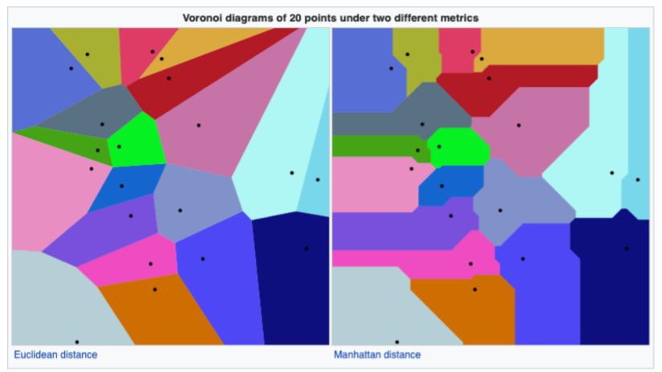
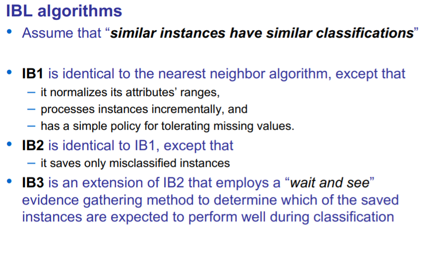

# Lazy Learning

**Definition**: • LAZY LEARNING refers to any machine learning process that defers the majority of computation to consultation time

* Training time: Is the time prior to consultation during which the system makes inferences from training data in preparation for consultation time.
* Consultation time: Consultation time is the time between when an object is presented to a system for an inference to be made and the time when the inference is completed

Lazy learning delays generalization until a query is made to the system

Generalization Performance of a learning algorithm refers to the performance on out-of-simple data of the models learned by the algorithm

**Advantages**: 

* The target function is approximated locally
* It can simultaneously solve multiple problems
* It deals successfully with changes in the problem domain
* Suitable for complex and incomplete problem domains

**Disadvantages**: 

* Requires a large space to store the entire training
* It may be slow for solving a problem but it has a fast training

## Nearest Neighbor (NN)

In a data collection M, the nearest neighbor to a data object q is the data object Mi", which minimizes dist(q, Mi")

* Where dist is distance measure defined for the objects in question

### Basic Idea:

* Get som example set of cases with known outputs
* When we see a new case, assign its output to be the same as the mos similar known case.

### Voronoi diagram

Voronoi diagram is a way of dividing space into a number of regions 

* The regions are called Voronoi cells.
* A Voronoi diagram is the computational geometry concept that represents partition of the given space onto regions, with bounds determined by distances to a specified family of objects.

Different metrices give rise to different Voronoi diagrams

## Instance-based Learning (IBL)

It's a lazy learning algorithm.

Differences:

* Normalizes all attributes in range [0..1]
* Handles missing attributes

It produces a local approximations to the target function

**Distance Measure** : Neares neighbour, typically Euclidean

**Number of neighbours to consider** : One

Algorithm only use a selected instances to generate classification predictions

IBL algorithms are incremental and their goals include: maximizing classification accuracy.

## K-Nearest Neighbor (KNN)

Distance measure typically euclidean and number of neighbors to consider it's **k** that it is predefined positive integer and typically small and odd

