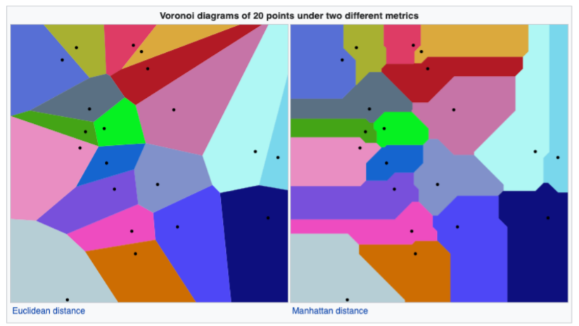

# Lazy Learning

**Definition**: LAZY LEARNING refers to any machine learning process that defers the majority of computation to consultation time

* Training time: Is the time prior to consultation during which the system makes inferences from training data in preparation for consultation time.
* Consultation time: Consultation time is the time between when an object is presented to a system for an inference to be made and the time when the inference is completed

Lazy learning delays generalization until a query is made to the system

Generalization Performance of a learning algorithm refers to the performance on out-of-simple data of the models learned by the algorithm

**Advantages**: 

* The target function is approximated locally
* It can simultaneously solve multiple problems
* It deals successfully with changes in the problem domain
* Suitable for complex and incomplete problem domains

**Disadvantages**: 

* Requires a large space to store the entire training
* It may be slow for solving a problem but it has a fast training

## Nearest Neighbor (NN)

In a data collection M, the nearest neighbor to a data object q is the data object Mi", which minimizes dist(q, Mi")

* Where dist is distance measure defined for the objects in question

### Basic Idea:

* Get som example set of cases with known outputs
* When we see a new case, assign its output to be the same as the mos similar known case.

### Voronoi diagram

Voronoi diagram is a way of dividing space into a number of regions. 

* The regions are called Voronoi cells.
* A Voronoi diagram is the computational geometry concept that represents partition of the given space onto regions, with bounds determined by distances to a specified family of objects.

Different metrices give rise to different Voronoi diagrams

## Instance-based Learning (IBL)

It's a lazy learning algorithm.

Differences:

* Normalizes all attributes in range [0..1]
* Handles missing attributes

It produces a local approximations to the target function

On IB1 just store the training examples, D.

**Distance Measure** : Neares neighbour, typically Euclidean

**Number of neighbours to consider** : One

Algorithm only use a selected instances to generate classification predictions.

**Algorithm**

IBL algorithms are incremental and their goals include: maximizing classification accuracy.

## K-Nearest Neighbor (KNN)

Distance measure typically euclidean and number of neighbors to consider it's **k** that it is predefined positive integer and typically small and odd

* Training method: Save the training examples
* At prediction time: 
  * Find the k training examples that are closest to the test example x.
  * Classification: the outpit is a class membership.
  * Regression: The output is a value

## When to consider NN algorithms

* Instances map to points in R^n
* Not more then say 20 attributes per instance
* Lots of training data

**Advantages**

* Training is fast
* Can learn complex target functions
* Don't lose information

## Way to normalize data

$$
X_t'= \frac{X_t - min}{max-min}
$$

## Issues to consider in a k-NN

**About the k**

* In a binary classification need to chose a odd number to avoid tied votes.

* Small K captures fine structure
* Large k is less sensitive to noise

The principle of “majority voting” for deciding the class labels can be problematic when the class distribution is skewed (sesgat)

Irrelevant features within a large feature set, tend to degrade performance

## Distance-Weighted kNN

The weighted k-NN algorithm can be used for classification or regression.

* Pros: Fast training, its a lazy algorithm, learn complex functions easily and not lose information.
* Cons: Slow at query time and need a lot of storage.

When dimensionality increases, the volume of the space increases so fast that the available data becomes sparse.

The number of features is too large relative to the number of training samples.

## Case-Based Reasoning (CBR)

CBR is an advances instance-based learning appplied to more complex instance objects.

* Case-based reasoning is […] reasoning by remembering – [Leake, 1996]
* A case-based reasoner solves new problems by adapting solutions that were used to solve old problems [Riesbeck & Schank, 1989]

### CBR in a nutshell

* Store previous experience in memory
* To solve new problems:
  * Retrieve similar experience about similar situations from memory
  * Reuse the experience in the context of the new situation. 
  * Store new experience in memory ( learning )

### Steps of CBR

1. New problem is introduced in the problem space

2. Durin retrieval problem is matched against problems of the previous cases by computing a similarity function

3. If a proposed solution does not meet the necessary requirements of a new problem situation, adaptation occurs and a new solution is created

4. Revise the proposed solution

4. A received solution and a new problem together form a new case that is incorporated in the case base during the learning step (retain phase)

   

In CBR a new problem can be solved by retrieving similar problems or adapting retrieved solutions. Similar problems have similar solutions

### Assumptions in CBR 

* Similar problems have similar solutions
* The world is a regular place: what holds true today will probably hold true tomorrow
* Situations repeat: if they do not, there is no point in remembering them

### Task for CBR

* Good in diagnosis, preditions
* Bad in engineering design, planning and scheduling

### Case representation

* Flat feature-value list
  * Simple case structure
* Object oriented representation
  * Case: Collection of objects (instances of classes)
* For special tasks:
  * Graph representations: set of nodes and arcs
* The choice of representation:
  * Dependent on requirements of domain and task
  * Structure of already available case data

### Solving a new diagnostic problem

**Similarity of cases**

* Similarity for each feature
  * Depends on feature values.

### Modeling similarity

Different approaches depending on case representation.

Similarity measures:

* Local similarity measure: similarity on feature level.
* Global similarity measure:
  * Combines local similarity measures
  * Takes care of different importance of attributes

### How to adapt the solution

* Null adaptation - copy retrieved solution
* Manual or interactive adaptation
  * User adapts the retrieved solution
* Automated adaptation
  * CBR system is able to adapt the retrieved solution
  * Adaptation knowledge required

### Automated adaptation Methods

* Substitution
  * Change some part(s) of the retrieved solution
* Transformation
  * alters the structure of the solution
* Generative
  * replays the method of deriving the retrieved solution on the new problem. 

### What can be learned

* New experience to be retained as new case
* Improved similarity assessment, importance of features
* Organization / Indexing of the case base to improve efficiency
* Knowledge for solution adaptation
* Forgetting cases (learn to forget)
  * For efficiency or because out of date

### CBR cycle

### Pros & Cons

**Advantages over other techniques**

* Reduces the knowledge acquisition effort
* Requires less maintenance effort
* Makes use of existing data in databases.
* Improve over time and adapt to changes in the environment.
* High user acceptance.

## Summary

* CBR is a technique for solving problems based on experience
* CBR problem solving involves four phases
  * Retrieval, Reuse, Revise, and Retain
* Different techniques for:
  * Representing the knowledge, in particular, the cases
  * Realizing the four phases
* CBR has several advantages over tradition Knowledge-based Systems
* Several applications
  * Classification, diagnosis, decision support, planning, configuration, design, ... 
