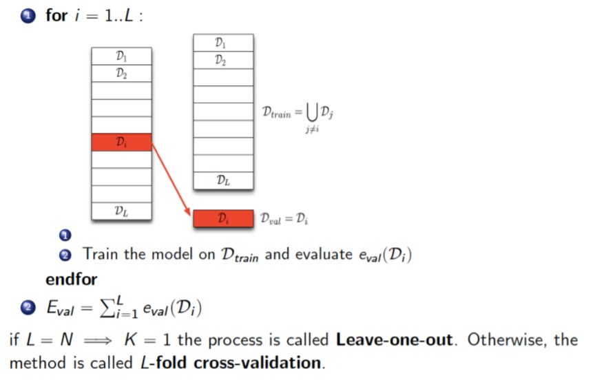

# Theory 9. Model Evaluation

Why do we evaluate a model's performance?

* To know how well it works, reporting results etc...
* To compare models. For choose which model is better. 

## Definition

* **Model Evaluation** is the process of assessing a property or properties of a model
  * Evaluation metrics
  * Evaluation techniques
* **Model Selection** is the process of choosing among many candidate models for a predictive modeling problem. 
  * Probabilistic measures
  * Resampling methods

In model evaluation:

* A learning algorithm must interpolate appropriate predictions of regions of the instance space that are not included in the training data.
* Algorithm evaluation techniques are designed to provide more reliable estimates of the accuracy of the models learning by an algorithm than would be obtained by assessing them on the training data. 

## Evaluation metrics

### Performance metrics

* Precision & Recall & F1 score

  * Precision: What percent of our predictions are accurate?

  * Recall: How many of the accurate predictions did we capture

  * F1 score: Single number that combines the two values. Good for ranking / sorting
    $$
    \text{F1} = 2 \times\frac{precision \times recall}{precision + recall}
    $$
    

* Precision at N

  * How many accurate examples did we capture in our top N ranked examples. This is often used in information (document) retrieval

### Confusion matrix

---

Accuracy could not be useful measure in cases where there is a large class skew (sesgat)

### Precision/recall curves

Plots the precision vs. recall (TP-rate) as a threshold on the confidence of an instance being positive is varied.

Show the fraction of predictions that are false positives.

Good for tasks with lots of negative instances 

### ROC Curves

A Receiver Operating Characteristic (ROC) curve plots the TP-rate vs. the FP-rate as a threshold on the confidence of an instance being positive is varied.

Can identify optimal classification thresholds for tasks with differential misclassification costs 

## Evaluation techniques

### Testing on 'realistic data'

Ideal: Evaluate the learned model on real life. But sometimes can only evaluate on simulated data. 

Testing on biased datasets can lead to inaccurate estimation of performance

### Unbiased data ( Dades imparcials)

Data that represents the diversity in our target distribution of data on which we want to make predictions (i.e., it is a random, representative sample. This is a good scenario)

### Biased data

Data that does not accurately reflect our target population.

Training on biased data can lead to inaccuracies

### Test Set

* Data need to be splited randomly. If not , it may lead to underfitting (ajust insuficient)
* Test set and training set should be interchangeable, except for data size

**Three-way split**

Validation for get and select the best model and after we can calculate the accuracy using test set. 

**Examples in each dataset**

* Training: Typically 60-80% of data

* Test set: Typically 20-30% of your trained set

* Validation set: Often 20% of data

  Examples:

  * 3 way: Training: 60%, CV: 20%, Test: 20%
  * 2 ways: Training 70%, Test: 30%

Some datasets are affected by seasonality. 

### Cross-validation

Used when a hold-out plan is difficult to design or was not designed at the beginning.

Used when the dataset is small, and you want to use all the data for good model training.

**How many folds we need?**

* Common choice: 5-fold or 10-fold cross validation.
* Large datasets: even a 3-Fold cross validation will be quite accurate.
* Smaller datasets: we will prefer a bigger L.
* Leave-One-Out approach (L=N). In this case the number of folds L is equal to the number of examples N. Used for smaller datasets.

### Imbalance

* Sometimes, classes have very unequal frequency
  * Cancer diagnosis: 99% healthy, 1% disease.
  * eCommerce: 90% don’t buy, 10% buy.

**Important**: Estimate the final results using an imbalanced held-out (test) set

**How to create a “balanced” set:**

* Treat the majority class &rarr; undersampling
* Treat the small class &rarr; oversampling

**Down-sample &rarr; undersampling**

Sample (randomly choose) a random subset of points in the majority class

**Up-sample &rarr; oversampling**

Repeat minority points.

### Reweighting

Assign larger weights to samples from the smaller class

A commonly used weighting scheme is linearly by class size:
$$
W_c=\frac{n}{n_c}
$$
Where *nc* is the size of the class c and n is :
$$
n = \sum_c n_c
$$
the total sample size. 

## Overfitting and underfitting

### Overfitting

A model overfits the training data when it describes features that arise(augmenta) from noise or variance in the data, rather than the underlying distribution from which the data were drawn.

Usually leads(condueix) to loss of accuracy on out-of-sample data.

Approaches to avoid overfitting include: 

* Using low variance learners
* Minimum description length technique
* Pruning
* Regularization
* Stopping criteria 

### Underfitting (high Bias)

In underfitting, the training error and test error are high.

### Overfitting (high Variance)

If the model overfits:

* It memorizes the training data.
* It has a low training error and high test error
* It can't generalize well to new data. 

Overfitting is caused by:

* Too much model complexity (too many features)
* Too little data or not enough data diversity
  * Big data: The more data we have, the more complex a model we can use
  * Diversity: Redundant data does not add information and thus does not improve the mode. 

### Addressing (abordar) Overfitting

Reduce features or dimensions

* Select which features to keep
* Reduce dimension
* Select which model to use.

### Regularization

A simple model that fits the training data well is more likely to capture the regularities in it and generalize well.

A regularizer is introduced to quantify the complexity of a model. There is no universally best regularizer, and a regularization approach must be chosen depending on the dataset

