# Support Vector Machine

SVM is a supervised machine learning algorithm which can be used for classification or regression.

The objective of the Support Vector Machine is to find the best splitting boundary between data.

**Hyperplane**: generalization of a plane.

* In 2 dimensions: can separate by a line.
* In 3 dimensions: can separate by a plane.
* In higher dimensions: need hyperplanes.

A hyperplane is an affine subspace of dimension n-1, which divides the space into two half spaces which correspond to the inputs of 2 distinct classes.

## SVM

**Definition**: Support Vector Machine is a system for efficiently training linear learning machines in kernel-induced feature spaces, while respecting the insights of generalization theory and exploiting optimization theory.

The aim of the SVM classification is to devise a computationally efficient way of learning “good” separating hyperplanes in a high dimensional feature space.

Support Vector Machine (SVM) finds an optimal solution: maximizes the distance between the hyperplane and the “difficult points” close to decision boundary.

The simplest model of SVM is a maximal margin classifier.

## Maximal Margin Classifier

It works only for data that is linearly separable.

* Can not be used in many real-world problems.

The maximal margin classifier optimizes the generalization error by separating the data with the maximal margin hyperplane.

Solving SVMs is a quadratic programming problem.

Margin ρ of the separator is the width of separation between classes

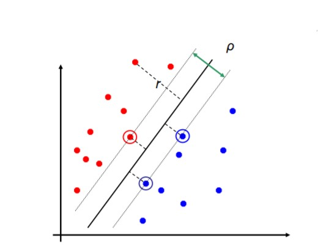

Maximizing the margin is good according to intuition and theory.

Implies that only support vectors are important; other training examples are ignorable.

## Linear SVM mathematically

Generalization theory gives guidance to prevent overfitting.

* Misclassification error and the function complexity bound generalization error.
* Maximizing margins minimizes complexity.
* “Eliminates” overfitting.

Optimization theory provides mathematical techniques to find hyperplanes

* Solution depends only on Support Vectors not on the number of attributes.

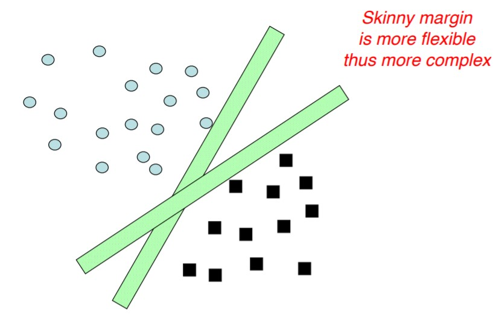

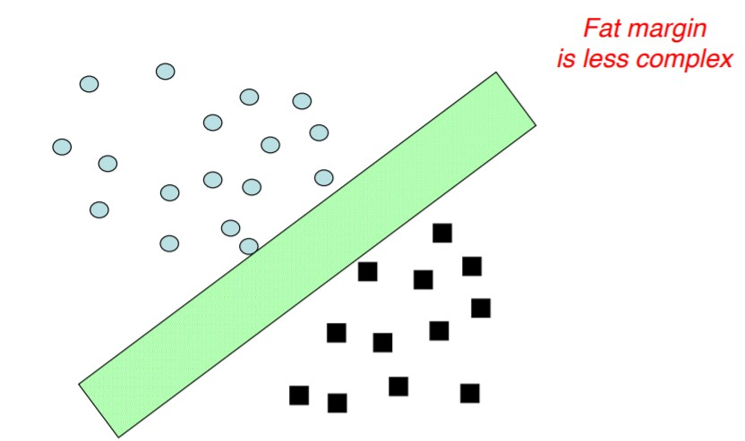

### VC dimension

The Vapnik-Chervonenkis dimension: Model complexity determines the PERFORMANCE/COST on both the TRAINING and TEST sets.

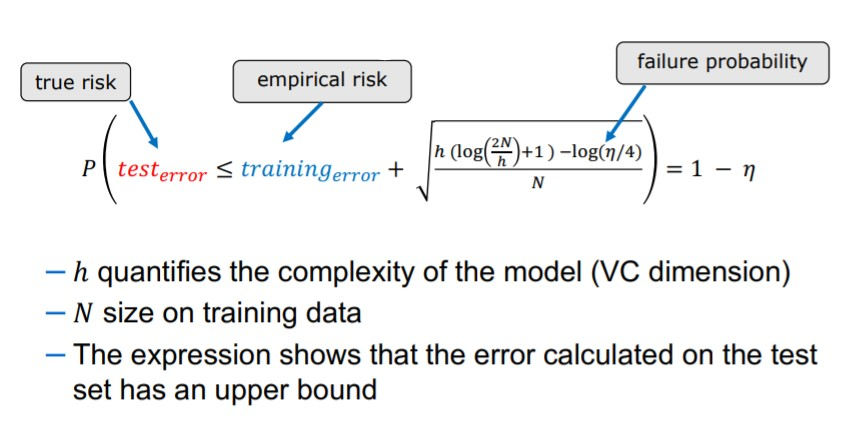

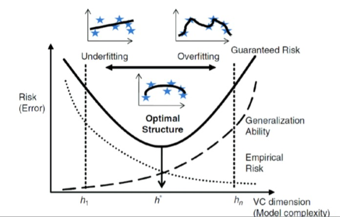

For linear classifiers

* m: dimensions/features
* h = m + 1

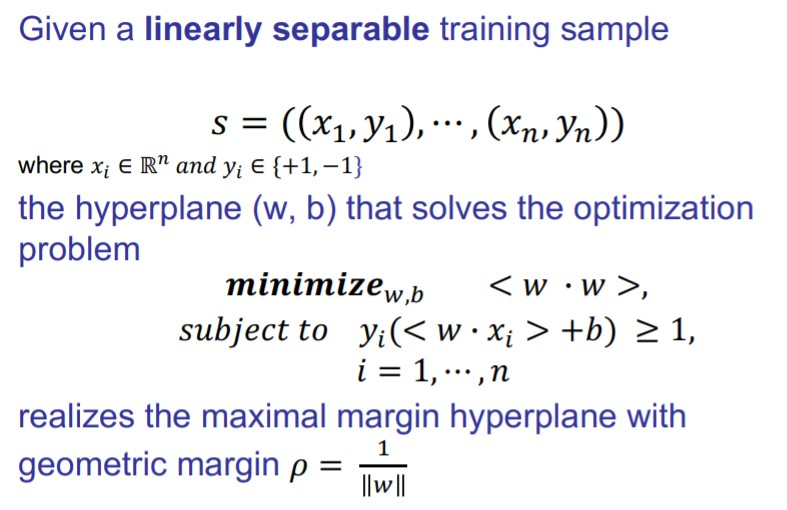

For support vectors, the inequality becomes an equality.

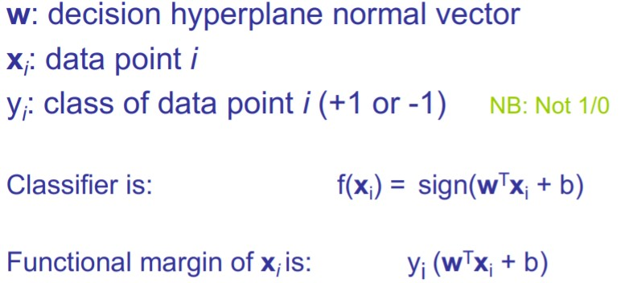

### The optimization problem

The optimization theory establishes that an optimization problem, called primal, has a DUAL form if the function to be optimized and the restrictions are strictly convex.

* Under these circumstances, solving the dual problem let obtaining the solution to the primal problem.

***Note**: Check L10 Slide 40*

### 'Soft' Margin solution

C is a regularization parameter

* Small C allows constraints to be easily ignored ⟶ large margin.
* Large " makes constraints hard to ignore ⟶ narrow margin
* C = ∞ enforces all constraints: hard margin

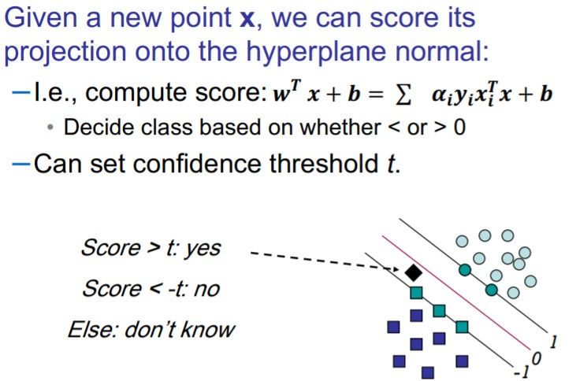

### Summary Linear SVMs

* The classifier is a separating hyperplane.
  * Most “important” training points are support vectors; they define the hyperplane.
* Quadratic optimization algorithms can identify which training points xi are support vectors with non-zero Lagrangian multipliers α

## Non-linear SVM mathematically

Key idea: transform xi to a higher dimensional space to “make life easier”

* Input space: the space the point xi are located.
* Feature space: the space of (xi) after transformation

General idea: the original feature space can always be mapped to some higher-dimensional feature space where the training set is separable

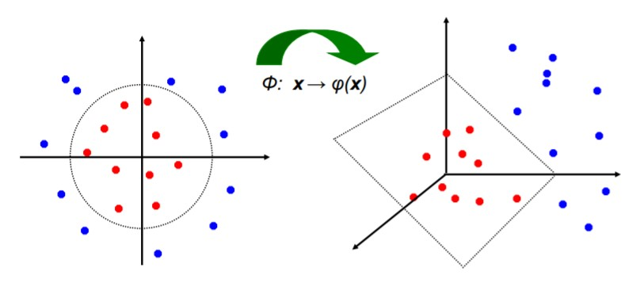

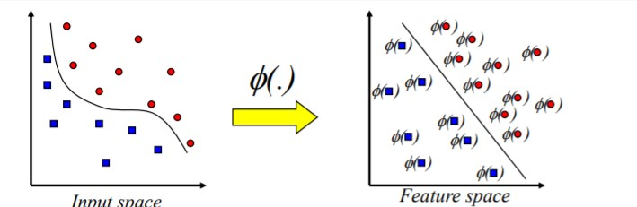

Not all similarity measures can be used as kernel function.

* The kernel function needs to satisfy the Mercer function.
  * Every positive definite symmetric function is a kernel.

This also means that optimization problem can be solved in polynomial time

**Example Kernel functions**

We use kernels because make non-separable problem separable and map data into better representational space.

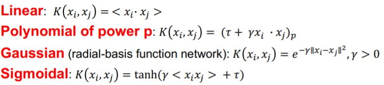