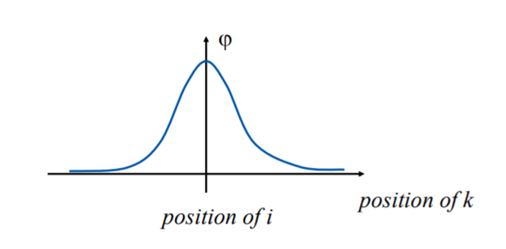
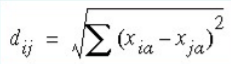

# Visualization

**Objective:** Visualizing low-dimensional views of high-dimensional data

Main goal is to communicate the information clearly and effectively through graphical means. So the **VISUALIZATION** is the study of the visual representation of the data. 

Information  > data > knowledge > wisdom

**How do we visualize data of high dimensionality?**

* Eliminate dimensions
* Dive & conquer: create multiple visualizations of low dimensionality
* Latent and projection models

## Latency and projection

**Projection**

* Dimensionality compression
* Similitude information coding

**Clustering**

* Finding grouping structure in data
* Similitude information coding

**Self-Organizing Map(SOM) & Generative Topographic Mapping (GTM)**

* Combine latent representation and clustering

## Self Organizing Maps

Kohonen describes SOM as "visualization and analysis tool for high dimensional data"

**Applications**

* Clustering
* Visualization
* Dimensionality reduction
* Classification
* Feature extraction

The purpose of SOM is to map a multi-dimensional input space onto a topology preserving map of neurons

*  Preserve a topological so that neighboring neurons respond to «similar» input patterns
* The topological structure is often a 2 or 3 dimensional space

### Commonly output-layer structures

* SOM maps a multi-dimensional input space onto a topology preserving map of neurons

* Each neuron is assigned a weight vector with the same dimensionality of the input space

* Each Input pattern is compared to each weight vector
* Distance is calculated between the input pattern and each neuron in the network (e.g. Euclidean Distance)
* Selects the neuron that is closest as the winning neuron

### Adaptation in SOM

* During training, the “winner” neuron and its neighborhood adapts to make their weight vector more similar to the input pattern that caused the activation.
* The neurons are moved closer to the input pattern.
* The magnitude of the adaptation is controlled via a learning parameter which decays over time.

### Quantization error

* Measures how well our neurons represent the input patterns
* It is calculated by summing all the distances between each input pattern an the neuron to which is mapped. 

### Topological error

* Evaluates the complexity of the output space
* Measures the number of times the secund closest neighbor in the input space is not mapped into the neighbourhood of the neuron in the output space.
* A hight topolofical error may indicate that the classification problem is complex or may suggest that the training was not adequate and the network is folded. 

### SOM training process 

* Neurons initialized ramdomly
* Unfolding phase
  * Neurons are "spread out" and pulled towards the general area (in the input space) where they will stay
* Fine tuning phase
  * SOM match the neurons as far as possible to the input patterns, thus decreasing the quantization error

### Neighbourhood function

Indicates how closely neurons i and k in the output layer are connected to each other. Usually used Gaussian function 

## Multi-Dimensional Scaling (MDS)

The goal of an MDS analysis is to find a spatial configuration of objects when all that is known is some measure of their general (dis)similarity. 

Reduces large amounts of data into easy-to-visualize structures

How? By assigning instances to specific locations in space

Distances between points in space match dis/similarities as closely as possible: 

* Similar objects: Close points
* Dissimilar objects: Far apart points

Data of MDS: similarities, dissimilarities, distances, or proximities reflects amount of dis/similarity or distance between pairs of objects. 

Distinction between similarity and dissimilarity data dependent on type of scale used:

* Dissimilarity scale: Low #=high similarity & High #=high dissimilarity.
* Similarity scale: Opposite of dissimilarity. E.g. On a scale of 1-9 (1 being the same and 9 completely different) how similar are chocolate bars A and B? Dissimilarity scale

### Types of MDS

1. Type of proximities:
   - Metric/quantitative. Quantitative information/interval data about object's proximities. E.g city distances
   - Non-metric/qualitative: Qualitative information/nominal data about proximities. E.g rank order.
2. Number of proximity matrices
   * Proximity matrix is the input for MDS
   * The above criteria yield:
     * Classical MDS: One proximity matrix
     * Replicated MDS: Several matrices
     * Weighted MDS/Individual Difference Scaling

### MDS Model

Classical MDS uses Euclidean to model data proximities in geometrical space. 

### Output of MDS

* Clusters: Grouping in a MDS spatial representation.
  * Rrepresent a domain/subdomain
* Dimensions: Hidden structures in data. Ordered groupings that explain similarity between items.

