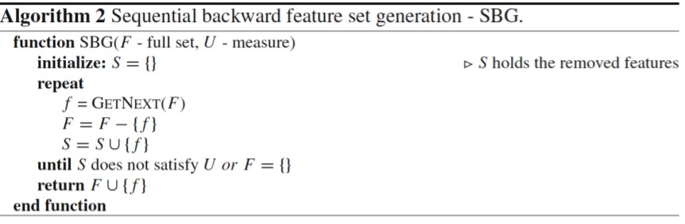
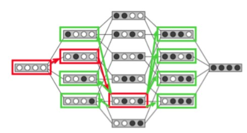

# Feature selection

**Why reducing dimensionality**

Not useful:

* More information means easier task
* Models can ignore irrelevant features.

Lots of inputs means:

* Lots of parameters
* Large input space
* Curse of dimensionality and risks of overfitting

The required number of samples (to achieve the same accuracy) grows exponentially with the number of variables.

The number of points in a grid increases exponentially with dimension (DIM)

**Definition**: Feature selection is a process that chooses an optimal subset of features according to a certain criterion [Liu and Motoda, 1998].

Feature selection is typically a search problem for finding an optimal or suboptimal subset of m features out of original M features.

**Benefits**

* Excluding irrelevant and redundant features
* Allows reducing system complexity and processing time
* Improves the prediction accuracy

So we need FS for improve performance, visualize data for model selection, reduce dimensionality and remove noise, reduce the cost of the data and the complexity of the resulting model description.

FS can be considered as a search problem, where each stat of the search space corresponds to a concrete subset of features selected.

The selection can be represented as a binary array, with each element corresponding to the value 1, if the feature is currently selected by the algorithm and 0, if it does not occur.

## Searching

Search of a Subset of Features

* Search direction
  * Sequential forward generation (SFG)
  * Sequential Backward generation (SBG)
  * Bidirectional Generation (BG)
  * Random Generation (RG)
* Search Strategies
  * Exhaustive Search
  * Heuristic search
  * Non deterministic Search

### Sequential Forward Generation (SFG)

It starts with an empty set of features S. As the search starts, features are added into S according to some criterion that distinguish the best feature from the others. S grows until it reaches a full set of original features. The stopping criteria can be a threshold for the number of relevant features m or simply the generation of all possible subsets in brute force mode.

**Algorithm**

### Sequential Backward Generation (SBG)

 It starts with a full set of features and iteratively, they are removed one at a time. Here, the criterion must point out the worst or least important feature. By the end, the subset is only composed of a unique feature, which is considered to be the most informative of the whole set. As in the previous case, different.

**Algorithm**

### Forward-Backward

Begins the search in both directions, performing SFG and SBG concurrently. They stop in two cases

* when one search finds the best subset comprised of m features before it reaches the exact middle
* both searches achieve the middle of the search space. It takes advantage of both SFG and SBG.

**Algorithm**

### Random Generation

**Algorithm**

### Search Strategies

* **Exhaustive Search**: It corresponds to explore all possible subsets to find the optimal ones. Only exhaustive search can guarantee the optimality. Nevertheless, they are also impractical in real data sets with a high M. O(2^M)
* **Heuristic Search**: : It employs heuristics to carry out the search. Thus, it prevents brute force search. The maximum length of this path is M and the number of subsets generated is O(M). The choice of the heuristic is crucial to find a closer optimal subset of features in a faster operation.
* **Non-deterministic Search**: Random search strategy and can generate best subsets constantly and keep improving the quality of selected features as time goes by. In each step, the next subset is obtained at random.
  * We do not know when the optimal set is obtained, although we know which one is better than the previous one and which one is the best at the moment.

## Selection Criteria

### Information Measures

* Shannon's Entropy

  

* Information gain

### Distance Measures

Measures of separability, discrimination or divergence measures. 

* Euclidean
* Minkowski
* Canberra

### Dependence Measures

* Known as measures of association or correlation.

* Its main goal is to quantify how strongly two variables are correlated or present some association with each other.

* Pearson correlation coefficient

  

### Consistency Measures

Attempt to find a minimum number of features that separate classes as the full set of features can.

**P(C|FullSet) = P(C|SubSet).**

An inconsistency is defined as the case of two examples with the same inputs (same feature values) but with different output feature values (classes in classification).

### Accuracy Measures

* Accuracy
* Error rate
* Information gain
* Chi-squared

## Principle for selecting

* Filter algorithm: some feature evaluation function is used rather than optimizing the classifier’s performance.
* Wrapper algorithm: the performance of the classifier is used to evaluate the feature subsets.
* Embedded feature selection algorithm: performs variable selection (implicitly) in the course of model training. Similar to wrappers, but in this approach, the features are selected during the learning process.

### Filters

* Measuring uncertainty, distances, dependence or consistency is usually cheaper than measuring the accuracy of a learning process. Thus, filter methods are usually faster.
* It does not rely on a particular learning bias, in such a way that the selected features can be used to learn different models from different DM techniques.
* It can handle larger sized data, due to the simplicity and low time complexity of the evaluation measures.

### Wrappers

* Can achieve the purpose of improving the particular learner’s predictive performance.

* Usage of internal statistical validation to control the overfitting, ensembles of learners and hybridizations with heuristic learning like Bayesian classifiers or Decision Tree induction.

### Embedded FS

* Similar to the wrapper approach in the sense that the features are specifically selected for a certain learning algorithm, but in this approach, the features are selected during the learning process.
* They could take advantage of the available data by not requiring to split the training data into a training and validation set; they could achieve a faster solution by avoiding the re-training of a predictor for each feature subset explored.

## Aspects: Output of Feature Selection

### Feature Ranking Techniques

* Ranked list of features which are ordered according to evaluation measures.
* Return the relevance of the features.

### Minimum Subset Techniques

* The number of relevant features is a parameter that is often not known by the practitioner.
* There must be a second category of techniques focused on obtaining the minimum possible subset without ordering the features.
* Whatever is relevant within the subset, is otherwise irrelevant.

## Apects : Evaluation

**Goals**

* Inferability: For predictive tasks, considered as an improvement of the prediction of unseen examples with respect to the direct usage of the raw training data.
* Interpretability: Given the incomprehension of raw data by humans, DM is also used for generating more understandable structure representation that can explain the behavior of the data.
* Data Reduction: It is better and simpler to handle data with lower dimensions in terms of efficiency and interpretability

Three major components to categorize combinations: Search Direction, Search Strategy, Evaluation Measure.

**Exhaustive Methods** cover the whole search space.

**Focus Algorithm**

**Heuristic Methods**: not have any expectations of finding an optimal subset with a rapid solution.

**Nondeterministic methods**: They add or remove features to and from a subset without a sequential order.

**Feature Weighting Methods**: Provide weights to features, also can be used for FS.

## Summary

* Feature selection has different elements
  * Searching for the best subset of features
    * Forward, Backward, Bidirectional, or Random generation
  * Selection Criteria
    * Heuristic, Exhaustive, or Non deterministic search
  * Criteria for evaluating different subsets
    * Information, distance, dependency, or accuracy measures
  * Principle for selecting (selection algorithms)
    * Filters, Wrappers, or Embedded algorithms
