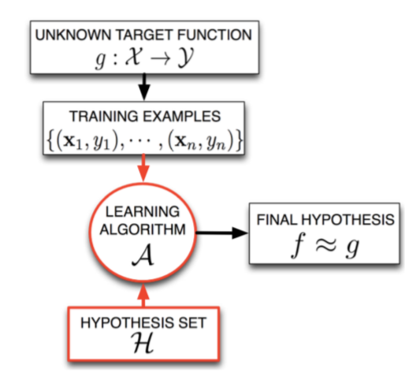

# Supervised Learning

Improve the performance of a software system, based on previous experience

**Task**

* Prediction: phone and credit card fraud
* Understanding: market basks.
* control : flying helicopters, playing.

**Machine Learning is Used when:**

* There is a Pattern.
* We can not pin it down mathematically
* We have data on it.

**Prediction**: supervised learning: given(x,y) pairs, find a mapping from a new *x* to a new *y*, e.g., regression classification

**Understanding**: unsupervsied learning: Given a set of *x*, find something interesting or useful about their structure. 

**Control**: reinforcement learning: given an external system upon which you can exert control action *a* and receive percepts, *p*, a reward signal *r* indicating good

## Elements of supervised problem

### Data

$$
\text{Training: } \{ (x_1, y_1)...(x_N, y_N);
\\
(x_i, y_i) \in \R^d \ \cross \R
$$

where **x** is the feature data set. **y** is the target output/label

### Model

* Hypothesis set: The set of possible / candidate models, H.
* Learning algorithm : The method for selecting the most appropriate model candidate (f) with respect to some quality function (e.g. model accuracy)

### Output

The selected model,
$$
f \in \H
$$
 

## Linear regression

## Descent optimization methods

