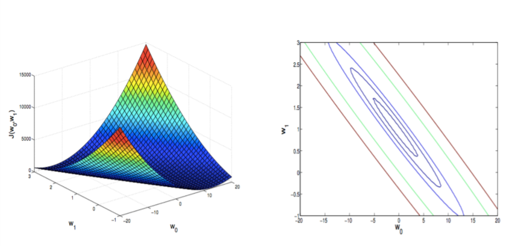

# Supervised Learning

Improve the performance of a software system, based on previous experience

**Task**

* Prediction: phone and credit card fraud
* Understanding: market basks.
* control : flying helicopters, playing.

**Machine Learning is Used when:**

* There is a Pattern.
* We can not pin it down mathematically
* We have data on it.

**Learning algorithm**: the process for select the most appropiate hypothesis from a hypothesis set H, the set of linear models H(w0, w1) = w1x + w0, where (x0, w1) are called parameters

**Prediction**: supervised learning: given(x,y) pairs, find a mapping from a new *x* to a new *y*, e.g., regression classification

**Understanding**: unsupervsied learning: Given a set of *x*, find something interesting or useful about their structure. 

**Control**: reinforcement learning: given an external system upon which you can exert control action *a* and receive percepts, *p*, a reward signal *r* indicating good

**Regression**: Given a picture of a person, we have to predict their age on the basis of the given picture. The output is continuous.

**Classification**: Given a patient with a tumor, we have to predict whether the tumor is malignant or benign. The output is discrete. 

## Elements of supervised problem

### Data

$$
\text{Training: } \{ (x_1, y_1)...(x_N, y_N);
\\
(x_i, y_i) \in \R^d \ \cross \R
$$

where **x** is the feature data set. **y** is the target output/label

### Model

* Hypothesis set: The set of possible / candidate models, H.
* Learning algorithm : The method for selecting the most appropriate model candidate (f) with respect to some quality function (e.g. model accuracy)

### Output

The selected model,
$$
f \in \H
$$

## Linear regression

## Descent optimization methods

**How do we find the minimum in an automated way?**

With descent methods:

The gradient of a function is the multi-variate extension of the derivative for a single variable.

Not all direction on that space are descent directions.

Gradient descent is an algorithm to minimize any function or parameter.

* *t* is the learning rate. 
  * If *t* is too small, gradient descent will be slow.
  * If t is too large, gradient descent can overshoot the minimum. It may fail to converge or even diverge
  * Gradient descent can converge even if t is fixed

## Basic concepts of ML

