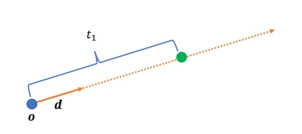
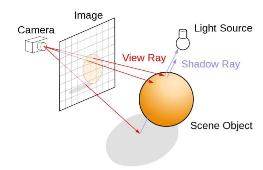
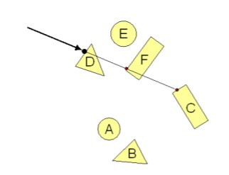
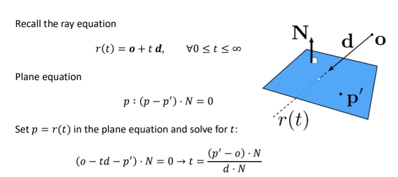
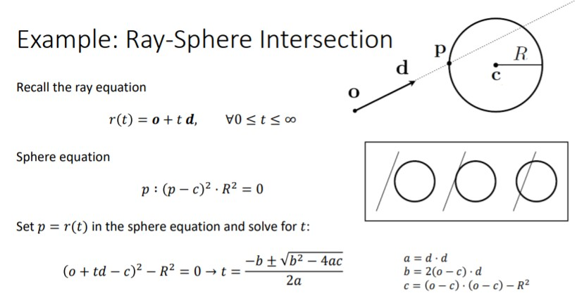
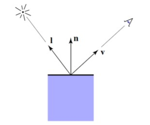
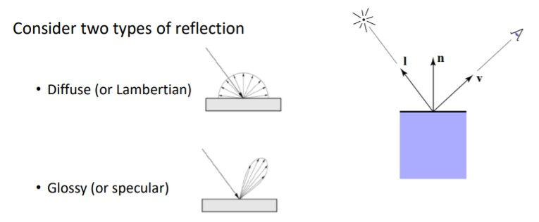
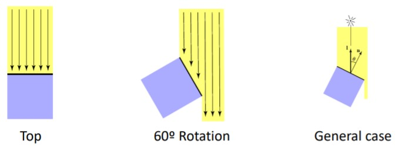

# Ray Tracing


**Definition** : A family of rendering methods which ressort to rays to simulate light propagation in a 3D virtual scene.

**Ray Tracer**: Program used to shoot rays.


### What does it take to do ray tracing?

Full description of a 3D virtual scene.

* Scene geometry (objects)
* Materials associated to each object. 
* Light sources
* Virtual cameras

### Ray



O is the origin, d is the direction.  So ray is defined by
$$
r(t) = o + t d, \forall0 \le t \leq \infin
$$

## Simple Ray Tracing with Phong Reflectance



### Ray-Scene Intersection

The objective is find the closest intersection along ray and store the details (3D coordinates of the intersection)

The brute force way test intersection of the ray with each object of the scene, keep the closest intersection. 



The general approach is use the ray equation to find the ray points which also belong to the object.

**Example** : Ray-Plane intersection



**Example**: Ray-Sphere intersection



**Algorithm**

```cpp
for (line = 0; line <= height -1; ++line) {
	for(col = 0; col <= width -1; ++col)
		ray = cemera.generateRay(line,col);
		if(object.intersect(ray)) {
			image(col,line) = red;
		}
		else image(col,line) = black;
	}
}
```

###  Shading

The use of color to give an impression of light and shade in a picture. 

### Direct Illumination

Light arriving from light sources and reflected towards the camera. 

Inputs:

* Viewer direction (v)

* Normal at the surface (n)

* Direction of the light source (i)

* Surface material parameters (kd, ks)

  



### Light arriving at surface point.

Considering disffuse point light sources with no area, the intensity decreases with square of the distance $L_i (p) = \frac{I_L}{d^2}$

### Shadow Test

Visibility of point light source. Can be dtermined using a single ray.

If occluded

* No contribution
* Point is in the shadow.

If not occluded
$$
L_i(p) = \frac{I_L}{d^2}
$$

### Reflection at the Surface



### Lamber (or Difusse) Reflection

* Ligh is uniformly reflected in all directions.
* Follows the Lambert's cosine law.



Independent of view direction
$$
L_d(p,v) )=k_d\frac{I}{d^2}max(0,n·L)
$$

### Specular Reflection

Appearence depends on view direction
$$
L_s(p,v) )=k_s\frac{I}{d^2}max(0,v·r)^s
\\ \\ \text{where: } \ r = 2(n·l)n-l
$$

### Ambient Term 

Constants value added to the total reflected light. 

Used to capture the indirect light component. Not explicitly simulated in this model. Crude assumption.
$$
L_a = k_dI_a
$$