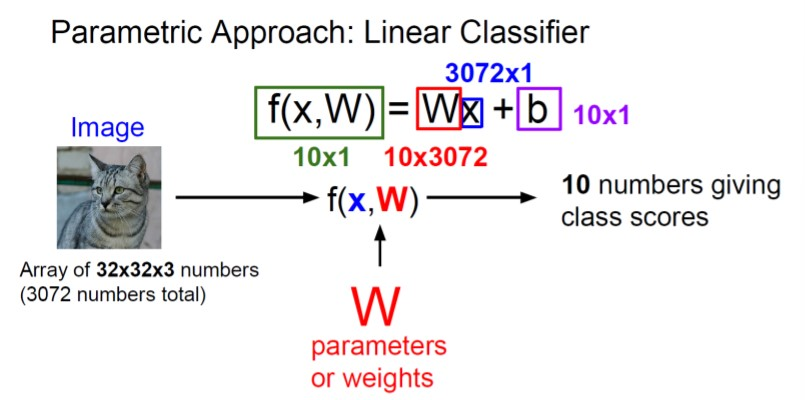
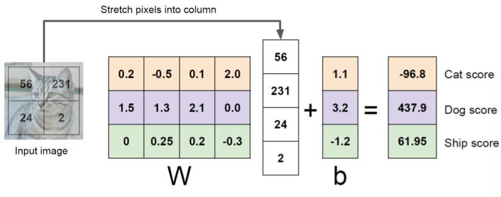
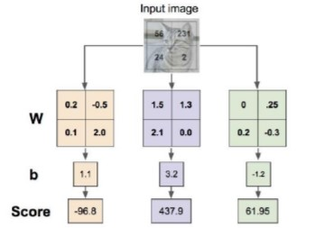
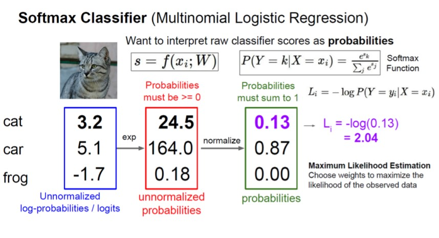

**Nota**: max 25 de març per enviar els tres papers per mirar.

# Object recognition

x son l'objecte, és a dir 32x32x3 . W son els pesos. El 10 son per dir que tinc 10 classes diferents. La B és el bias. 

Exemple amb quatre pixels i tres classes (gat, gos, barco)

Els pesos representen sempre com la mitja dels valors de la imatge. 

En el classificador (diapo 17) es fa per un no lineal la H per tal que sigui més fàcil d'apendre problemes no lineals

(26) un filtre sols produeix un resultat de profunditat 1.

Amb ReLu els valors negatius desapareixen. 

